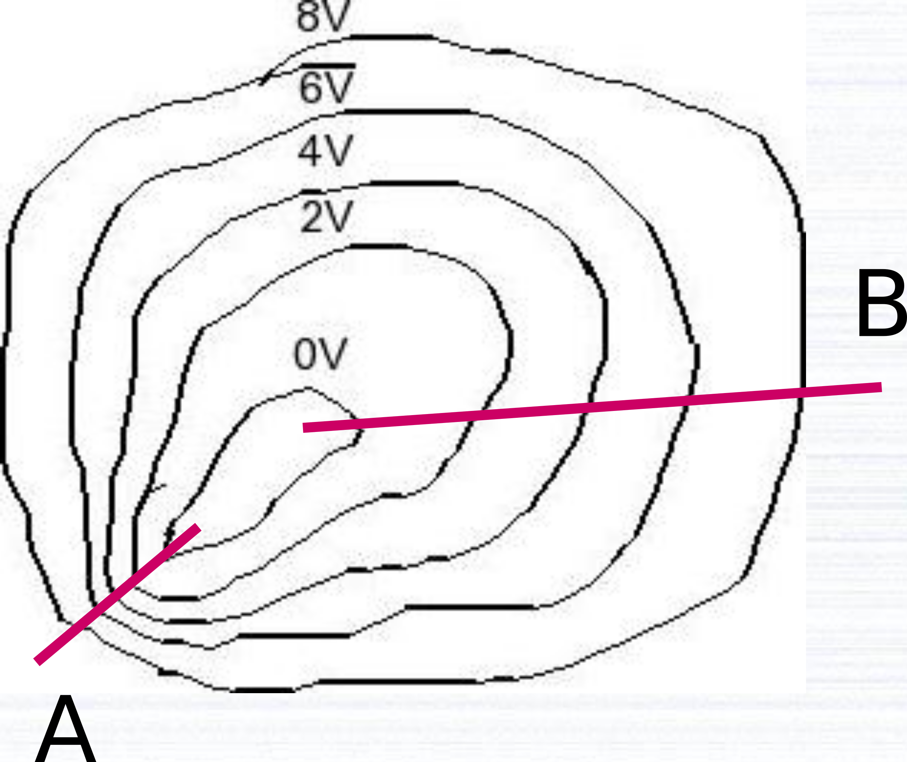

```{r setup, include=FALSE}
knitr::opts_chunk$set(echo = TRUE)
```

# Reeglid

$$pinge = \frac{töö}{laeng}$$

$$voolutugevus = \frac{laeng}{aeg} === \frac{võimsus}{pinge}$$

```{r}
ELEMENTARYCHARGE = 1.6E-19
FORCE_CHARGES = 9E9
GRAVITATION_EARTH = 6.67E-11
WEIGHT_EARTH = 6E24
RADIUS_EARTH = 6.4E6
GRAVITATIONAL_ACCELERATION_EARTH = GRAVITATION_EARTH * WEIGHT_EARTH / RADIUS_EARTH ^ 2
```

$$ELEKTRILINE\_JÕUD = 9 \cdot 10^9 * \frac{N \cdot m^2}{C^2}$$

$$\vec{{tugevus}_{elektriväli}} = \frac{\vec{jõud} \cdot N}{laeng \cdot C} === \frac{\vec{ELEKTRILINE\_JÕUD} \cdot \frac{N \cdot m ^ 2}{C ^ 2} \cdot (laeng \cdot C) ^ 2}{(kaugus \cdot m) ^ 2 \cdot (laeng \cdot C)}$$

$$\vec{{tugevus}_{elektriväli}} = \frac{\vec{ELEKTRILINE\_JÕUD} \cdot \frac{N \cdot m ^ 2}{C ^ 2} \cdot laeng \cdot C}{(kaugus \cdot m) ^ 2}$$

$$\vec{{tugevus}_{elektriväli}} = \frac{\vec{ELEKTRILINE\_JÕUD} \cdot laeng}{(kaugus) ^ 2} \cdot \frac{N}{C}$$
$$\vec{{tugevus}_{elektriväli}} = \frac{\vec{jõud} \cdot N}{laeng \cdot C} === \frac{\frac{töö \cdot J}{kaugus \cdot m}}{laeng \cdot C} === \frac{\frac{pinge \cdot V \cdot laeng \cdot C}{kaugus \cdot m}}{laeng \cdot C} === \frac{pinge \cdot V}{kaugus \cdot m}$$

Laetud kehade süsteemi väljatugevuse arvutamises liidetakse üksikute kehade elektrivälja tugevuse vektorid.

```{r}
AVOGADRO = 6.02e23
```

$${elektrone}_{kokku} = \frac{{elektrone}_{aatomis} * {mass}_{aine}}{{mass}_{molaarne}}$$

$${tugevus}_{vool} = \frac{{laenguhulk}_{juhiRistlõigetLäbinud}}{aeg}$$

```{r}
CONCENTRATION_ELECTRONS_CU = 8.5E28
```

$${ELEKTRONIDE\_KONTSENTRATSIOON}_{CU} = 8.5 \cdot 10 ^ {28} \cdot \frac{1}{m ^ 3}$$

$$takistus = \frac{eritakistus \cdot \Omega \cdot m \cdot pikkus \cdot m}{{pindala}_{ristlõige} \cdot m ^ 2} === \frac{eritakistus \cdot pikkus}{{pindala}_{ristlõige}} * \Omega$$

$${pinge}_{tõhus} = \frac{{pinge}_{absoluutne}}{\sqrt{2}}$$

```{r}
DENSITY_CU = 8.96E-3 / 1E-6
```

$${eralduvSoojushulk} = voolutugevus ^ 2 \cdot takistus \cdot aeg$$

Jadaühenduses on voolutugevus kõikides tarbijates ühesugune ja pinged liituvad.

$${valguskiirus}_{vaakumis} = \frac{lainepikkus}{periood} === lainepikkus \cdot sagedus$$

```{r}
SPEED_LIGHT <- 299792458
```

# Ülesanded

## Ekvipotentsiaaljooned

### Ülesande püstitus



Millises sihis liikudes 
muutub potentsiaal 
kiiremini?

• sihis A

• sihis B

### Lahendus

*A*

## Magnitude of the electrical force

### Task

Two balloons are charged with an identical 
quantity and type of charge: -6.25 µC. They are held apart at 
a separation distance of 61.7 cm. Determine the magnitude 
of the electrical force of repulsion between them.

### Solution

The calculation process:

```{r}
electricalForce = FORCE_CHARGES * (-6.25e-6) ^ 2 / 61.7e-2 ^ 2
```

`r electricalForce` * N is the magnitude of the electrical force of repulsion between them.

## Charge

### Task

Two balloons with the same amount of charge repel with 0.0648 N of force 
when held at a separation distance of 28.2 cm. Determine the quantity of charge on the 
balloons.

### Solution

The calculation process:

```{r}
charge = sqrt(.0648 * 28.2e-2 ^ 2 / FORCE_CHARGES)
```

`r charge` * C is the quantity of charge on the balloons.

## Distance

### Task

Two different objects are given charges of +3.27 μC and -4.91 μC. What 
separation distance will cause the force of attraction between the two objects to be 0.358 
N?

### Solution

The calculation process:

```{r}
distanceBetweenObjects = sqrt(FORCE_CHARGES * abs(3.27e-6) * abs(-4.91e-6) / .358)
```

`r format(distanceBetweenObjects, digits = 3)` * m is the separation distance that will cause the force of attraction between the two objects to be .358 * N.

## Laengukandjad

### Ülesande püstitus

Kui suur võiks ligikaudu olla laengukandjate suunatud 
liikumise kiirus 230 V pingega ahelas, kus on 20 W 
pirn?

Laengukandjate kontsentratsioon vases on $8.5E28 * \frac{1}{m^3}$.

Juhi ristlõikepindala on 13 * mm^2^. 

A.
1 mm/h

B.
1 mm/s

C.
1 m/s

D.
1 km/s

### Lahendus

Arvutuskäik:

```{r}
options(scipen = 999)
velocity = 20 / 230 / ELEMENTARYCHARGE / 8.5E28 / (13 * 1E-3)
velocity
aInSi = 1 * 1e-3 / 3600
aInSi
bInSi = 1 * 1e-3
bInSi
cInSi = 1
cInSi
dInSi = 1 * 1e3
dInSi
differenceFromA = deparse(abs(aInSi - velocity))
differenceFromA
differenceFromB = deparse(abs(bInSi - velocity))
differenceFromB
differenceFromC = deparse(abs(cInSi - velocity))
differenceFromC
differenceFromD = deparse(abs(dInSi - velocity))
differenceFromD
minimum = min(c(differenceFromA, differenceFromB, differenceFromC, differenceFromD))
minimum
library(switchcase)
choice <- switchCase(
  minimum,
  alt(
    ..expr == differenceFromA,
    {NULL},
    "A"
  ),
  alt(
    ..expr == differenceFromB,
    {NULL},
    "B"
  ),
  alt(
    ..expr == differenceFromC,
    {NULL},
    "C"
  ),
  alt(
    ..expr == differenceFromD,
    {NULL},
    "D"
  ),
  alt(
    NULL,
    {NULL},
    "E"
  )
)
choice
options(scipen = 0)
```
*`r choice`*.

## Ohmi seadus

### Ülesande püstitus

Ohmi seadus:

$$voolutugevus = \frac{pinge}{takistus}$$
Ohmi
seadusest võime avaldada takistuse:

$$takistus = \frac{pinge}{voolutugevus}$$

See on 
Ohmi
seadusest 
avaldatud. 
Võimaldab arvutada 
takistust, kui pinge ja 
voolutugevus on mõõdetud.

Kas see tähendab, et kui me pinget 
2 korda suurendame, siis takistus 
suureneb 2 korda?

### Lahendus

Ei.

## Alalisvool ja vahelduvvool

### Ülesande püstitus

Elektrilöögi korral on inimesele ohtlikum

A.
alalisvool

B.
vahelduvvool

### Lahendus

*A*.

## Jõulukuuse küünlad

### Ülesande püstitus


Jõulukuuse tuled on

A.
jadaühenduses

B.
rööpühenduses

### Lahendus

*A*.

## Punktlaengud

### Ülesande püstitus

Kaks punktlaengut asetsevad üksteisest 6 cm kaugusel ning mõjutavad üksteist jõuga 20 N. Leia:

a) jõud nende kahe punktlaengu vahel, kui laengute vaheline kaugus on 12 cm;

b) laengute suurused, kui nende absoluutväärtused on võrdsed.

### Lahendus

b) Esmalt arvutan ühe punktlaengu:

```{r}
charge = sqrt(20 * (6 * 1E-2) ^ 2 / FORCE_CHARGES)
```

`r format(charge, digits = 2)` * C on kummagi laengu suurus, kui nende absoluutväärtused on võrdsed.

a) Nüüd arvutan uue jõu:

```{r}
force = FORCE_CHARGES * charge ^ 2 / (12 * 1E-2) ^ 2
```

`r force` * N on jõud nende kahe punktlaengu vahel, kui laengute vaheline kaugus on 12 * cm.

## Kaks kuulikest

### Ülesande püstitus

Kaks kuulikest laengutega 1 μC on üksteisest 3 cm kaugusel.

a) Kui suur jõud mõjub nende kuulikeste vahel?

b) Millise massiga kehale mõjub Maa raskusjõuväljas sama suur jõud?

### Lahendus

a) Arvutuskäik:

```{r}
force = FORCE_CHARGES * 1E-6 ^ 2 / (3E-2) ^ 2
```

`r force` * N suurune jõud mõjub nende kuulikeste vahel.

b) Eeldan, et see teine keha on Maa raskuskeskmest sama kaugel kui kuulikesed üksteisest:

```{r}
weight = force / GRAVITATIONAL_ACCELERATION_EARTH 
```

`r format(weight, digits = 2)` * kg kaalub keha, millele mõjub Maa raskusjõuväljas sama suur jõud.

## Vihmapilv

### Ülesande püstitus

Vihmapilve ja maapinna vaheline elektriliste potentsiaalide vahe on umbes 100 miljonit volti. Välgulöögi korral kantakse pilvelt maapinnani 2 C suurune laeng. Kui suur on välgulöögi energia?

### Lahendus

(200 miljonit) * J on välgulöögi energia.

## Elektrivälja tugevus

### Ülesande püstitus

Kui suur on elektriväljatugevus 3 cm kaugusel punktlaengust, mille laeng on $2 \cdot 10^{-4} C$?

### Lahendus

Arvutuskäik:

```{r}
force = FORCE_CHARGES * 2e-4 / 3e-2 ^ 2
```

$`r force` * \frac{N}{C}$ on elektrivälja tugevus 3 * cm kaugusel punktlaengust, mille laeng on 2e-4 * C.

## Punktlaengud

### Ülesande püstitus

Kaks positiivse laenguga 2 C punktlaengut asuvad teineteisest 1 m kaugusel. Kui suur on elektrivälja tugevus punktis, mis asub laengute vahel 30 cm kaugusel ühest neist laengutest?

### Lahendus

Arvutuskäik:

```{r}
forcedCharges = FORCE_CHARGES * 2
force1 = forcedCharges / 30e-2 ^ 2
force2 = forcedCharges / (1 - 30e-2) ^ 2
force = abs(force1 - force2)
```

$(`r format(force, digits = 1)`) \cdot \frac{N}{C}$ on elektrivälja tugevus punktis, mis asub laengute vahel 30 * cm kaugusel ühest neist laengutest.

## Elektrivälja potentsiaal

### Ülesande püstitus

Punktis A on elektrivälja potentsiaal $5 \cdot 10 ^ 5 V$. Kui sellesse punkti asetada keha laenguga 0,02 C, kui suur on selle keha potentsiaalne energia?

### Lahendus

10 * kJ on selle keha potentsiaalne energia, kui sellesse punkti asetada keha laenguga .02 * C.

## Elektronide kogulaeng

### Ülesande püstitus

Kui suur on 0,5 kilogrammis vases olevate elektronide kogulaeng? Kui kaua läbib selline laeng taskulambi pirni, kui pirni läbiva voolu tugevus on 0,28 A?

### Lahendus

Vase aatomis on 29 elektroni. Lasen arvutada vasetükis olevate elektronide koguarvu:

```{r}
totalElectrons = 29 * .5 / (63.546e-3) * AVOGADRO
```

Nüüd lasen arvutada selles vasetükis olevate elektronide kogulaengu:

```{r}
totalCharge = totalElectrons * ELEMENTARYCHARGE
```

`r format(totalCharge, digits = "2")` * C on .5 * kg vases olevate elektronide kogulaeng.

Lasen arvutada kestuse:

```{r}
duration = totalCharge / .28
```

`r duration` * s läbib selline laeng taskulambi pirni, kui pirni läbiva voolu tugevus on .28 * A.

Lasen selle kestuse väärtuse konverteerida suuremateks ühikuteks:

```{r}
minutes = duration / 60
minutes
hours = minutes / 60
hours
days = hours / 24
days
```

## Aku laeng

### Ülesande püstitus

Poole tunni jooksul vähenes akus olev laeng 720 C võrra. Kui suur oli aku tühjenemisvool?

### Lahendus

.4 * A oli aku tühjenemisvool.

## Elektrijuhe

### Ülesande püstitus

Vasest elektrijuhet pikkusega 20 cm ja diameetriga 4 mm läbib vool tugevusega 0,3 A. Millise aja jooksul jõuavad elektronid juhtme ühest otsast teise, kui elektronide kontsentratsioon vases on $8,5 \cdot 10 ^ {28} m ^ {-3}$?

### Lahendus

Arvutuskäik:

```{r}
library(Ryacas)
equation = paste(".3 ==", ELEMENTARYCHARGE, "*", CONCENTRATION_ELECTRONS_CU, "* pi * (", 4e-3 / 2, ") ^ 2 *", 20e-2, "/ time", sep = " ")
equation
time = eval(parse(text = yac_str(y_rmvars(paste("Solve(", equation, ", time)", sep = "")))))
```

`r format(time, digits = "1")` * s kestel jõuavad elektronid juhtme ühest otsast teise, kui elektronide kontsentratsioon vases on $8.5 \cdot 10 ^ {28} * \frac{1}{m ^ 3}$.

Lasen selle ajaväärtuse arvutada ka suurematesse ühikutesse:

```{r}
minutes = time / 60
minutes
hours = minutes / 60
hours
days = hours / 24
days
```

## Autoaku

### Ülesande püstitus

Auto elektrisüsteemi pinge on 12 V. Autoaku mahutavus on 50Ah (ampertundi).

a) Kui suure laengu aku mahutab?

b) Kui autokülmiku energiatarve on 48 W, siis kui kaua autokülmik töötab, enne kui täislaetud aku tühjaks saab?

### Lahendus

a) 180 * kC mahutab aku.

b) 45 * ks töötab autokülmik, enne kui täislaetud aku tühjaks saab.

Lasen teisendada viimase ajaväärtuse suuremateks ühikuteks:

```{r}
minutes = 45000 / 60
minutes
hours = minutes / 60
hours
days = hours / 24
days
```

## Trepikoda

### Ülesande püstitus

Pimedas trepikojas põleb pidevalt pirn võimsusega 25 W ja pingega 230 V. Leida:

a) pirni läbiv voolutugevus;

b) pirni takistus;

c) energia, mis kulutatakse aasta jooksul;

d) aastase arve suurus, mis tuleks elektrienergia eest tasuda, kui 1 kWh elektrienergiat maksab 5 senti.

### Lahendus

a) $\frac{5}{46} \cdot A$ on pirni läbiva voolu tugevus.

Lasen selle voolutugevuse väärtuse teisendada väiksemaks ühikuks:

```{r}
current = 25 / 230 * 1e3
current
```

b) 2116 * Ω on pirni takistus.

c) Arvutuskäik:

```{r}
energyPerYear = 25 / 230 * 365.25 * 24 * 60 * 60 * 230
```

`r energyPerYear` * W * s kulututatakse energiat aasta kestel.

d) Arvutuskäik:

```{r}
amountInCents = energyPerYear / 3600 * 1e-3 * 5
```

`r amountInCents` * senti on aastase arve summa, mis tuleks elektrienergia eest tasuda, kui 1 * kWh elektrienergiat maksab 5 * senti.

## Esituled

### Ülesande püstitus

Auto mõlemad esituled tarbivad voolu tugevusega 3 A. Kui kaua võivad esituled põleda seisva mootoriga autol, mille aku mahutavus on 60 Ah?

### Lahendus

72000 * s võivad esituled põleda seisva mootoriga autol, mille aku mahutavus on 60 * Ah. Või siiski mitte? Kui ainult üks esituli põleks, siis. Aga kaks esituld põlevad. Seega poole vähem ehk 36000 * s.

## Madalpinge

### Ülesande püstitus

Madalpinge (0,4 kV) kaabelliinide jaoks kasutatava kaabli minimaalne lubatud ristlõikepindala on 16 mm^2^. Kui suurt takistust omab sellise ristlõikepindalaga vasest 3 km pikkune kaablilõik? Vase eritakistus on $1,7 \cdot 10 ^ {-8} Ω \cdot m$.

### Lahendus

Arvutuskäik:

```{r}
resistancy = 1.7e-8 * 3e3 / 16e-6
```

`r resistancy` * Ω suurust takistust omab sellise ristlõikepindalaga vasest 3 * km pikkune kaablilõik.

## Niiske nahk

### Ülesande püstitus

Niiske naha korral võib inimese keha takistus olla 600 Ω. Kui suur alalispinge võib sellisel juhul põhjustada surma, kui surmavaks voolutugevuseks on 50 mA?

### Lahendus

50 * mA on .05 * A.

Vähemalt 30 * V suurune alalispinge võib sellisel juhul põhjustada surma, kui surmavaks voolutugevuseks on 50 * mA.

## Pirn

### Ülesande püstitus

LED-pirn elektrilise võimsusega 12 W annab sama palju valgust kui üks 60 vatine hõõgniidiga pirn, ligikaudu 700 luumenit. Hõõgniidiga pirn maksab 1 euro, LED-pirn 20 eurot. Kui elektrienergia hinnaks võtta 5 senti/kWh ning pirn põleb 3 tundi ööpäevas, kui pika aja jooksul tasub LED-pirn ennast ära?

### Lahendus

Arvutuskäik:

```{r}
library(Ryacas)
equation = paste("2000 + 12 * 3 * 5e-3 / 24 / 60 / 60 * s == 100 + 60 * 3 * 5e-3 / 24 / 60 / 60 * s", sep = " ")
equation
time = eval(parse(text = yac_str(y_rmvars(paste("Solve(", equation, ", s)", sep = "")))))
```

`r time` * s möödudes tasub LED-pirn ennast ära, kui elektrienergia hinnaks võtta $5 * \frac{senti}{kWh}$.

Kuna nii suur arv sekundites on hoomamatu, lasen selle teisendada suuremateks ühikuteks:

```{r}
minutes = time / 60
minutes
hours = minutes / 60
hours
days = hours / 24
days
```

## Vahelduvpinge

### Ülesande püstitus

USA-s kasutatakse vooluvõrgus vahelduvpinget, mille efektiivväärtus on 110 V. Kui suur on sellise pinge amplituudväärtus?

### Lahendus

Arvutuskäik:

$110 \cdot \sqrt{2} \cdot V$ on sellise pinge amplituudväärtus.

Lasen välja arvutada ka ebatäpse väärtuse:

```{r}
110 * sqrt(2)
```

## Soojendi

### Ülesande püstitus

Elektriline soojendi pingega 230 V tarbib voolu 9 A.

a) Kui suure soojushulga eraldab soojendi ühe minuti jooksul?

b) Kui suur on laenguhulk, mis läbib soojendit ühe tunni jooksul?

### Lahendus

a) 124200 * J suuruse soojushulga eraldab soojendi ühe minuti kestel.

b) 32400 * C läbib soojendit ühe tunni kestel.

## Nutitelefon

### Ülesande püstitus

Nutitelefoni aku pinge on 3,70 V ja mahutavus 2300 mAh. Kui pidevalt internetti kasutada, siis peab aku vastu 8 tundi. Leida interneti kasutamisel

a) tarbitava voolu tugevus;

b) tarbitav võimsus;

c) 8 tunni jooksul tarbitav energia;

d) kas sellest energiast piisab 200 g toatemperatuuril (20 °C) oleva vee soojendamiseks 50 kraadini.

Vee erisoojus on $4190 J/(kg \cdot K)$.

### Lahendus

a) Arvutuskäik:

```{r}
current = 2300e-3 * 3600 / (8 * 3600)
```

`r current` * A on tarbitava voolu tugevus.

b) Arvutuskäik:

```{r}
power = 3.7 * current
```

`r power` * W on tarbitav võimsus.

c) Arvutuskäik:

```{r}
energy = power * 8 * 3600
```

`r energy` * W * s on 8 * tunni kestel tarbitav energia.

d) Arvutuskäik:

```{r}
heatForWater = 4190 * 200e-3 * (50 - 20)
heatForWater
if (heatForWater > energy) {
  enough = "ei piisa"
} else {
  enough = "piisab"
} 
```

Sellest energiast `r enough` 200 * g toatemperatuuril (20 * °C) oleva vee soojendamiseks 50 * kraadini.

## Nikroomist traat

### Ülesande püstitus

Mitu meetrit nikroomist traati läbimõõduga 0,4 mm kulub elektrilise küttekeha valmistamiseks, kui küttekeha võimsus pingel 230 V peab olema 5 kW? Nikrooni eritakistus on $1,1 \cdot 10 ^ {-6} \Omega \cdot m$.

### Lahendus

Arvutuskäik:

```{r}
library(Ryacas)
equation = paste("230 / (5e3 / 230) == 1.1e-6 * length / (pi * .4e-3 ^ 2 / 4)", sep = " ")
equation
lengthOfWire = eval(parse(text = yac_str(y_rmvars(paste("Solve(", equation, ", length)", sep = "")))))
```

`r format(lengthOfWire, digits = 2)` * m nikroomist traati läbimõõduga .4 * mm kulub elektrilise küttekeha valmistamiseks, kui küttekeha võimsus pingel 230 * V peab olema 5 * kW.

## Traadijupp

### Ülesande püstitus

Kui palju aega kulub 3 cm pikkuse vasest traadijupi temperatuuri tõstmiseks sulamistemperatuurini, kui traadile rakendatakse pinge 230 V? Algtemperatuuriks võtta toatemperatuur 20 °C ja eeldada, et soojusvahetust ümbritseva keskkonnaga ei toimu, st kogu elektrivoolu poolt tehtud töö kulub traadi soojendamiseks. Vase eritakistus on $1,7 \cdot 10 ^ {-8} \Omega \cdot m$, erisoojus $385 J/(kg \cdot K)$ ja sulamistemperatuur 1083 °C.

### Lahendus

Selle ülesande lahendamiseks tuleb ühendada hulganisti valemeid. Soojushulga saab välja arvutada erisoojuse, massi ja temperatuurimuutuse kaudu. Samuti saab soojushulga välja arvutada voolutugevuse, takistuse ja aja kaudu. Et pole vahet, kumba valemit kasutada, saan nende valemite põhjal koostada võrrandi:

```{r}
library(Ryacas)
equation = paste(385 * DENSITY_CU * 3E-2 * 1.7E-8 * 3E-2, "/ resistancy *", (1083 - 20), "==", 230 ^ 2, "/ resistancy ^ 2 * resistancy * time", sep =" ")
equation
timeOfCurrent = eval(parse(text = yac_str(y_rmvars(paste("Solve(", equation, ", time)", sep = "")))))
```

`r format(timeOfCurrent, digits = 4)` * s kulub 3 * cm pikkuse vasest traadijupi temperatuuri tõstmiseks sulamistemperatuurini, kui traadile rakendatakse pinge 230 * V.

## Jõuluküünlad

### Ülesande püstitus

Jõuluküünalde "CRYSTAL" ahelas on 100 LED lampi. Jõuluküünalde tööpinge on 230 V ja võimsus 10 W. Kui suur on ühe LED lambi takistus?

### Lahendus

52.9 * Ω on ühe LED-lambi takistus.

## Vaskjuhtme pikkus

### Ülesande püstitus

Vaskjuhtme ristlõikepindala on 1,5 mm^2^ ja eritakistus 1,7· 10^-8^ Ω·m.  Kui pikk on juhe, kui selle takistus on 0.041 Ω? Vastus esitada meetrites kahe tüvenumbri täpsusega.

### Lahendus

Arvutuskäik:

```{r}
lengthOfWireOfCu <- .041 * 1.5e-6 / (1.7e-8)
```

`r signif(lengthOfWireOfCu, digits = 2)` * m pikk on juhe, kui selle takistus on .041 * Ω.

