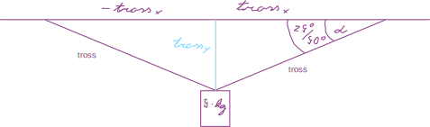

## Mehaanika

### Reeglid

#### Ühtlaselt muutuv liikumine

##### Vahemaa

$$vahemaaLõpp = vahemaaAlgus + algKiirus * aeg + \frac{kiirendus * aeg ^ 2}{2}$$

$$vahemaaLõpp = vahemaaAlgus + algKiirus * \frac{lõppKiirus - algKiirus}{kiirendus} + \frac{kiirendus * (\frac{lõppKiirus - algKiirus}{kiirendus}) ^ 2}{2}$$

$$vahemaa = \frac{algKiirus * lõppKiirus - algKiirus ^ 2}{kiirendus} + \frac{\frac{lõppKiirus ^ 2 - 2 * lõppKiirus * algKiirus + algKiirus ^ 2}{kiirendus}}{2}$$

$$vahemaa = \frac{algKiirus * lõppKiirus - algKiirus ^ 2}{kiirendus} + \frac{lõppKiirus ^ 2 - 2 * lõppKiirus * algKiirus + algKiirus ^ 2}{2 * kiirendus}$$

$$vahemaa = \frac{2 * algKiirus * lõppKiirus - 2 * algKiirus ^ 2 + lõppKiirus ^ 2 - 2 * lõppKiirus * algKiirus + algKiirus ^ 2}{2 * kiirendus}$$

$$vahemaa = \frac{lõppKiirus ^ 2 - algKiirus ^ 2}{2 * kiirendus}$$

##### Kiirendus

$$kiirendus = \frac{lõppkiirus - algkiirus}{aeg} === \frac{lõppkiirus ^ 2 - algkiirus ^ 2}{2 * vahemaa}$$

#### Raskuskiirendus

$$g = G * \frac{M}{R ^ 2}$$
$G = 6.67 * 10 ^ {-11} \frac{N * m ^ 2}{kg ^ 2}$ Maa mass olevat 6 * 10^24^ kg. Maa raadius olevat 6.4 * 10^6^ m.

```{r}
g <- 6.67 * 10 ^ (-11) * (6 * 10 ^ 24) / (6.4 * 10 ^ 6) ^ 2

```

g = `r g` $* \frac{m}{s ^ 2}$

#### Rõhk

rõhk = mass * *g*

#### Hõõrdejõud

hõõrdeJõud = hõõrdeTegur * rõhk

### Ülesanded

#### Autobuss

##### Ülesande püstitus

Peatuskohast väljuva autobussi liikumist kirjeldab esimese 10 s jooksul võrrand *s* = 0,38*t^2^*, kus *s* on teepikkus meetrites ja *t* aeg sekundites.

a) Kui suur on bussi kiirendus?

b) Kui pika tee läbib buss esimese 10 sekundiga?

c) Kui suure kiiruse saavutab buss selle aja jooksul?

##### Lahendus

a) $,76 * \frac{m}{s^2}$.

b) 38 * m.

c) $7,6 * \frac{m}{s}$.

#### Lennukikandja

##### Ülesande püstitus

Lennukikandja püüde- ja pidurdustrossidel kulub 25 tonnise hävitaja peatamiseks 2 sekundit. Pidurdamine algab, kui hävitaja kiirus on 240 km/h^[Imeline teadus, 2013, nr 9]

a) Kui suur kiirendus mõjub piloodile pidurdamise ajal?

b) Mitmekordne raskuskiirendus see on?

c) Kui pikk on hävitaja pidurdusteekond?

d) Kui suur on pidurdav jõud?

##### Lahendus

$240 * \frac{km}{h} === \frac{240 * (1000 * m)}{3600 * s} === \frac{200*m}{3*s}$

a) Mõjuv kiirendus on $-\frac{100 * m}{3 * s ^ 2}$.

b) Raskuskiirenduse suhte arvutan selliselt:

```{r}
accelerationOfPlaneToG = 100 / 3 / g
```

See on `r accelerationOfPlaneToG`-kordne raskuskiirendus.

c) $\frac{200 * m}{3 * s} * 2 * s + \frac{-\frac{100 * m}{3 * s ^ 2} * (2 * s) ^ 2}{2} === \frac{400}{3} * m - \frac{200}{3} * m === \frac{200}{3} * m$

d) $\frac{2500000}{3} * N$ See on ligikaudu:

```{r}
breakingForce = 25 * 1000 * (-100 / 3)
```

`r breakingForce` N.

#### Autod

##### Ülesande püstitus

Maanteel sõidab veoauto, mille pikkus on 16 meetrit ja kiirus 72 km/h. Veoauto taha jõuab sõiduauto, mille kiirus on 90 km/h ja pikkus 4 m. Sõiduauto juht soovib sooritada möödasõitu. Nii möödasõidu alustamisel kui ka lõpetamisel peab autode vaheline pikivahe olema 75 m.

a) Kui kaua kulub möödasõiduks aega?

b) Kui pikk on möödasõidumaa?

c) Kui vastu tuleb auto, mille kiirus on 90 km/h, siis kui kaugel peaks see möödasõidu alguses olema, et mööda sõitev sõiduauto oleks sellega kohakuti parajasti möödasõidu lõppedes?

##### Lahendus

Jätan arvestamata, et möödasõiduks on vaja ümberreastuda ja lihtsuse mõttes kujutan ette, et lühem auto justkui läbiks pikema auto. Tähistan möödasõidu vahemaa lühema auto jaoks meetrites *x*'ga. Sel juhul on pikema auto jaoks möödasõidu vahemaa *x - 79* m, kui võrdlen autode esiotsi, sest pikivahe peab olema 75 m ja lühema auto pikkus on neli meetrit. Möödasõidu lõppedes on mõlemal kulunud võrdne ajavahemik. Teisendan lühema auto kiiruse rahvusvahelistesse ühikutesse:

```{r}
speedOfShorterVehicle = 90 * 1000 / 3600
```

$$90 * \frac{km}{h} === 90 * \frac{1000 * m}{3600 * s} === 25 * \frac{m}{s}$$

Teen sama pikema auto kiirusega:

```{r}
speedOfLongerVehicle = 72 * 1000 / 3600
```

$$72 * \frac{km}{h} === 72 * \frac{1000 * m}{3600 * s} === 20 * \frac{m}{s}$$

Lühema auto möödasõidu ajavahemik on $\frac{x * m}{`r speedOfShorterVehicle`` 90 * \frac{1000 * m}{3600 s}`} === \frac{x}{25} * s$. Pikema auto möödasõidu ajavahemik on:

```{r}
lengthOfShorterVehicle = 4
distanceBetweenVehicles = 75
lengthOfLongerVehicle = 16
subtractablesForLongerVehicle = 2 * distanceBetweenVehicles + lengthOfShorterVehicle + lengthOfLongerVehicle
subtractablesForLongerVehicle
```

$\frac{(x - `r subtractablesForLongerVehicle`) * m}{`r speedOfLongerVehicle` * \frac{m}{s}} === \frac{(x - `r subtractablesForLongerVehicle`)}{`r speedOfLongerVehicle`} * s$. Et need ajavahemikud on võrdsed, koostan võrrandi:

$$\frac{x}{`r speedOfShorterVehicle`} * s === \frac{x - `r subtractablesForLongerVehicle`}{`r speedOfLongerVehicle`} * s$$

Lahendan selle võrrandi:

$$`r speedOfLongerVehicle` * x === `r speedOfShorterVehicle` * x - `r subtractablesForLongerVehicle` * `r speedOfShorterVehicle`$$

$$5 * x === 4250$$

$$x = 850$$

Sain just teada, et möödasõidu vahemaa lühema auto jaoks on 850 m. Selle vahemaa läbiks lühem auto:

```{r}
distanceOfShorterVehicle = 850
timeOfShorterVehicle = distanceOfShorterVehicle / speedOfShorterVehicle
```

`r timeOfShorterVehicle` sekundiga. Pikema auto jaoks on möödasõidu vahemaa:

```{r}
distanceOfLongerVehicle = (distanceOfShorterVehicle - subtractablesForLongerVehicle)
```

`r distanceOfLongerVehicle` meetrit, mille pikem auto läbib:

```{r}
timeOfLongerVehicle = distanceOfLongerVehicle / speedOfLongerVehicle
```

`r timeOfLongerVehicle` sekundiga. Et need ajavahemikud on võrdsed, on võrrand õigesti lahendatud.

*c*-osa jaoks eeldan, et *kohakuti* tähendab, et autode esiotsad on kohakuti, sest vastutuleva auto pikkus pole teada. Nii möödasõitev kui vastutulev auto peavad esiotste kohakuti jõudmiseks läbima võrdse vahemaa, sest kummagi auto kiirus on sama. Seetõttu peab vastutulev auto olema möödasõitva auto möödasõidu alguses möödasõitva auto esiotsast

```{r}
distanceOfIncomingVehicle = 2 * distanceOfShorterVehicle
```

`r distanceOfIncomingVehicle` meetri kaugusel.

##### Lahendid

a) `r timeOfLongerVehicle` sekundit

b) `r distanceOfShorterVehicle` meetrit

c) `r distanceOfIncomingVehicle` meetrit

#### Pall

##### Ülesande püstitus

Poiss viskas palli vertikaalselt üles ja püüdis selle samas kohas 2s pärast kinni. Kui kõrgele lendas pall?

##### Lahendus

Palli lennu kestus oli kaks sekundit. Eeldan, et poiss viskas selle palli üles Maal ja seetõttu mõjub pallile gravitatsioonijõud. Palli lähtekoha loen nulliks sõltumata sellest, kui kõrgel asub palli ja käe irdumiskoht. Sellise lennu trajektoori kirjeldab funktsioon, mille graafik on parabool. Kuna parabooli haarad on üksteise suhtes peegelpildis, siis võime järeldada nii palli tõusmine kui laskumine kumbki kestsid eraldi ühe sekundi. Vaja on arvutada selle parabooli haripunkti ordinaadi väärtus. Kiiruse komponendi arvutamiseks tõusva palli jaoks kasutan valemit $-g === \frac{v - v_{0}}{t}$, kus  *g* on Maa raskuskiirendust, *v* palli lõppkiirus, $v_{0}$ palli algkiirus ja *t* aeg. Palli lõppkiirus on null. Seega on palli algkiiruse komponent avaldatav valemiga $v_{0} = g * t$. Palli maksimaalne kõrgus on seega arvutatav valemiga:

$$maxHeightOfBall = g * t * t - \frac{g * t ^ {2}}{2}$$

Kuna aeg on üks sekund, siis on palli maksimaalne kõrgus meetrites:

$$maxheightOfBall = g - \frac{g}{2} === \frac{g}{2}$$

Ligikaudse väärtuse arvutamiseks topin sellesse valemisse teadaolevad väärtused:

```{r}
maxHeightOfBall = g / 2
maxHeightOfBall
```

#### Turvavöö

##### Ülesande püstitus

Turvavööde katsetamisel sõidab auto vastu seina kiirusega 90 km/h ja peatub 0,1 s jooksul. Juhi kohal istub nukk massiga 75 kg. Kui suurele jõule peab turvavöö vastu pidama?

##### Lahendus

Esmalt on vaja teisendada auto algkiirus 90 km/h rahvusvahelisse mõõtühikute süsteemi:

```{r}
speed = 90 * 1000 / 3600
```

Auto algkiirus on $`r speed` \frac{m}{s}$.

Arvutan auto kiirenduse:

```{r}
acceleration = (0 - speed) / .1
```

Auto kiirendus on $`r acceleration` \frac{m}{s^2}$.

Viimaks arvutan jõu:

```{r}
force = -(acceleration * 75)
```

Turvavöö peab vastu pidama jõule `r force` N.

#### Äkkpidurdus

##### Ülesande püstitus

Auto sõidab kiirusega 50 km/h. Peale äkkpidurdust rattad blokeeruvad ja auto libiseb 15 m, kuni jääb seisma. Kui kaugele libiseb sama auto blokeerunud ratastega juhul, kui auto kiirus enne pidurdamist on 150 km/h?

##### Lahendus

Teisendan auto kiiruse 50 km/h rahvusvahelisse mõõtühikute süsteemi:

```{r}
speed50 = 50 * 1000 / 3600
```

Auto kiirus 50 km/h on teisendatuna $`r speed50` \frac{m}{s}$.

Kui miski libiseb, on tegemist hõõrdumisega. Hõõrdumise arvestamiseks on vaja teada hõõrdetegurit. Selle saab arvutada kiirenduse kaudu. Nii et järgmisena arvutan auto kiirenduse pidurdamise ajal algkiiruse 50 km/h puhul nullkiiruseni:

```{r}
acceleration50 = (0 - speed50 ^ 2) / 2 / 15
```

Selle auto kiirendus kiiruselt 50 km/h nullkiiruseni on $`r acceleration50` * \frac{m}{s ^ 2}$.

Autole mõjub horisontaalsihis pidurdusjõud ja seda tasakaalustab hõõrdejõud. Selle võrduse alusel arvutan hõõrdeteguri, mis on sama objekti ja sama pinna puhul alati sama:

```{r}
frictionFactor = acceleration50 / g
```

Selle auto ja selle pinna omavaheline hõõrdetegur on `r frictionFactor`.

Auto kiirus 150 km/h on teisendatuna rahvusvaheliste mõõtühikute süsteemi

```{r}
speed150 = 150 * 1000 / 3600
```

Nüüd, kui hõõrdetegur on teada, arvutan auto pidurduskiirenduse nullkiiruseni algkiiruse 150 km/h puhul:

```{r}
acceleration150 = frictionFactor * g
```

Auto pidurduskiirendus kiiruselt 150 km/h nullkiiruseni on $`r acceleration150` \frac{m}{s ^ 2}$.

Nüüd on kõik vajalikud andmed olemas, et arvutada auto libisemise vahemaa kiiruselt 150 km/h:

```{r}
distance150 = (0 - speed150 ^ 2) / 2 / acceleration150
```

Auto libiseb blokeerunud ratastega `r distance150` m juhul, kui auto kiirus enne pidurdamist on 150 km/h.

#### Koormaga veoauto

##### Ülesande püstitus

Mööda teed sõidab 2 tonnise koormaga veoauto. Takistust nähes juht pidurdab äkitselt, rattad blokeeruvad ja auto libiseb peatumiseni 42 m. Kui kaugele oleks veoauto libisenud ilma koormata, kui tühja veoauto mass on 5 t? Eeldada, et rehvide ja teepinna vaheline hõõrdejõud jääb samaks.

##### Lahendus

Meile pole teada algkiirus, kuid võime eeldada, et algkiirus on mõlema massi puhul sama. Kasutan valemit:

$$-algKiirus ^ 2 === vahemaa * 2 * kiirendus$$

Kiirenduse saan avaldada jõu kaudu ja sellesse valemisse asendada:

$$-algKiirus ^ 2 === vahemaa * 2 * \frac{pidurdusjõud}{mass}$$

Kuna vahemaa ja mass on esialgse juhu kohta teada, siis teen vastavad asendused:

$$-algKiirus ^ 2 === (42 * m) * 2 * \frac{pidurdusjõud}{7000 * kg}$$

Teise juhu puhul on teada üksnes mass ja vaja on arvutada vahemaa:

$$vahemaa2 = \frac{(42 * m) * 2 * \frac{pidurdusjõud}{7000 * kg}}{2 * \frac{pidurdusjõud}{5000 * kg}} === 30 * m$$

Veoauto oleks libisenud ilma koormata 30 m kaugusele, kui tühja veoauto mass on viis tonni.

#### Raskus trossi otsas

##### Ülesande püstitus

Raskus massiga 5 kg ripub kahe trossi otsas (vt joonist \@ref(fig:hanging-weight)). Kui suur on kummagi trossi pinge, kui

a) α = 25°;

b) α = 50°.


##### Lahendus

###### Üldine lahendus



Kuna algandmeid napib ja ainult ühe nurga suurus on teada, siis eeldan, et trossid on ühepikkused. Kõik kolm jõudu peavad üksteist tasakaalustama. Igal jõul on nii rõhtne kui püstine komponent. Näeme jooniselt \@ref(fig:hanging-weight-complemented), et rõhtne komponent puudub raskusjõul ning ülejäänud rõhtsad komponendid on absoluutväärtuselt ühesugused, mistõttu koostan võrrandi üksnes püstiste komponentidega:

$$(5 * kg) * g === 2 * tross * sin(\alpha)$$

Avaldan sellest võrrandist trossi pikkuse:

$$tross = \frac{5 * kg * g}{2 * sin(\alpha)}$$

```{r}
calculateForce <- function(alpha) {
  5 * g / 2 / sin(alpha)
}
```

###### a-osa

```{r}
forceA = calculateForce(25 * pi / 180)
```

Kummagi trossi pinge on `r forceA` * N, kui α = 25 °.

###### b-osa

```{r}
forceB = calculateForce(50 * pi / 180)
```

Kummagi trossi pinge on `r forceB` * N, kui α = 50 °.
