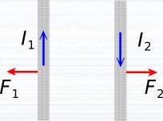
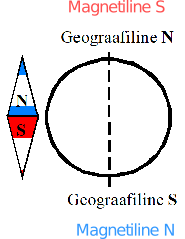
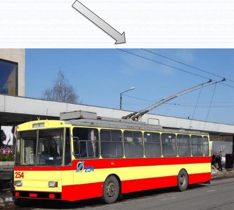

```{r setup, include=FALSE}
knitr::opts_chunk$set(echo = TRUE)
```

# Reeglid

$${jõud}_{juhtmelõigule} = {induktsioon}_{magnetväli} \cdot voolutugevus \cdot pikkus \cdot \sin({nurk}_{vooluSuund, magnetväljaSuund})$$

$${jõud}_{osakesele} = laeng \cdot kiirus \cdot {induktsioon}_{magnetväli} \cdot \sin({nurk}_{liikumissuund, \vec{{induktsioon}_{magnetväli}}})$$

```{r}
MASS_PROTON = 1.6726219e-27
MASS_ELECTRON = 9.10783E-31
ELEMENTARYCHARGE = 1.6E-19
GRAVITATION_EARTH = 6.67E-11
MASS_EARTH = 6E24
RADIUS_EARTH = 6.4E6
GRAVITATIONAL_ACCELERATION_EARTH = GRAVITATION_EARTH * MASS_EARTH / RADIUS_EARTH ^ 2
```



$$magnetvoog = magnetinduktsioon \cdot T \cdot pindala \cdot m^2 \cdot cos({nurk}_{{normaal}_{pind}, magnetväljaJõujoon})$$

Ühik võib olla veeber.

Faraday' induktsiooniseadus:

$${elektromotoorjõud}_{juhtmeKeerus} = - \frac{\Delta(magnetvoog)}{\Delta(aeg)}$$

Ühik võib olla volt.

$${ülekanne}_{trafo} = \frac{{pinge}_{primaarmähis}}{{pinge}_{sekundaarmähis}} === \frac{{keerde}_{primaarmähises}}{{keerde}_{sekundaarmähises}}$$

# Ülesanded

## Poolused

### Ülesande püstitus



Kus asub Maa magnetiline 
põhjapoolus?

A.
geograafilisel 
põhjapoolusel 

B.
geograafilisel 
lõunapoolusel

### Lahendus

*B*.

## Trolliliin

### Ülesande püstitus



Kas trollibussi kontaktliinid

A.
tõmbuvad?

B.
tõukuvad?

### Lahendus

*B*.

Sest voolud on 
vastassuunalised.

## Trollide kontaktliin

### Ülesande püstitus

Trollide kontaktliinis võib alalisvoolu tugevus ulatuda 5000 amprini. Kui suur jõud mõjub sellisel juhul kahe 1 meetri pikkuse juhtmelõigu vahel, kui juhtmete vaheline kaugus on 80 cm?

### Lahendus

Jõu arvutamiseks on vaja kummagi juhtme voolutugevus omavahel esmalt korrutada. Selle tehte tulemus on 25e6 * A^2^. Voolutugevuste korrutis tuleb seejärel korrutada võrdeteguriga ja tulemuseks on 5 * N. Lõpuks tuleb arvutatud jõud jagada juhtmetevahelise kaugusega ja tulemuseks on 6.25 * N.

6.25 * N suurune jõud mõjub sellisel juhul kahe 1 * m pikkuse juhtmelõigu vahel, kui juhtmete vaheline kaugus on 80 * cm.

## Sirgjuhe

### Ülesande püstitus

Sirgjuhe, mille pikkus on 20 cm, moodustab homogeense magnetvälja induktsioonijoontega nurga 60°. Kui juhet läbib 0,15 A tugevune vool, mõjutab magnetväli seda jõuga 15 mN. Leida magnetinduktsiooni väärtus.

### Lahendus

$\frac{10}{\sqrt{3}} \cdot T$ on magnetinduktsiooni väärtus.

Lasen välja arvutada ka magnetinduktsiooni ebatäpse väärtuse:

```{r}
15e-3 / 15e-2 / 20e-2 / sin(60 * pi / 180)
```

## Homogeenne magnetväli

### Ülesande püstitus

Leida homogeenses magnetväljas risti induktsioonijoontega liikuva prootoni ja elektroni trajektoori raadiused, kui nad liiguvad kiirusega 35 Mm/s ning magnetinduktsioon on 0,5 T.

### Lahendus

Raadiuse saab avaldada mitme valemi kombinatsioonist. Kiirendusjõud on massi ja kiirenduse korrutis. Kesktõmbekiirendus on kiiruse ruudu ja raadiuse suhe. Jõudu osakesele saab arvutada ka laengu, kiiruse, magnetvälja induktsiooni ning osakese liikumissuuna ja magnetvälja induktsiooni vahelise nurga siinuse korrutisena. See kompott kokku raadiuse arvutamiseks on selline:

```{r}
radiusOfProton = MASS_PROTON * 35e6 ^ 2 / (ELEMENTARYCHARGE * 35e6 * .5 * sin(pi / 2))
radiusOfElectron = MASS_ELECTRON * 35e6 ^ 2 / (ELEMENTARYCHARGE * 35e6 * .5 * sin(pi / 2))
```

`r radiusOfProton` * m on homogeenses magnetväljas risti induktsioonijoontega liikuva prootoni raadius, kui see liigub kiirusega $35 * \frac{Mm}{s}$ ning magnetinduktsioon on .5 * T.

`r radiusOfElectron` * m on homogeenses magnetväljas risti induktsioonijoontega liikuva elektroni raadius, kui see liigub kiirusega $35 * \frac{Mm}{s}$ ning magnetinduktsioon on .5 * T.

## Osakeste sattumine magnetvälja

### Ülesande püstitus

Kaks ühesuguse laenguga, kuid erineva massiga osakest liiguvad samas suunas ühesu-
guse kineetilise energiaga. Osakesed satuvad magnetvälja, kus nad liiguvad mööda ringjooni.
Ringjoonte raadiuste suhe on 42,9. Milline on osakeste masside suhe?

### Lahendus

Kineetiline energia on väljendatav valemiga:

$$energia = \frac{mass \cdot kiirus ^ 2}{2}$$

Kirjas on, et osakeste kineetilised energiad on võrdsed. Seega jääb järele masside ja kiiruste ruutude korrutiste võrdsus:

$${mass}_{1} \cdot {kiirus}_{1} ^ 2 === {mass}_{2} \cdot {kiirus}_{2} ^ 2$$

Sellest võrdusest avaldan masside suhte:

$$\begin{equation}
\frac{{mass}_{1}}{{mass}_2} === \frac{{kiirus}_2 ^ 2}{{kiirus}_1 ^ 2}(\#eq:volume)
\end{equation}$$

Kirjutan ka välja raadiuste suhte:

$$\frac{{raadius}_1}{{raadius}_2} === \frac{\frac{{mass}_1 \cdot {kiirus}_1 ^ 2}{laeng \cdot {kiirus}_1 \cdot {induktsioon}_{magnetväli} \cdot \sin({nurk}_{liikumissuund, \vec{{induktsioon}_{magnetväli}}})}}{\frac{{mass}_2 \cdot {kiirus}_2 ^ 2}{laeng \cdot {kiirus}_2 \cdot {induktsioon}_{magnetväli} \cdot \sin({nurk}_{liikumissuund, \vec{{induktsioon}_{magnetväli}}})}} === \frac{{mass}_1 \cdot {kiirus}_1}{{mass}_2 \cdot {kiirus}_2}$$

Oletan, et ${raadius}_1$ on suurem, seega:

$${raadius}_1 = 42.9 \cdot {raadius}_2$$

Järgnevalt avaldan suurema raadiusega liikuva osakese kiiruse:

$${kiirus}_1 = \frac{42.9 \cdot {raadius}_2 \cdot {mass}_2 \cdot {kiirus}_2}{{raadius}_2 \cdot {mass}_1} === \frac{42.9 \cdot {mass}_2 \cdot {kiirus}_2}{{mass}_1}$$

Siinkohal asendan viimatiavaldatud suurema raadiusega liikuva osakese kiiruse võrdusesse \@ref(eq:volume):

$$\frac{{mass}_{1}}{{mass}_2} === \frac{{kiirus}_2 ^ 2}{(\frac{42.9 \cdot {mass}_2 \cdot {kiirus}_2}{{mass}_1}) ^ 2} === \frac{{kiirus}_2 ^ 2}{\frac{42.9 ^ 2 \cdot {mass}_2 ^ 2 \cdot {kiirus}_2 ^ 2}{{mass}_1 ^ 2}} === \frac{{mass}_1 ^ 2}{42.9 ^ 2 \cdot {mass}_2 ^ 2}$$

Järgnevalt avaldan arvväärtuse:

$$1848.99 === \frac{{mass}_2 \cdot {mass}_1 ^ 2}{{mass}_1 \cdot {mass}_2 ^ 2} === \frac{{mass}_1}{{mass}_2}$$

1848.99 on osakeste masside suhe.

## Horisontaalne juhe

### Ülesande püstitus

Horisontaalne juhe, mille pikkus on 735 mm ning mass 12 g ja mida läbib 8 A tugevune vool, püsib liikumatuna homogeenses magnetväljas, mille magnetinduktsiooni jooned on risti juhtmega. Leida magnetinduktsiooni arvväärtus.

### Lahendus

Ilmselt mõjub juhtmele gravitatsioonijõud. Seetõttu on arvutuskäik selline:

```{r}
library(Ryacas)
equality = paste(12e-3 * GRAVITATIONAL_ACCELERATION_EARTH, "== induction *", 8 * 735e-3 * sin(pi / 2), sep = " ")
induction = eval(parse(text = yac_str(y_rmvars(paste("Solve(", equality, ", induction)", sep ="")))))
```

`r induction` * T on magnetinduktsiooni arvväärtus.

## Prooton

### Ülesande püstitus

Kui suur jõud mõjub magnetväljas induktsioonijoontega risti liikuvale prootonile, kui magnetinduktsioon on 1,2 T ja prootoni kiirus on 20Mm/s?

### Lahendus

Arvutuskäik:

```{r}
forceOnProton = ELEMENTARYCHARGE * 20e6 * 1.2 * sin(pi / 2)
```

`r forceOnProton` * N suurune jõud mõjub magnetväljas induktsioonijoontega risti liikuvale prootonile, kui magnetinduktsioon on 1.2 * T ja prootoni kiirus on $20 \cdot \frac{Mm}{s}$.

## Elektron

### Ülesande püstitus

Elektron liigub homogeenses magnetväljas, mille magnetinduktsioon on 40 mT, mööda ringjoont raadiusega 3 mm. Kui suur on elektroni kiirus ja kineetiline energia?

### Lahendus

Arvutuskäik:

$$\frac{{MASS}_{ELEKTRON} \cdot kiirus ^ 2}{raadius} === {LAENG}_{ELEKTRON} \cdot kiirus \cdot {induktsioon} * sin({nurk}_{liikumissuund, \vec{{induktsioon}}})$$

```{r}
velocity = 3e-3 * ELEMENTARYCHARGE * 40e-3 * sin(pi / 2) / MASS_ELECTRON
energy = MASS_ELECTRON * velocity ^ 2 / 2
```

$`r velocity` \cdot \frac{m}{s}$ on elektroni kiirus.

`r energy` * J on elektroni kineetiline energia.

## Generaator

### Ülesande püstitus

Generaatori mähise ühe keeru pindala on 20 cm^2^ ja mähises on keerdusid 400. Mähis asetseb magnetväljas magnetinduktsiooniga 1,0 mT.

a) Kui suur on üht keerdu läbiv magnetvoog, kui magnetväli läbib keerdu risti pinnaga?

b) Kui suur on sellisel juhul tervet mähist läbiv magnetvoog?

c) Mähis pannakse pöörlema kiirusega 3000 pööret minutis. Pöörlemisel muutub mähist läbiv magnetvoog nullist maksimumini ühe poolpöörde jooksul. Kui suur on mähises tekkiv induktsiooni elektromotoorjõud?

### Lahendus

a) Arvutuskäik:

```{r}
magnetFlowInOne = 1e-3 * 20e-4 * cos(0)
```

`r magnetFlowInOne`* Wb on üht keerdu läbiv magnetvoog, kui magnetväli läbib keerdu risti pinnaga.

b) 8e-4 * Wb on sellisel juhul tervet mähist läbiv magnetvoog.

c) -8e-2 * V on mähises tekkiv induktsiooni elektromotoorjõud.

## Transformaator

### Ülesande püstitus

Transformaatori primaarmähises on 150 keerdu ja sellele rakendatakse pinge 230 V. Mitu keerdu peab olema sekundaarmähises, et sealt saadav pinge oleks 12 V?

### Lahendus

$\frac{180}{23} \cdot keerdu$ peab olema sekundaarmähises, et sealt saadav pinge oleks 12 * V.

## Neoonlambid

### Ülesande püstitus

Neoonlambid vajavad süttimiseks pinget 12 kV. Et neid saaks kasutada madalpingevõrgus pingega 230 V, tuleb vahele panna trafo. Milline peab olema selle trafo ülekandearv?

### Lahendus

$\frac{23}{1200}$ on selle trafo ülekande arv.

Lasen selle arvu ebatäpsena välja arvutada:

```{r}
23 / 1200
```

## Tramm

### Ülesande püstitus

Tramm, mille mass on 7 tonni, sõidab kiirusega 10 km/h. Trammi pidurdamiseks kulub 5 sekundit. Leida, kui suur on pidurdav jõud. Vastus esitada kahe tüvenumbri täpsusega. Lisada ühik!

### Lahendus

Arvutuskäik:

```{r}
forceOfBreaking <- -7e3 * (0 - 10e3 / 3600) / 5
```

`r signif(forceOfBreaking, digits = 2)` * N on pidurdav jõud.
