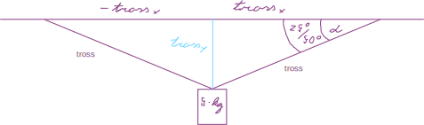
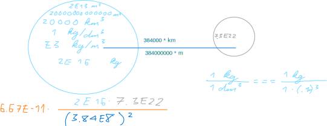
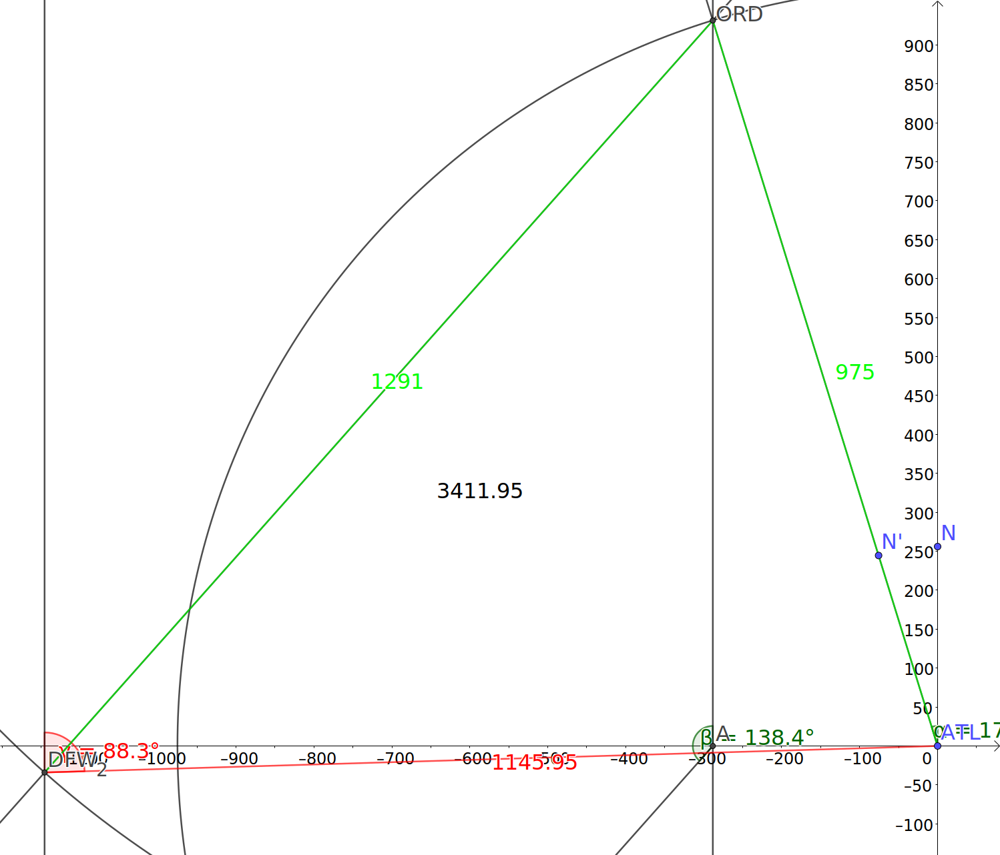
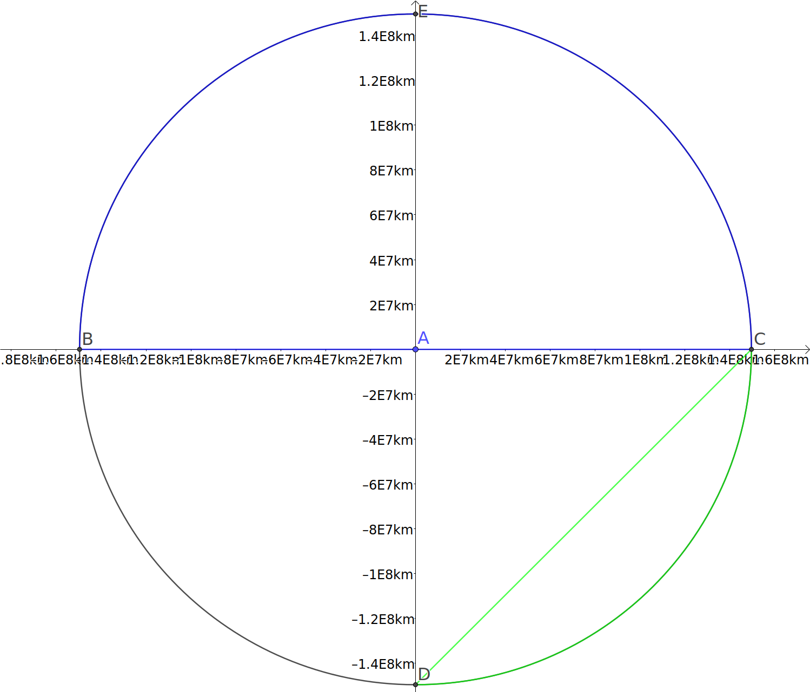
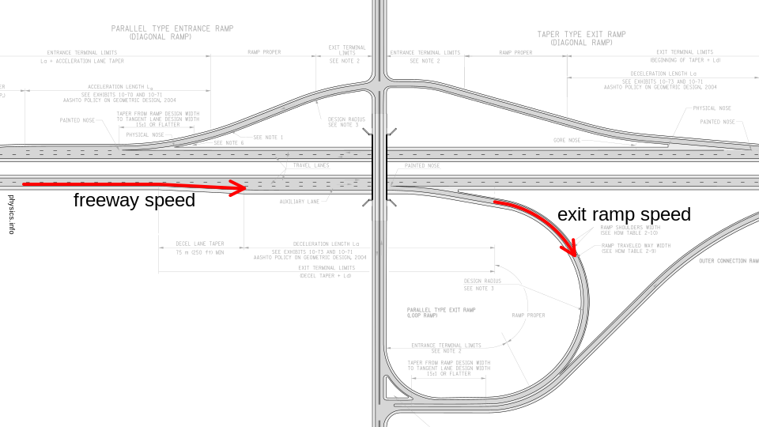

# Reeglid

## Ühikud

+----------+-----------------+--------+------------+--------------------+
| Eesliide | Kümne astendaja | Lühend | Näide      | Selgitus           |
+==========+=================+========+============+====================+
| piko-    | -12             | p      | 1 \* pN    | üks pikonjuuton    |
+----------+-----------------+--------+------------+--------------------+
| nano-    | -9              | n      | 2 \* nm    | kaks nanomeetrit   |
+----------+-----------------+--------+------------+--------------------+
| mikro-   | -6              | μ      | 3 \* μg    | kolm mikrogrammi   |
+----------+-----------------+--------+------------+--------------------+
| milli-   | -3              | m      | 4 \* mW    | neli millivatti    |
+----------+-----------------+--------+------------+--------------------+
| senti-   | -2              | c      | 5 \* cK    | viis sentikelvinit |
+----------+-----------------+--------+------------+--------------------+
| detsi-   | -1              | d      | 6 \* dA    | kuus detsiamprit   |
+----------+-----------------+--------+------------+--------------------+
| deka-    | 1               | D      | 7 \* Db    | seitse dekabitti   |
+----------+-----------------+--------+------------+--------------------+
| hekto-   | 2               | H      | 8 \* HB    | kaheksa hektobaiti |
+----------+-----------------+--------+------------+--------------------+
| kilo-    | 3               | K      | 9 \* Klx   | üheksa kiloluksi   |
+----------+-----------------+--------+------------+--------------------+
| mega-    | 6               | M      | 10 \* MJ   | kümme megadžauli   |
+----------+-----------------+--------+------------+--------------------+
| giga-    | 9               | G      | 100 \* GPa | sada gigapaskalit  |
+----------+-----------------+--------+------------+--------------------+
| tera-    | 12              | T      | .5 \* Tcd  | pool terakandelat  |
+----------+-----------------+--------+------------+--------------------+

: Ühikute eesliited

Konvertereid:

1.  (UnitConverters.net)[<https://www.unitconverters.net/volume/cubic-kilometer-to-cubic-meter.htm>]

2.  (Calculate weight of compounds and materials per volume)[<https://www.aqua-calc.com/calculate/volume-to-weight>]

```{r}
convertFromKmPerHToMPerS <- function(velocityInKmPerH) {
  (velocityInKmPerH * 1000 / 3600)
}

convertFromMiToM <- function(mi) {
  mi * 1609.344
}

convertFromFtToM <- function(ft) {
  convertFromMiToM(ft / 5280)
}
```

## Sirgjooneline liikumine

Valguse kiirus vaakumis:

```{r}
SPEED_LIGHT <- 299792458
```


Joonisel \@ref(fig:integrating-time) on kujutatud ajatelge, millele on märgitud võrdsed ajavahemikud. Võime neid ajavahemikke kujutada ka lõputult nullilähedasena. Kui need ajavahemikud kokku liita, saame koguaja:

$$\sum_{i = algus}^{\infty}(\Delta(t))_i === \int{dt} === t$$

Tuletan kiirenduse valemi jõnksutamise kaudu:

$$jõnks = \frac{d(kiirendus)}{d({t})}$$

$${d({t})} = jõnks \cdot d({kiirendus})$$

$$\int_{algkiirendus}^{kiirendus}d(kiirendus) === \int_{0}^{t}jõnks \cdot d(t)$$

$$kiirendus - algkiirendus === jõnks \cdot t$$

```{=tex}
\begin{equation}
\color{green}{\bf{kiirendus = algkiirendus + jõnks \cdot t}}
(\#eq:zeroeth-equation-of-motion-for-constant-jerk)
\end{equation}
```
Tuletan kiiruse valemi kiirenduse ja jõnksutamise kaudu:

$$kiirendus = \frac{d(kiirus)}{d(t)}$$

```{=tex}
\begin{equation}
d(kiirus) === kiirendus \cdot d(t)
(\#eq:acceleration)
\end{equation}
```
Asendan valemisse \@ref(eq:acceleration) kiirenduse valemist \@ref(eq:zeroeth-equation-of-motion-for-constant-jerk):

$$d(kiirus) === (algkiirendus + jõnks \cdot t) \cdot d(t)$$

$$\int_{algkiirus}^{kiirus}d(kiirus) === \int_{0}^{t}(algkiirendus + jõnks \cdot t) \cdot d(t)$$

$$kiirus - algkiirus === algkiirendus \cdot t + \frac{jõnks \cdot t^2}{2}$$

```{=tex}
\begin{equation}
\color{green}{\bf{kiirus = algkiirus + algkiirendus \cdot t + \frac{jõnks \cdot t^2}{2}}}
(\#eq:first-equation-of-motion-for-constant-jerk)
\end{equation}
```
Keskmine kiirus on vahemaa ja selle läbimiseks kulunud ajavahemiku suhe. Milline on hetkekiirus? Selleks tuleb jagada lõputult lühike vahemaa lõputult lühikese selle vahemaa läbimiseks kulunud ajavahemikuga:

```{=tex}
\begin{equation}
\overrightarrow{hetkekiirus} = \frac{d(\overrightarrow{vahemaa})}{d(t)}
(\#eq:momentvelocity)
\end{equation}
```
Valemist \@ref(eq:momentvelocity) avaldan vahemaa:

```{=tex}
\begin{equation}
d(\overrightarrow{vahemaa}) = \overrightarrow{hetkekiirus} \cdot d(t)
(\#eq:smallest-distance)
\end{equation}
```
Asendan valemisse \@ref(eq:smallest-distance) hetkekiiruse valemist \@ref(eq:first-equation-of-motion-for-constant-jerk) ja jätkan tuletamist:

$$d(vahemaa) === (algkiirus + algkiirendus \cdot t + \frac{jõnks \cdot t^2}{2}) \cdot d(t)$$

$$\int_{s_0}^{vahemaa}d(vahemaa) ===\\
\int_{0}^{t}(algkiirus + algkiirendus \cdot t + \frac{j \cdot t^2}{2}) \cdot d(t)$$

$$vahemaa - s_0 === algkiirus \cdot t + \frac{kiirendus \cdot t^2}{2} + \frac{j \cdot t^3}{6}$$

```{=tex}
\begin{equation}
\color{green}{\bf{vahemaa === s_0 + algkiirus \cdot t + \frac{kiirendus \cdot t^2}{2} + \frac{j \cdot t^3}{6}}}
(\#eq:second-equation-of-motion-for-constant-jerk)
\end{equation}
```
Kogu vahemaa on integreeritud ülilühikestest vahemaa juppidest:

```{=tex}
\begin{equation}
\overrightarrow{vahemaa} = \int{d(\overrightarrow{vahemaa})}
(\#eq:whole-distance)
\end{equation}
```
Asendan valemist \@ref(eq:smallest-distance) ülilühikese ajavahemiku valemisse \@ref(eq:whole-distance):

```{=tex}
\begin{equation}
\overrightarrow{vahemaa} = \int_{alghetk}^{lõpphetk}{\overrightarrow{hetkekiirus} \cdot d(ajavahemik)}
(\#eq:whole-distance-integrated)
\end{equation}
```
Kui hetkekiirus on $\color{red}{\textbf{konstantne}}$, siis

```{=tex}
\begin{equation}
\overrightarrow{vahemaa} = \overrightarrow{hetkekiirus} \cdot \int_{alghetk}^{lõpphetk}{d(ajavahemik)} === \overrightarrow{hetkekiirus} \cdot ajavahemik + \overrightarrow{\underbrace{lähe}_{konstant}}
(\#eq:whole-distance-with-constant-momentvelocity)
\end{equation}
```


Kui ülilühikese vahemaa ja selle läbimiseks kulunud ülilühikese ajavahemiku suhe on kiirus, mis näitab, kui kiiresti asukoht muutub ajas, siis kiiruse muutumist ajas näitab kiirendus:

```{=tex}
\begin{equation}
\overrightarrow{kiirendus} = \lim_{\Delta {ajavahemik} \to 0} \frac{\Delta {\overrightarrow{kiirus}}}{\Delta {ajavahemik}} === \frac{d(\overrightarrow{kiirus})}{d(ajavahemik)}
(\#eq:acceleration-by-velocity)
\end{equation}
```
Asendan valemist \@ref(eq:momentvelocity) valemisse \@ref(eq:acceleration-by-velocity) kiiruse:

```{=tex}
\begin{equation}
\overrightarrow{kiirendus} = \frac{d(\frac{d(\overrightarrow{vahemaa})}{d(ajavahemik)})}{d(ajavahemik)}
(\#eq:acceleration-by-distance-and-time)
\end{equation}
```
Avaldan valemist \@ref(eq:acceleration-by-velocity) üliväikese kiiruse:

```{=tex}
\begin{equation}
d(\overrightarrow{kiirus}) = \overrightarrow{kiirendus} \cdot {d(ajavahemik)}
(\#eq:momentvelocity-by-acceleration-and-time)
\end{equation}
```
Kui kiirendus on $\color{red}{\textbf{konstantne}}$, siis

```{=tex}
\begin{equation}
{kiirus} = \int{\overrightarrow{kiirendus} \cdot {d(ajavahemik)}} === \overrightarrow{kiirendus} \cdot \int{d(ajavahemik)} ===\\
\overrightarrow{kiirendus} \cdot ajavahemik + \underbrace{lähte\_kiirus}_{konstant}
(\#eq:velocity-by-integration)
\end{equation}
```
Keskmise kiirenduse saame arvutada nii:

```{=tex}
\begin{equation}
{keskmine\_kiirendus} = \frac{\overrightarrow{{kiirus}_{lõpp}} - \overrightarrow{{kiirus}_{algus}}}{ajavahemik}
(\#eq:keskmine-kiirendus)
\end{equation}
```
Kui kiirendus on $\color{red}{\textbf{konstantne}}$, siis asendades valemisse \@ref(eq:whole-distance-integrated) kiiruse valemist \@ref(eq:keskmine-kiirendus):

```{=tex}
\begin{equation}
\overrightarrow{vahemaa} = \int{\overrightarrow{kiirendus_{keskmine}} \cdot {ajavahemik} + \overrightarrow{alg\_kiirus} \cdot d(ajavahemik)} ===\\
\int{\overrightarrow{kiirendus_{keskmine}} \cdot {ajavahemik} \cdot d(ajavahemik)} + \int{\overrightarrow{alg\_kiirus} \cdot d(ajavahemik)} ===\\
\overrightarrow{kiirendus_{keskmine}} \cdot \int{{ajavahemik} \cdot d(ajavahemik)} + \overrightarrow{alg\_kiirus} \cdot \int{d(ajavahemik)} === \\
\overrightarrow{kiirendus_{keskmine}} \cdot \frac{ajavahemik^2}{2} + \overrightarrow{alg\_kiirus} \cdot ajavahemik + \underbrace{\overrightarrow{lähe}}_{konstant}
(\#eq:vahemaa-kiirenduse-kaudu)
\end{equation}
```
Avaldan valemist \@ref(eq:keskmine-kiirendus) ajavahemiku:

```{=tex}
\begin{equation}
{ajavahemik} = \frac{\overrightarrow{{kiirus}_{lõpp}} - \overrightarrow{{kiirus}_{algus}}}{\overrightarrow{{kiirendus}_{keskmine}}}
(\#eq:ajavahemik)
\end{equation}
```
Kui lähe on null, siis lähtuvalt valemist \@ref(eq:vahemaa-kiirenduse-kaudu)

```{=tex}
\begin{equation}
\overrightarrow{vahemaa} = \overrightarrow{kiirendus_{keskmine}} \cdot \frac{ajavahemik^2}{2} + \overrightarrow{{kiirus}_{algus}} \cdot ajavahemik + 0 ===\\ \overrightarrow{kiirendus_{keskmine}} \cdot \frac{(\frac{\overrightarrow{{kiirus}_{lõpp}} - \overrightarrow{{kiirus}_{algus}}}{\overrightarrow{{kiirendus}_{keskmine}}})^2}{2} + \overrightarrow{{kiirus}_{algus}} \cdot \frac{\overrightarrow{{kiirus}_{lõpp}} - \overrightarrow{{kiirus}_{algus}}}{\overrightarrow{{kiirendus}_{keskmine}}} ===\\ \frac{\overrightarrow{{kiirus}_{lõpp}}^2 - 2 \cdot \overrightarrow{{kiirus}_{lõpp}} \cdot \overrightarrow{{kiirus}_{algus}} + \overrightarrow{{kiirus}_{algus}}^2}{2 \cdot \overrightarrow{{kiirendus}_{keskmine}}} + \frac{\overrightarrow{{kiirus}_{algus}} \cdot \overrightarrow{{kiirus}_{lõpp}} - \overrightarrow{{kiirus}_{algus}}^2}{\overrightarrow{{kiirendus}_{keskmine}}} ===\\ \frac{\overrightarrow{{kiirus}_{lõpp}}^2 - \overrightarrow{{kiirus}_{algus}}^2}{2 \cdot \overrightarrow{{kiirendus}_{keskmine}}}
(\#eq:vahemaa-kiiruste-ja-kiirenduse-kaudu)
\end{equation}
```
Muutuva kiirenduse valem:

```{=tex}
\begin{equation}
\overrightarrow{kiirenduse\_muut} = \frac{d(\overrightarrow{kiirendus_{keskmine}})}{d(ajavahemik)} === \frac{kiirendus_{lõpp} - kiirendus_{algus}}{ajavahemik}
(\#eq:kiirenduse-muut)
\end{equation}
```
Keskmise kiiruse valem:

```{=tex}
\begin{equation}
\overline{kiirus} = \frac{\Delta(vahemaa)}{\Delta(ajavahemik)} === \frac{\overrightarrow{kiirus_{algus}} + \overrightarrow{kiirus_{lõpp}}}{2}
(\#eq:mean-velocity)
\end{equation}
```
Pythagorase teoreem:

```{=tex}
\begin{equation}
|c| = \sqrt{|kaatet_2|^2 + |kaatet_2|^2}
(\#eq:pythagorean)
\end{equation}
```
Tõusunurk:

```{=tex}
\begin{equation}
\alpha = atan(\frac{nihe_{vertikaalne}}{\Delta(x)})
(\#eq:tangent-angle)
\end{equation}
```

Nurgateisendus:

```{=tex}
\begin{equation}
nurk_{rad} = \frac{nurk° \cdot \pi}{180°}
(\#eq:angle-from-degrees-to-radians)
\end{equation}
```

Koosinusteoreem:

```{=tex}
\begin{equation}
|a| = \sqrt{|b|^2 + |c|^2 - 2 \cdot |b| \cdot |c| \cdot cos(nurk_{b, c})}
(\#eq:cosine-theorem)
\end{equation}
```

## Impulss

$$impulss = mass * kiirus$$

$$kehadeSüsteemiKoguImpulss = \sum{süsteemiKehaImpulss}$$

See on alati jääv.

Elastne põrge:

$$mass_1 * \vec{kiirus_1} + mass_2 * \vec{kiirus_2} === mass_1 * \vec{kiirus_1 ^ \prime} + mass_2 + \vec{kiirus_2 ^ \prime}$$

Energia jäävuse seadus:

$$\frac{mass_1 * \vec{kiirus_1} ^ 2}{2} + \frac{mass_2 * \vec{kiirus_2} ^ 2}{2} === \frac{mass_1 * (\vec{kiirus_1} ^ \prime) ^ 2}{2} + \frac{mass_2 * (\vec{kiirus_2} ^ \prime) ^ 2}{2}$$

Mitteelastne põrge:

$$mass_1 * \vec{kiirus_1} + mass_2 * \vec{kiirus_2} === (mass_1 + mass_2) * \vec{kiirus ^ \prime}$$

$$jõuImpulss = impulsiMuut$$

$$jõud * ajavahemik === impulsiMuut$$

## Ringliikumine

Maa keskmine raadius:

```{r}
RADIUS_EARTH <- 6.371E6
```

Ringjoone pikkus:

```{=tex}
\begin{equation}
pikkus_{ringjoon} = 2 \cdot \pi \cdot raadius
(\#eq:length-of-circle)
\end{equation}
```

```{=tex}
\begin{equation}
\vec{{kiirus}_{joon}} = \frac{{pikkus}_{kaar}}{ajavahemik}
(\#eq:line-velocity)
\end{equation}
```

$$\vec{{kiirus}_{nurk}} = \frac{nurk}{ajavahemik}$$

$$\vec{{kiirus}_{joon}} = \vec{{kiirus}_{nurk}} * raadius$$

$$\vec{{kiirendus}_{kesktõmme}} = \frac{\vec{{kiirus}_{joon}} ^ 2}{raadius}$$

$${moment}_{inerts} = mass * raadius ^ 2$$

Suund kruvireegli järgi:

$${moment}_{\vec{impulss}} = \vec{impulss} * raadius === mass * \vec{{kiirus}_{joon}} * raadius === mass * \vec{{kiirus}_{nurk}} * raadius ^ 2$$

$${moment}_{\vec{impulss}} = \vec{{kiirus}_{nurk}} * {moment}_{inerts}$$

Suletud süsteemi koguimpulsimoment on jääv.

## Gravitatsioonijõud

$G = 6.67 * 10 ^ {-11} \frac{N * m ^ 2}{kg ^ 2}$ Maa mass olevat 6 \* 10^24^ kg. Maa raadius olevat 6.4 \* 10^6^ m.

```{r}
gravitationalConstant = 6.67E-11
```

$$gravitatsiooniJõud = GRAVITATSIOONI\_KONSTANT * \frac{mass1 * mass2}{punktmassidevahelinekaugus^2}$$

$$g = G * \frac{M}{R ^ 2}$$

```{r}
g <- gravitationalConstant * (6 * 10 ^ 24) / (6.4 * 10 ^ 6) ^ 2
```

g = `r g` $* \frac{m}{s ^ 2}$

Selline valem kehtib objekti kohta, mis on täpselt Maa pinnal. Kui see asub pinna sees või selle kohal, siis tuleb kasutada sellist valemit:

$$gravitatsiooniKiirendus = GRAVITATSIOONI\_KONSTANT * \frac{maaMass}{(maaRaadius + kõrgusMaaPinnast) ^ 2}$$

## Rõhk

rõhk = mass \* *g*

## Hõõrdejõud

hõõrdeJõud = hõõrdeTegur \* rõhk

```{r}
calculateDistanceOfDecceleration <- function(velocity, frictionFactor) {
  ((velocity) ^ 2) / 2 / g / frictionFactor
}
```

## Töö

$$töö = \vec{jõud} * \vec{nihe} * cos(nurk_{\vec{nihe}, \vec{jõud}})$$

$$energia_{potentsiaalne} = mass * \vec{gravitatsiooniKiirendus} * kõrgus$$

Välisjõudude töö koorma tõstmisel võrdub koorma potentsiaalse energia muuduga:

$$töö = potentsiaalneEnergia_2 - potentsiaalneEnergia_1$$

Suletud süsteemi mehaaniline koguenergia on jääv:

$$energia = energia_{potentsiaalne} + energia_{kineetiline}$$

$$energia = mass * \vec{gravitatsiooniKiirendus} * kõrgus + \frac{mass * \vec{kiirus} ^ 2}{2}$$

$$võimsus = \frac{töö}{ajavahemik}$$

$${elastsusJõuEenergia}_{potentsiaalne} = \frac{jäikus * {pikkus}_{surumine} ^ 2}{2}$$

$${tegur}_{kasu} = \frac{töö}{energia}$$

## Jõumoment

$${moment}_{jõud} = jõud * raadius * sin({nurk}_{raadius, {mõjuSirge}_{jõud}})$$

Kangi tasakaal:

$${jõud}_1 * {raadius}_1 === {jõud}_2 * {raadius}_2$$

# Ülesanded

## Autobuss

### Ülesande püstitus

Peatuskohast väljuva autobussi liikumist kirjeldab esimese 10 s jooksul võrrand *s* = 0,38*t^2^*, kus *s* on teepikkus meetrites ja *t* aeg sekundites.

a)  Kui suur on bussi kiirendus?

b)  Kui pika tee läbib buss esimese 10 sekundiga?

c)  Kui suure kiiruse saavutab buss selle aja jooksul?

### Lahendus

a)  $,76 * \frac{m}{s^2}$.

b)  38 \* m.

c)  $7,6 * \frac{m}{s}$.

## Lennukikandja

### Ülesande püstitus

Lennukikandja püüde- ja pidurdustrossidel kulub 25 tonnise hävitaja peatamiseks 2 sekundit. Pidurdamine algab, kui hävitaja kiirus on 240 km/h[^1]

[^1]: Imeline teadus, 2013, nr 9

a)  Kui suur kiirendus mõjub piloodile pidurdamise ajal?

b)  Mitmekordne raskuskiirendus see on?

c)  Kui pikk on hävitaja pidurdusteekond?

d)  Kui suur on pidurdav jõud?

### Lahendus

$240 * \frac{km}{h} === \frac{240 * (1000 * m)}{3600 * s} === \frac{200*m}{3*s}$

a)  Mõjuv kiirendus on $-\frac{100 * m}{3 * s ^ 2}$.

b)  Raskuskiirenduse suhte arvutan selliselt:

```{r}
accelerationOfPlaneToG = 100 / 3 / g
```

See on `r accelerationOfPlaneToG`-kordne raskuskiirendus.

c)  $\frac{200 * m}{3 * s} * 2 * s + \frac{-\frac{100 * m}{3 * s ^ 2} * (2 * s) ^ 2}{2} === \frac{400}{3} * m - \frac{200}{3} * m === \frac{200}{3} * m$

d)  $\frac{2500000}{3} * N$ See on ligikaudu:

```{r}
breakingForce = 25 * 1000 * (-100 / 3)
```

`r breakingForce` N.

## Autod

### Ülesande püstitus

Maanteel sõidab veoauto, mille pikkus on 16 meetrit ja kiirus 72 km/h. Veoauto taha jõuab sõiduauto, mille kiirus on 90 km/h ja pikkus 4 m. Sõiduauto juht soovib sooritada möödasõitu. Nii möödasõidu alustamisel kui ka lõpetamisel peab autode vaheline pikivahe olema 75 m.

a)  Kui kaua kulub möödasõiduks aega?

b)  Kui pikk on möödasõidumaa?

c)  Kui vastu tuleb auto, mille kiirus on 90 km/h, siis kui kaugel peaks see möödasõidu alguses olema, et mööda sõitev sõiduauto oleks sellega kohakuti parajasti möödasõidu lõppedes?

### Lahendus

Jätan arvestamata, et möödasõiduks on vaja ümberreastuda ja lihtsuse mõttes kujutan ette, et lühem auto justkui läbiks pikema auto. Tähistan möödasõidu vahemaa lühema auto jaoks meetrites *x*'ga. Sel juhul on pikema auto jaoks möödasõidu vahemaa *x - 79* m, kui võrdlen autode esiotsi, sest pikivahe peab olema 75 m ja lühema auto pikkus on neli meetrit. Möödasõidu lõppedes on mõlemal kulunud võrdne ajavahemik. Teisendan lühema auto kiiruse rahvusvahelistesse ühikutesse:

```{r}
speedOfShorterVehicle = 90 * 1000 / 3600
```

$$90 * \frac{km}{h} === 90 * \frac{1000 * m}{3600 * s} === 25 * \frac{m}{s}$$

Teen sama pikema auto kiirusega:

```{r}
speedOfLongerVehicle = 72 * 1000 / 3600
```

$$72 * \frac{km}{h} === 72 * \frac{1000 * m}{3600 * s} === 20 * \frac{m}{s}$$

Lühema auto möödasõidu ajavahemik on $\frac{x * m}{`r speedOfShorterVehicle`` 90 * \frac{1000 * m}{3600 s}`} === \frac{x}{25} * s$. Pikema auto möödasõidu ajavahemik on:

```{r}
lengthOfShorterVehicle = 4
distanceBetweenVehicles = 75
lengthOfLongerVehicle = 16
subtractablesForLongerVehicle = 2 * distanceBetweenVehicles + lengthOfShorterVehicle + lengthOfLongerVehicle
subtractablesForLongerVehicle
```

$\frac{(x - `r subtractablesForLongerVehicle`) * m}{`r speedOfLongerVehicle` * \frac{m}{s}} === \frac{(x - `r subtractablesForLongerVehicle`)}{`r speedOfLongerVehicle`} * s$. Et need ajavahemikud on võrdsed, koostan võrrandi:

$$\frac{x}{`r speedOfShorterVehicle`} * s === \frac{x - `r subtractablesForLongerVehicle`}{`r speedOfLongerVehicle`} * s$$

Lahendan selle võrrandi:

$$`r speedOfLongerVehicle` * x === `r speedOfShorterVehicle` * x - `r subtractablesForLongerVehicle` * `r speedOfShorterVehicle`$$

$$5 * x === 4250$$

$$x = 850$$

Sain just teada, et möödasõidu vahemaa lühema auto jaoks on 850 m. Selle vahemaa läbiks lühem auto:

```{r}
distanceOfShorterVehicle = 850
timeOfShorterVehicle = distanceOfShorterVehicle / speedOfShorterVehicle
```

`r timeOfShorterVehicle` sekundiga. Pikema auto jaoks on möödasõidu vahemaa:

```{r}
distanceOfLongerVehicle = (distanceOfShorterVehicle - subtractablesForLongerVehicle)
```

`r distanceOfLongerVehicle` meetrit, mille pikem auto läbib:

```{r}
timeOfLongerVehicle = distanceOfLongerVehicle / speedOfLongerVehicle
```

`r timeOfLongerVehicle` sekundiga. Et need ajavahemikud on võrdsed, on võrrand õigesti lahendatud.

*c*-osa jaoks eeldan, et *kohakuti* tähendab, et autode esiotsad on kohakuti, sest vastutuleva auto pikkus pole teada. Nii möödasõitev kui vastutulev auto peavad esiotste kohakuti jõudmiseks läbima võrdse vahemaa, sest kummagi auto kiirus on sama. Seetõttu peab vastutulev auto olema möödasõitva auto möödasõidu alguses möödasõitva auto esiotsast

```{r}
distanceOfIncomingVehicle = 2 * distanceOfShorterVehicle
```

`r distanceOfIncomingVehicle` meetri kaugusel.

### Lahendid

a)  `r timeOfLongerVehicle` sekundit

b)  `r distanceOfShorterVehicle` meetrit

c)  `r distanceOfIncomingVehicle` meetrit

## Pall

### Ülesande püstitus

Poiss viskas palli vertikaalselt üles ja püüdis selle samas kohas 2s pärast kinni. Kui kõrgele lendas pall?

### Lahendus

Palli lennu kestus oli kaks sekundit. Eeldan, et poiss viskas selle palli üles Maal ja seetõttu mõjub pallile gravitatsioonijõud. Palli lähtekoha loen nulliks sõltumata sellest, kui kõrgel asub palli ja käe irdumiskoht. Sellise lennu trajektoori kirjeldab funktsioon, mille graafik on parabool. Kuna parabooli haarad on üksteise suhtes peegelpildis, siis võime järeldada nii palli tõusmine kui laskumine kumbki kestsid eraldi ühe sekundi. Vaja on arvutada selle parabooli haripunkti ordinaadi väärtus. Kiiruse komponendi arvutamiseks tõusva palli jaoks kasutan valemit $-g === \frac{v - v_{0}}{t}$, kus *g* on Maa raskuskiirendust, *v* palli lõppkiirus, $v_{0}$ palli algkiirus ja *t* aeg. Palli lõppkiirus on null. Seega on palli algkiiruse komponent avaldatav valemiga $v_{0} = g * t$. Palli maksimaalne kõrgus on seega arvutatav valemiga:

$$maxHeightOfBall = g * t * t - \frac{g * t ^ {2}}{2}$$

Kuna aeg on üks sekund, siis on palli maksimaalne kõrgus meetrites:

$$maxheightOfBall = g - \frac{g}{2} === \frac{g}{2}$$

Ligikaudse väärtuse arvutamiseks topin sellesse valemisse teadaolevad väärtused:

```{r}
maxHeightOfBall = g / 2
maxHeightOfBall
```

## Turvavöö

### Ülesande püstitus

Turvavööde katsetamisel sõidab auto vastu seina kiirusega 90 km/h ja peatub 0,1 s jooksul. Juhi kohal istub nukk massiga 75 kg. Kui suurele jõule peab turvavöö vastu pidama?

### Lahendus

Esmalt on vaja teisendada auto algkiirus 90 km/h rahvusvahelisse mõõtühikute süsteemi:

```{r}
speed = 90 * 1000 / 3600
```

Auto algkiirus on $`r speed` \frac{m}{s}$.

Arvutan auto kiirenduse:

```{r}
acceleration = (0 - speed) / .1
```

Auto kiirendus on $`r acceleration` \frac{m}{s^2}$.

Viimaks arvutan jõu:

```{r}
force = -(acceleration * 75)
```

Turvavöö peab vastu pidama jõule `r force` N.

## Äkkpidurdus

### Ülesande püstitus

Auto sõidab kiirusega 50 km/h. Peale äkkpidurdust rattad blokeeruvad ja auto libiseb 15 m, kuni jääb seisma. Kui kaugele libiseb sama auto blokeerunud ratastega juhul, kui auto kiirus enne pidurdamist on 150 km/h?

### Lahendus

Teisendan auto kiiruse 50 km/h rahvusvahelisse mõõtühikute süsteemi:

```{r}
speed50 = 50 * 1000 / 3600
```

Auto kiirus 50 km/h on teisendatuna $`r speed50` \frac{m}{s}$.

Kui miski libiseb, on tegemist hõõrdumisega. Hõõrdumise arvestamiseks on vaja teada hõõrdetegurit. Selle saab arvutada kiirenduse kaudu. Nii et järgmisena arvutan auto kiirenduse pidurdamise ajal algkiiruse 50 km/h puhul nullkiiruseni:

```{r}
acceleration50 = (0 - speed50 ^ 2) / 2 / 15
```

Selle auto kiirendus kiiruselt 50 km/h nullkiiruseni on $`r acceleration50` * \frac{m}{s ^ 2}$.

Autole mõjub horisontaalsihis pidurdusjõud ja seda tasakaalustab hõõrdejõud. Selle võrduse alusel arvutan hõõrdeteguri, mis on sama objekti ja sama pinna puhul alati sama:

```{r}
frictionFactor = acceleration50 / g
```

Selle auto ja selle pinna omavaheline hõõrdetegur on `r frictionFactor`.

Auto kiirus 150 km/h on teisendatuna rahvusvaheliste mõõtühikute süsteemi

```{r}
speed150 = 150 * 1000 / 3600
```

Nüüd, kui hõõrdetegur on teada, arvutan auto pidurduskiirenduse nullkiiruseni algkiiruse 150 km/h puhul:

```{r}
acceleration150 = frictionFactor * g
```

Auto pidurduskiirendus kiiruselt 150 km/h nullkiiruseni on $`r acceleration150` \frac{m}{s ^ 2}$.

Nüüd on kõik vajalikud andmed olemas, et arvutada auto libisemise vahemaa kiiruselt 150 km/h:

```{r}
distance150 = (0 - speed150 ^ 2) / 2 / acceleration150
```

Auto libiseb blokeerunud ratastega `r distance150` m juhul, kui auto kiirus enne pidurdamist on 150 km/h.

## Koormaga veoauto

### Ülesande püstitus

Mööda teed sõidab 2 tonnise koormaga veoauto. Takistust nähes juht pidurdab äkitselt, rattad blokeeruvad ja auto libiseb peatumiseni 42 m. Kui kaugele oleks veoauto libisenud ilma koormata, kui tühja veoauto mass on 5 t? Eeldada, et rehvide ja teepinna vaheline hõõrdejõud jääb samaks.

### Lahendus

Meile pole teada algkiirus, kuid võime eeldada, et algkiirus on mõlema massi puhul sama. Kasutan valemit:

$$-algKiirus ^ 2 === vahemaa * 2 * kiirendus$$

Kiirenduse saan avaldada jõu kaudu ja sellesse valemisse asendada:

$$-algKiirus ^ 2 === vahemaa * 2 * \frac{pidurdusjõud}{mass}$$

Kuna vahemaa ja mass on esialgse juhu kohta teada, siis teen vastavad asendused:

$$-algKiirus ^ 2 === (42 * m) * 2 * \frac{pidurdusjõud}{7000 * kg}$$

Teise juhu puhul on teada üksnes mass ja vaja on arvutada vahemaa:

$$vahemaa2 = \frac{(42 * m) * 2 * \frac{pidurdusjõud}{7000 * kg}}{2 * \frac{pidurdusjõud}{5000 * kg}} === 30 * m$$

Veoauto oleks libisenud ilma koormata 30 m kaugusele, kui tühja veoauto mass on viis tonni.

## Raskus trossi otsas

### Ülesande püstitus

Raskus massiga 5 kg ripub kahe trossi otsas (vt joonist \@ref(fig:hanging-weight)). Kui suur on kummagi trossi pinge, kui

a)  α = 25°;

b)  α = 50°.


### Lahendus

#### Üldine lahendus



Kuna algandmeid napib ja ainult ühe nurga suurus on teada, siis eeldan, et trossid on ühepikkused. Kõik kolm jõudu peavad üksteist tasakaalustama. Igal jõul on nii rõhtne kui püstine komponent. Näeme jooniselt \@ref(fig:hanging-weight-complemented), et rõhtne komponent puudub raskusjõul ning ülejäänud rõhtsad komponendid on absoluutväärtuselt ühesugused, mistõttu koostan võrrandi üksnes püstiste komponentidega:

$$(5 * kg) * g === 2 * tross * sin(\alpha)$$

Avaldan sellest võrrandist trossi pikkuse:

$$tross = \frac{5 * kg * g}{2 * sin(\alpha)}$$

```{r}
calculateForce <- function(alpha) {
  5 * g / 2 / sin(alpha)
}
```

#### a-osa

```{r}
forceA = calculateForce(25 * pi / 180)
```

Kummagi trossi pinge on `r forceA` \* N, kui α = 25 °.

#### b-osa

```{r}
forceB = calculateForce(50 * pi / 180)
```

Kummagi trossi pinge on `r forceB` \* N, kui α = 50 °.

## Läänemeri

### Ülesande püstitus

Läänemere maht on umbes 20000 km^3^. Kuu mass on 7,3 \* 10^22^ kg ja keskmine kaugus Maast 384000 km. Kui suur gravitatsioonijõud on Kuu ja Läänemere vahel?

### Lahendus



Selles ülesandes on vaja teha palju konverteerimisi. Et arvutada Kuu ja Läänemere vaheline jõud, on vaja lisaks gravitatsioonikonstandile kasutada Läänemere ja Kuu massi ning nendevahelist kaugust.

Läänemere massist pole teavitatud. Siiski on teavitatud Läänemere ruumalast. Selle konverteerin esmalt kuupmeetritesse:

```{r}
volumeOfSea = 20000 * (1000) ^ 3
```

Läänemere maht kuupmeetrites on `r volumeOfSea`.

On kindlaks tehtud, et üks kilogramm vett tasakaalustab üht liitrit vett. Kui mitu kilogrammi vett tasakaalustab üht kuupmeetrit vett?

```{r}
weightToVolume = 1 / (1 * .1 ^ 3)
```

Üht kuupmeetrit vett tasakaalustab `r weightToVolume` kg vett.

Nüüd on võimalik välja arvutada Läänemere mass:

```{r}
weightOfSea = volumeOfSea * weightToVolume
```

Läänemere mass on `r weightOfSea` kg.

Kuu keskmine kaugus maast on

```{r}
distanceBetweenCelestialbodies = 384000 * 1000
```

`r distanceBetweenCelestialbodies` m.

Nüüd on kõik vajalikud sisendid sobival kujul ja saan arvutada gravitatsioonijõu Kuu ja Läänemere vahel:

```{r}
gravitationalForce = gravitationalConstant * weightOfSea * 7.3e22 / distanceBetweenCelestialbodies ^ 2
```

Kuu ja Läänemere vahel on gravitatsioonijõud suurusega `r gravitationalForce` N.

## Orbitaaljaam

### Ülesande püstitus

Kui suurt raskuskiirendust tunnevad orbitaaljaamas asuvad astronaudid, kui orbitaaljaam on 200 km kõrgusel Maa pinnast? Maa mass on $6 \cdot 10^{24} kg$ ja raadius $6,4 \cdot 10^6 m$.

### Lahendus

```{r}
gravitationalAccelerationOfAstronauts = gravitationalConstant * 6e24 / (6.4e6 + 200 * 1000) ^ 2
```

Astronaudid tunnevad orbitaaljaamas raskuskiirendust $`r gravitationalAccelerationOfAstronauts` * \frac{m}{s^2}$.

## Veduri lähenemine ülesõidu kohale

### Ülesande püstitus

Raudtee ülesõidule läheneb vedur kiirusega 5 km/h. Tehnilise rikke tõttu on ülesõidule jäänud seisma veoauto, mille mass on neli korda väiksem veduri massist. Peale kokkupõrget lükkab vedur autot enda ees. Millise kiirusega vedur koos autoga liigub?

### Lahendus

Lähtun mitteelastse põrke valemist:

$$\vec{kiirus_{ühine}} = \frac{mass_{vedur} * \vec{kiirus_{vedur}}}{\frac{5}{4} * mass_{vedur}}$$

```{r}
commonVelocity = 4 / 5 * 5 * 1000 / 3600
```

Vedur liigub koos autoga kiirusega $`r commonVelocity` * \frac{m}{s}$.

## Röövkala

### Ülesande püstitus

5 kilogrammine röövkala ujub vees kiirusega 1 m/s. Röövkala avab suu ja neelab alla talle vastu ujunud väiksema kala, mille mass on 1 kg. Peale allaneelamist jääb röövkala seisma. Kui suure kiirusega ujus kala, mis alla neelati?

## Lahendus

Kala, kes alla neelati, ujus kiirusega $5 * \frac{m}{s}$.

## Autode kokkupõrge

### Ülesande püstitus

Kaks autot, mõlemad massiga 1000 kg, põrkavad kokku. Mõlema auto kiirus oli 20 m/s. Kui suure kiirusega ja millises suunas liiguvad kokkupõrkunud autod, kui

a)  üks auto sõitis põhja suunas ja teine lõuna suunas?

b)  üks auto sõitis põhja suunas ja teine ida suunas?

### Lahendus

a)  Autod ei liigu peale kokkupõrget.

b)  Pärast kokkupõrget liiguvad autod kirdesse. Kiiruse arvutan lähtudes mitteelastse kokkupõrke valemist ja Pythagorase teoreemist:

$$kiirus_{ühine} = \frac{\sqrt{(1000 * kg * 20 * \frac{m}{s}) ^ 2 + (1000 * kg * 20 * \frac{m}{s}) ^ 2}}{1000 * kg + 1000 * kg} === \frac{\sqrt{2 * (1000 * kg * 20 * \frac{m}{s}) ^ 2}}{2000 * kg}$$

$$kiirus_{ühine} = \frac{\sqrt{2 * 1000000 * 400 * kg ^ 2 * \frac{m ^ 2}{s ^ 2}}}{2000 * kg}$$

$$kiirus_{ühine} = \frac{1000 * 20 * kg * \frac{m}{s} * \sqrt{2}}{2000 * kg} === \frac{20000 * \frac{m}{s} * \sqrt{2}}{2000} === \frac{20 * \sqrt{2} * \frac{m}{s}}{2} === 10 * \sqrt{2} * \frac{m}{s}$$

```{r}
weight <- 1000
velocity <- 20
commonVelocity = sqrt((weight * velocity) ^ 2 + (weight * velocity) ^ 2) / (weight + weight)
commonVelocity
```

## Külmik

### Ülesande püstitus

Külmik, mille mass on 300 kg, tuleb tassida teisele korrusele. Kui palju tööd tuleb seejuures teha, kui teine korrus asub 6 m kõrgusel maapinnast? Mitu minutit saab selle energia arvel põleda elektripirn, mille võimsus on 60 W?

### Lahendus

Külmikul on nullist erinev potentsiaalne energia 6 m kõrgusel ja nulliga võrdne potentsiaalne energia 0 m kõrgusel.

```{r}
work = 300 * g * 6
```

Seejuures tuleb teha `r work` J tööd, kui teine korrus asub 6 m kõrgusel maapinnast.

```{r}
timeOfLighting = work / 60 / 60
```

`r timeOfLighting` min saab selle energia arvel põleda elektripirn, mille võimsus on 60 W.

## Aeglustusteekond

### Ülesande püstitus

Aeglustusteekond on teepikkus, mille auto läbib pidurite töölerakendumisest kuni täieliku peatumiseni. Veoauto massiga 8 t ja sõiduauto massiga 2 t sõidavad mõlemad kiirusega 90 km/h ja pidurdavad. Kui suur on kummagi auto aeglustusteekond? Hõõrdetegur asfaldi ja kummide vahel on 0,6.

### Lahendus

```{r}
velocityInMPerS = convertFromKmPerHToMPerS(90)
velocityInMPerS
distanceOfDecceleration = calculateDistanceOfDecceleration(convertFromKmPerHToMPerS(90), .6)
distanceOfDecceleration
```

Kuna aeglustusteekond ei sõltu massist, siis kummagi auto aeglustusteekond on `r distanceOfDecceleration` m.

## Paigalseisust alustamine

### Ülesande püstitus

Auto mille mass on 1,2 t, alustab paigalseisust liikumist kiirendusega 2 m/s^2^. Kui palju tööd teeb auto veojõud esimese 4 sekundi jooksul? Hõõrdumise võime jätta arvestamata.

### Lahendus

```{r}
accelerationFrom0 = 2
work = 1.2 * 1000 * accelerationFrom0 * ((accelerationFrom0 * 4) ^ 2) / 2 / accelerationFrom0
```

Auto veojõud teeb esimese 4 sekundi kestel `r work` J tööd.

## Vabalt langev keha

### Ülesande püstitus

2 kilogrammise massiga vabalt langev keha saavutab enne maapinnani jõudmist kiiruse 5 m/s. Kui suur oli raskusjõu töö keha langemisel? Kui kõrgelt langes keha?

### Lahendus

Kui kaua kukkus?

```{r}
timeOfFall = (5 - 0) / g
timeOfFall
heightOfFall = -g * timeOfFall ^ 2 / 2
workOfGravitationalForce = 0 - 2 * g * heightOfFall
```

Raskusjõu töö keha langemisel oli `r workOfGravitationalForce` J.

Keha langes `r abs(heightOfFall)` m kõrguselt.

## Avarii

### Ülesande püstitus

Kiirusega 90 km/h sõitev auto sooritab raske avarii, põrkudes vastu puud. Kui kõrgelt kukkudes saaks autos olijad niisama suure vigastuse?

### Lahendus

```{r}
heightOfFallOfObjectsInCar = convertFromKmPerHToMPerS(90) ^ 2 / 2 / g
```

Niisama suure vigastuse saaksid autos olijad kukkudes `r heightOfFallOfObjectsInCar` m kõrguselt.

## Kuul

### Ülesande püstitus

10 grammise massiga kuul, mis liikus kiirusega 900 m/s, läbis 4 cm paksuse laua ja väljus sellest kiirusega 600 m/s. Kui suur takistusjõud mõjus kuulile laua läbimisel?

### Lahendus

Kuulile mõjuv takistusjõud mõjub kuuli enda jõule vastupidises suunas:

```{r}
forceOfResistancy = -(10 * .001 * (600 ^ 2 - 900 ^ 2) / 2 / (4 * .01))
```

`r forceOfResistancy` N suurusega takistusjõud mõjus kuulile laua läbimisel.

## Kivi

### Ülesande püstitus

Kivi, mille mass on 0,2 kg, lastakse kukkuda 5 m kõrguselt. Kui suur on kivi kineetiline ja potentsiaalne energia 2 m kõrgusel maapinnast?

### Lahendus

```{r}
weightOfRock = .2
finalHeight = 2
kineticEnergy = weightOfRock * (sqrt((5 - finalHeight) * 2 * g)) ^ 2 / 2
potentialEnergy = weightOfRock * g * finalHeight
```

Kivi kineetiline energia 2 m kõrgusel maapinnast on `r kineticEnergy` J.

Kivi potentsiaalne energia 2 m kõrgusel maapinnast on `r potentialEnergy` J.

## Bensiini kulutamine

### Ülesande püstitus

Mitu liitrit bensiini kulutab auto 100 km läbimiseks, kui automootori kasutegur on 25% ja veojõud on 500 N? Bensiini kütteväärtus on 40 MJ/l.

### Lahendus

```{r}
workOfEngine = 500 * 100 * 1000
energy = workOfEngine / (25 / 100)
amountOfFuel = energy / (40 * 1000000)
```

`r amountOfFuel` liitrit bensiini kulutab auto 100 km läbimiseks, kui automootori kasutegur on 25 % ja veojõud on 500 N.

## Päikesekiirgus

### Ülesande püstitus

Eestis on summaarne päiksekiirgus pindalaühiku kohta keskmiselt 500 W/m^2^. Eramu võimsustarve on ligikaudu 2 kW. Päikesepaneelidega saab muuta päikesekiirgust elektrienergiaks kasuteguriga 20%. Milline peaks olema päikesepaneelide pindala, kui eramu energiakulu katmiseks soovitakse kasutada vaid päikeseenergiat?

### Lahendus

```{r}
area = 2 * 1000 / 500 / (20 / 100)
```

`r area` \* m \^ 2 peaks olema päikesepaneelide pindala, kui eramu energiakulu katmiseks soovitakse kasutada vaid päikeseenergiat.

## Jalgratta rataste pöörded

### Ülesande püstitus

Jalgrattal on all rattad läbimõõduga 26 tolli (1 toll =2,54 cm). Millise kiirusega sõidab jalgrattur, kui rattad pöörlevad kiirusega 1 pööre sekundis?

### Lahendus

```{r}
velocityOfBicycle = pi * 26 * 2.54 * .01
```

Jalgrattur sõidab kiirusega $`r velocityOfBicycle` * \frac{m}{s}$, kui rattad pöörlevad kiirusega 1 pööre sekundis.

## Jalgratta spidomeeter

### Ülesande püstitus

Jalgratta spidomeetril on esiratta kodara küljes andur, mille abil loendatakse esiratt apöördeid. Jalgratta kiiruse näitamiseks peab spidomeetri seadetes olema valitud õige esiratta läbimõõt. Oletame, et jalgrattur pole spidomeetrit õigesti seadistanud: seadetes on kirjas läbimõõt 26 tolli, kuid tegelikult on all rattad läbimõõduga 28 tolli. Sõidu ajal näitab spidomeeter kiirust 18 km/h. Milline on jalgratta õige kiirus?

### Lahendus

```{r}
timeOfWheel26 = pi * 26 * 2.54 / convertFromKmPerHToMPerS(18)
speed28 = pi * 28 * 2.54 / timeOfWheel26
```

Jalgratta õige kiirus on $`r speed28` * \frac{m}{s}$.

## Kurvi raadius

### Ülesande püstitus

Kurvi raadius on 30 m. Milline on maksimaalne kiirus (km/h), millega auto võib seda kurvi läbida, et hõõrdejõud rehvide ja asfaldi vahel suudaks autot teel hoida? Hõõrdetegur rehvide ja asfaldi vahel on 0,7.

### Lahendus

```{r}
maxVelocity = sqrt(30 * g * .7) * .001 / (1 / 3600)
```

$`r maxVelocity` * \frac{km}{h}$ on maksimaalne kiirus, millega auto võib seda kurvi läbida, et hõõrdejõud rehvide ja asfaldi vahel suudaks autot teel hoida.

## Mutri kinnikeeramine

### Ülesande püstitus

Mutri kinnikeeramiseks rakendatakse mutrivõtme otsale jõudu 80 N. Mutrivõtme pikkus on 0,25 m ja jõu suund on mutrivõtmega risti.

a)  Kui suur on jõumoment?

b)  Kui võtta mutrivõtmest kinni mutrile lähemalt, kauguselt 0,1 m, kui suurt jõudu tuleb siis rakendada, et jõumoment oleks sama?

c)  Kui suur on jõumoment siis, kui jõud rakendatakse mutrivõtme otsale, kuid jõud ei ole mutrivõtmega risti, vaid nurk jõu mõjusirge ning mutrivõtme vahel on 70°?

### Lahendus

```{r}
forceAtEnd = 80
radius = .25
```

a)  Arvutuskäik:

```{r}
momentumPiOver2 = forceAtEnd * radius * 1
```

Jõumoment on `r momentumPiOver2` \* N \* m.

b)  Arvutuskäik:

```{r}
forceForTool = momentumPiOver2 / .1
```

`r forceForTool` \* N jõudu tuleb siis rakendada, kui võtta mutrivõtmest kinni mutrile lähemalt, kauguselt 0.1 \* m, et jõumoment oleks sama.

c)  Arvutuskäik:

```{r}
momentum70PiOver180 = forceAtEnd * radius * sin(70 * pi / 180)
```

`r momentum70PiOver180` \* N \* m on jõumoment siis, kui jõud rakendatakse mutrivõtme otsale, kuid jõud ei ole mutrivõtmega risti, vaid nurk jõu mõjusirge ning mutrivõtme vahel on 70°.

## Kiik

### Ülesande püstitus

Kiige ühes otsas, kiige teljest kaugusel 1,5 m istub laps massiga 25 kg. Kui kaugele kiige teljest teisele poole peab istuma täiskasvanu massiga 75 kg, et kiik oleks tasakaalus?

### Lahendus

.5 \* m kaugusele kiige teljest teisele poole peab istuma täiskasvanu massiga 75 kg, et kiik oleks tasakaalus.

## Camps

### Task setup

A mountain climbing expedition establishes a base camp and two intermediate camps, A and B. Camp A is 11,200 m east of and 3,200 m above base camp. Camp B is 8400 m east of and 1700 m higher than Camp A. Determine the displacement between base camp and Camp B.

### Base data

lateral distance between the base camp and camp *A* *CA~x~* = 11200 \* m

vertical distance between the base camp and camp *A* *CA~y~* = 3200 \* m

lateral distance between camp *A* and camp *B* *AB~x~* = 8400 \* m

vertical distance between camp *A* and camp *B* *AB~y~* = 1700 \* m

### What to calculate?

the displacement between base camp and *Camp B* *cb*

the direction of the displacement *tangentAngle*

### Drawing


### The formulas

For reusing later, the lateral displacement can be calculated by summing up lateral distances:

$$lateralDisplacement = CA_x + AB_x$$

The same way for reusing later, the vertical displacement can be calculated:

$$verticalDisplacement = CA_y + AB_y$$

The displacement can be calculated using Pythagorean theorem \@ref(eq:pythagorean):

$$cb = \sqrt{(lateralDisplacement)^2 + (verticalDisplacement)^2}$$

The direction can be expressed using the tangent angle from the formula \@ref(eq:tangent-angle):

$$tangentAngle = atan(\frac{((verticalDisplacement))}{(lateralDisplacement)})$$

### The calculations

```{r}
lateralDisplacement = 11200 + 8400
verticalDisplacement = 3200 + 1700
cb = sqrt((lateralDisplacement)^2 + (verticalDisplacement)^2)
tangentAngle = atan(verticalDisplacement / lateralDisplacement)
tangentAngleInDegrees = tangentAngle / pi * 180
```

### Solution

Approximately `r signif(cb, digits <- 3)` \* m in the elevation direction `r signif(tangentAngle, digits <- 3)` (`r signif(tangentAngleInDegrees, digits <- 3)`°) is the displacement between base camp and Camp B.

## Round trip

### Setup

Three of the four busiest airports in the US are Hartsfield-Jackson in Atlanta, Georgia (ATL), O'Hare in Chicago, Illinois (ORD), and Dallas/Fort Worth in Texas (DFW). Complete the following table for roundtrip airplane journey from Atlanta to Chicago to Dallas to Atlanta. Note: Bearing are measured clockwise from due north.

| departure | arrival | distance | bearing |
|-----------|---------|----------|---------|
| ATL       | ORD     | 975 km   | 342.8°  |
| ORD       | DFW     | 1291 km  | 221.6°  |
| DFW       | ATL     |          |         |
| round     | trip    |          | n/a     |

: A roundtrip airplane journey

### Initial data

the distance between ATL and ORD *|AO|* = 975 * km === 975000 * m

the distance between ORD and DFW *|OD|* = 1291 * km === 1291000 * m

the bearing from ATL to ORD *α* = 342.8°

the bearing from ORD to DFW *β* = 221.6°

### To calculate

the distance between DFW and ATL *distance_da*

the bearing from DFW to ATL *bearing_da*

the round trip distance *distance_all*

### Drawing

I first create a drawing for the task.



### Formulas

If the length of two sides of triangle and the angle between them are known I can solve the whole triangle. The angle from due north anticlockwise from ATL to ORD is 17.2°. There's a smaller right triangle whoses shorter sides are the segment between ORD and x-axis and the segment between ATL and the intersection point *A* for the former segment with the x-axis. As the line (ORD, ATL) cuts two parallel lines - y-axis and the line (ORD, *A*), the angles (N, ATL, ORD) and (ATL, ORD, *A*) have the same size. The angle (*A*, ORD, DFW~2~) is easy to calculate: I just subtract a straight angle from the bearing of (ORD, DFW). So the angle (*A*, ORD, DFW~2~) is 41.6° which makes the angle (ATL, ORD, DFW~2~) as 58.8° in size. Now, I know the length of two adjacent sides and the angle between them and can use the cosine theorem \@ref(eq:cosine-theorem) to calculate the length of the segment (DFW~2~, ATL). I also need to convert angles sizes from degrees to radians using the formula \@ref(eq:angle-from-degrees-to-radians).

For $\angle{ORD, DFW_2, ATL}$, I also use the cosine theorem:

$$\angle{ORD, DFW_2, ATL} = acos(\frac{|(ORD, ATL)|^2 - |(ORD, DFW_2)|^2 - |(DFW_2, ATL)|^2}{2 \cdot |ORD, DFW_2| \cdot |DFW_2, ATL|})$$

For the bearing from DFW to ATl, the bearing from ORD to DFW must be added to $\angle{ORD, DFW_2, ATL}$ less a straight angle:

$$bearing_{da} = acos(\frac{|(ORD, ATL)|^2 - |(ORD, DFW_2)|^2 - |(DFW_2, ATL)|^2}{-2 \cdot |ORD, DFW_2| \cdot |DFW_2, ATL|}) + β - \pi$$

The round trip distance:

$$distance_{all} = |(ORD, ATL)| + |(ORD, DFW_2| + |DFW_2, ATL|$$

### Calculations

```{r}
distance_ao = 975
distance_od <- 1291
distance_da <- sqrt(distance_ao^2 + distance_od^2 - 2 * distance_ao * distance_od * cos((360 - 342.8 + 221.6 - 180) * pi / 180))
bearing_da <- (acos((distance_ao^2 - distance_od^2 - distance_da^2) / (-2 * distance_od * distance_da)) + 221.6 * pi / 180 - pi) / pi * 180
angle_oda <- acos((distance_ao^2 - distance_od^2 - distance_da^2) / (-2 * distance_od * distance_da))
angle_oda
distance_all <- distance_ao + distance_od + distance_da
```

### Solution

| departure | arrival | distance | bearing |
|-----------|---------|----------|---------|
| ATL       | ORD     | 975 km   | 342.8°  |
| ORD       | DFW     | 1291 km  | 221.6°  |
| DFW       | ATL     | `r signif(distance_da, digits <- 5)` km |`r signif(bearing_da, digits <- 4)`°|
| round     | trip    | `r signif(distance_all, digits <- 4)` km| n/a     |

: A completed roundtrip airplane journey table

## Earth's orbit

### Setup

Calculate both the distance and the magnitude of the displacement of the Earth after…

a. one complete orbit around the Sun

b. one-half orbit around the Sun

c. one-fourth orbit around the Sun

d. What relationship between distance and displacement does this illustrate?

### Drawing



### Formulas

For solving the task, I make use of two formulas: the length of the circle \@ref(eq:length-of-circle) and \@ref(eq:pythagorean).

### Solving

a. One complete orbit around the Sun means one complete trip around the circle which is $2 \cdot \pi \cdot radius$. The displacement of Earth would be nought as Earth would return to the place of origin.

b. One-half orbit around the Sun means a trip across one-half of the circle which is $\pi \cdot radius$. That half-orbit is the blue line CEB in the drawing. The displacement is the diameter of the circle or $2 \cdot radius$. That displacement is the blue segment CAB in the drawing.

c. One-fourth orbit around the Sun means a trip across one-fourth of the circle which is $\frac{\pi \cdot radius}{2}$. That fourth-orbit is the green arc CD in the drawing. The displacement is the hypothenuse of the right-angle triangle CAD in the drawing:

$$displacement = \sqrt{radius^2 + radius^2} === \sqrt{2} \cdot radius$$

d. If the distance is less than a full circle the less it is the less is the displacement.

## Walking

### Setup

I went for a walk one day. I walked north 6.0 km at 6.0 km/h and then west 10 km at 5.0 km/hr. Determine the average…

a. speed

b. velocity

…for the entire journey.

### Basic data

displacement north $\Delta(s_N) = 6.0 \cdot km === 6000 \cdot m$

average velocity north $\overrightarrow{v_N} = 6.0 \cdot \frac{km}{h} === \frac{5}{3} \cdot \frac{m}{s}$

displacement west $\Delta(s_W) = 10 \cdot km === 10000 \cdot m$

average velocity west $\overrightarrow{v_W} = 5.0 \cdot \frac{km}{h} === \frac{10}{9} \cdot \frac{m}{s}$

### To be calculated

average speed *average_speed*

average velocity *average_velocity*

### Formula

For both speed and velocity, I use the formula of the mean velocity \@ref(eq:mean-velocity). So the formula for the average speed is:

$$average\_{speed} = \frac{\Delta(s_N) + \Delta(s_W)}{\frac{\Delta(s_N)}{\overrightarrow{v_N}} + \frac{\Delta(s_W)}{\overrightarrow{v_W}}}$$

For the average velocity, I also use the Pythagorean theorem \@ref(eq:pythagorean):

$$average\_{velocity} = \frac{\sqrt{\Delta(s_N)^2 + \Delta(s_W)^2}}{\frac{\Delta(s_N)}{\overrightarrow{v_N}} + \frac{\Delta(s_W)}{\overrightarrow{v_W}}}$$

As the velocity has a direction, I also use the formula of the tangent \@ref(eq:tangent-angle). So the tangent angle can be calculated using the following formula:

$$tangent\_{angle} = atan(\frac{\Delta(s_W)}{\Delta(s_N)}) + \frac{\pi}{2}$$

### Calculations

```{r}
average_speed <- (6.0 + 10) / (6.0 / 6.0 + 10 / 5.0) * 1000 / 3600
average_speed_in_kph <- (6.0 + 10) / (6.0 / 6.0 + 10 / 5.0)
average_speed_in_kph
average_velocity <- (sqrt(6.0^2 + 10^2)) / (6.0 / 6.0 + 10 / 5.0) * 1000 / 3600
average_velocity <- (sqrt(6.0^2 + 10^2)) / (6.0 / 6.0 + 10 / 5.0)
average_velocity
tangent_angle <- atan(10 / 6.0) + pi / 2
```

### Results

The average speed of the whole journey is $`r signif(average_speed, digits <- 2)` \cdot \frac{m}{s}$. The average velocity of the whole journey is $`r signif(average_velocity, digits <- 2)` \cdot \frac{m}{s}$ at the angle `r signif(tangent_angle, digits <- 2)`.

## Point on equator

### Setup

How fast is a point on the equator moving due to the rotation of the Earth?

### Initial data

the radius of the Earth $r = `r RADIUS_EARTH` \cdot m$

the time Earth makes a rotation around its axis $t = 86400 \cdot s$

### To be calculated

the speed *v*

### Formulas

As the point on the equator rotates, I use the formula for the rotational speed \@ref(eq:line-velocity) which assumes the formula of the length of the circle \@ref(eq:length-of-circle). The complete formula looks like this:

$$v = \frac{2 \cdot \pi \cdot RADIUS_{EARTH}}{\Delta(t)}$$

### Calculation

```{r}
v <- 2 * pi * RADIUS_EARTH / (24 * 60 * 60)
```

### Result

$`r signif(v, digits <- 4)` \cdot \frac{m}{s}$ is a point on the equator moving due to the rotation of the Earth.

## Light year

### Setup

A common measure of astronomical distances is the light year. This is the distance a beam of light would travel in a vacuum in one year. Determine the size of a light year in meters.

### Initial data

the speed of light $v = `r SPEED_LIGHT` \cdot \frac{m}{s}$

seconds in a year knowing that 241 out of thousand years are longer than usual

### The data to be calculated

the size of a light year in meters *ly*

### Rule

I construct a formula for calculating the size of a light year in meters:

$$ly = v \cdot (\frac{241}{1000} \cdot 366 + \frac{1000 - 241}{1000} \cdot 365) \cdot 24 \cdot 60 \cdot 60$$

### Calculation

```{r}
ly = SPEED_LIGHT * (241 / 1000 * 366 + (1000 - 241) / 1000 * 365) * 24 * 60 * 60
```

### Result

`r ly` * m is the size of a light year.

## Conversion from miles to meters

### Setup

A problem for residents of the US only. Convert 60 mph (a common highway speed) to…

a. km/h

b. m/s

### Initial data

the speed in $\frac{miles}{h}$ 60

the number of meters in a mile 1609.344

### To be calculated

the speed in $\frac{km}{h}$ *v_kmph*

the speed in $\frac{m}{s}$ *v_mps*

### Calculations

```{r}
v_kmph = convertFromMiToM(60) / 1000
v_mps = convertFromKmPerHToMPerS(v_kmph)
```

### Results

a. $`r v_kmph` \cdot \frac{km}{h}$

b. $`r signif(v_mps, digits <- 7)` \cdot \frac{m}{s}$

## Accelerating car

### Setup

A problem about a car (US version).

a. A car is said to go "zero to sixty in six point six seconds". What is its acceleration in m/s^2^?

b. The driver can't release his foot from the gas pedal (a.k.a. the accelerator). How many additional seconds would it take for the driver to reach 80 mph assuming the acceleration remains constant?

c. A car moving at 80 mph has a speed of 35.8 m/s. What acceleration would it have if it took 5.0 s to come to a complete stop?

### Initial data

a.  initial speed $v_0 = 0 \cdot \frac{m}{s}$

    final speed $v_1 = 60 \cdot \frac{mi}{h}$

    change of time $\Delta(t) = 6.6 \cdot s$

b.  initial speed $v_0 = 60 \cdot \frac{mi}{h}$ 

    new final speed $v_1 = 80 \cdot \frac{mi}{h}$

    acceleration is constant

c.  initial speed $v_0 = 35.8 \cdot \frac{m}{s}$

    final speed $v_1 = 0 \cdot \frac{m}{s}$

    change of time $\Delta(t) = 5 \cdot s$

### What to calculate?

a. the acceleration *a_a*

b. the change of time $change_{time}$

c. the acceleration *a_c*

### Rules

a. Using the formula for the acceleration \@ref(eq:keskmine-kiirendus).

b.  I use the same formula as for *a* in a modified form:

    $$change_{time} = \frac{v_1 - v_0}{a_a}$$

c. I use the same formula as for *a*.

### Calculations

I first let to convert the speed $60 \cdot \frac{mi}{h}$ into $\frac{m}{s}$:

```{r}
v_1_a <- convertFromKmPerHToMPerS(convertFromMiToM(60) / 1000)
v_1_a
```

a.

```{r}
a_a <- (v_1_a - 0) / 6.6
```

b.

```{r}
change_time = (convertFromKmPerHToMPerS(convertFromMiToM(80) / 1000) - v_1_a) / a_a
```

c.

```{r}
a_c <- (0 - 35.8) / 5
```

### Results

a. $`r a_a` \cdot \frac{m}{s^2} forward$ is the acceleration.

b. `r change_time` additional seconds would it take for the driver to reach 80 mph assuming the acceleration remains constant.

c. The acceleration of $`r a_c` \cdot \frac{m}{s^2} forward$ would it have if it took 5.0 s to come to a complete stop.

## Baseball

### Setup

A baseball is pitched at 40 m/s (90 mph) in a Major League game. The batter hits the ball on a line drive straight toward the pitcher at 50 m/s (112 mph). Determine the the acceleration of the ball if it was in contact with the bat for $\frac{1}{30} \cdot s$.

### Initial data

initial velocity $v_0 = -40 \cdot \frac{m}{s}$

final velocity $v_1 = 50 \cdot \frac{m}{s}$

change of time $\Delta(t) = \frac{1}{30} \cdot s$

### What to calculate?

the acceleration $a$

### Rule

Using the formula for the acceleration \@ref(eq:keskmine-kiirendus).

### Calculation

```{r}
a = (50 - (-40)) / (1 / 30)
```

### Result

$`r a` \cdot \frac{m}{s^2}$ towards the pitcher is the acceleration of the ball if it was in contact with the bat for $\frac{1}{30} \cdot s$.

## Exit ramp

### Setup

The speed limit of a particular section of freeway is 25 m/s. The right travel lane is connected to an exit ramp with a short auxiliary lane. Cars would have a comfortable deceleration of $−2.0 m/s^2$ for 3.0 s in the auxiliary lane if they were driving at the speed limit.

a. What speed will cars have when they are done decelerating in this way? (This is also the speed limit of the exit ramp.)

b. What minimum length should the auxiliary lane be to allow for this deceleration?

Drivers don't always drive at the speed limit, and highway engineers take this into consideration.

c. Assume a car could decelerate at four times the "comfortable" rate without losing control. At what maximum speed could a car enter an auxiliary lane with the length you calculated in part *b.* and still exit at the intended speed?

d. Assume a driver was traveling on the freeway at the speed you calculated in part *c.* What distance is needed to decelerate this car to the speed limit of the exit ramp at the "comfortable" rate ?



### Initial data

a.  initial speed $v_0 = 25 \cdot \frac{m}{s}$

    acceleration $a = -2.0 \cdot \frac{m}{s^2}$
    
    change of time $t = 3.0 \cdot s$

b.  initial speed $v_0 = 25 \cdot \frac{m}{s}$

    change of time $t = 3.0 \cdot s$
    
    acceleration $a = -2.0 \cdot \frac{m}{s^2}$
    
    jerk $j = 0 \cdot \frac{m}{s^3}$
    
c.  acceleration $a = -8.0 \cdot \frac{m}{s^2}$

    change of time $t = 3.0 \cdot s$

d.  acceleration $a = -2.0 \cdot \frac{m}{s^2}$

    jerk $j = 0 \cdot \frac{m}{s^3}$

### What to calculate?

a. the final velocity $v$

b. the change in distance *change_distance*

c. the initial speed $v_0$

d. the change in distance *distance_comfortable*

### Rules

a. I use the formula for the velocity by integration \@ref(eq:velocity-by-integration).

b. I use the second formula of motion for constant jerk \@ref(eq:second-equation-of-motion-for-constant-jerk).

c. I use the formula for the distance by speed and acceleration \@ref(eq:vahemaa-kiiruste-ja-kiirenduse-kaudu) and rearrange it:

$$v_0 = \sqrt{v^2 - 2 \cdot change\_distance \cdot a}$$

d. I use the formula for the distance by speed and acceleration \@ref(eq:vahemaa-kiiruste-ja-kiirenduse-kaudu).

### Calculations

```{r}
t = 3.0
a <- -2.0
v <- a * t + 25
change_distance <- 25 * 3 + -2 * 3^2 / 2 + 0 * 3^3 / 6
v_0 <- sqrt(v^2 - 2 * change_distance * 4 * (a))
distance_comfortable <- (v^2 - v_0^2) / (2 * a)
```

### Results

a. The speed $`r v` \cdot \frac{m}{s}$ will cars have when they are done decelerating in this way.

b. The auxiliary lane should be the minimum length of `r change_distance` * m to allow for this deceleration.

c. At the maximum speed of $`r signif(v_0, digits <- 2)` \cdot \frac{m}{s}$ could a car enter an auxiliary lane with the length I calculated in part *b.* and still exit at the intended speed.

d. The distance `r distance_comfortable` * m is needed to decelerate this car to the speed limit of the exit ramp at the "comfortable" rate.

## Deceleration

### Setup

A car with an initial velocity of 60 mph needs 144 feet to come to a complete stop. Determine the stopping distance of this same car with an initial velocity of…

a. 30 mph

b. 20 mph

c. 10 mph

Note: The rate of change of velocity is not affected by initial velocity in this problem. Fast cars and slow cars slow down at the same rate.

### Initial data

initial velocity $v_0 = 60 \cdot \frac{mi}{h}$
    
distance initial_distance = 144 * ft
    
final velocity $0 \cdot \frac{m}{s}$
    
a. second initial velocity $v_{0_a} = 30 \cdot \frac{mi}{h}$

b. second initial velocity $v_{0_b} = 20 \cdot \frac{mi}{h}$

c. second initial velocity $v_{0_c} = 10 \cdot \frac{mi}{h}$

### What to calculate?

second distance *second_stopping_distance*

### Rule

I use the formula for the distance by speed and acceleration \@ref(eq:vahemaa-kiiruste-ja-kiirenduse-kaudu). I rearrange the formula to suit all three cases:

$$second\_stopping\_distance = \frac{0^2 - v_0^2}{2 \cdot \frac{0^2 - v_{0_0}^2}{2 \cdot initial\_distance}} === \frac{- v_0^2 \cdot initial\_distance}{- v_{0_0}^2} === \frac{v_0^2 \cdot initial\_distance}{v_{0_0}^2}$$

### Calculations

```{r}
initial_invert_acceleration <- convertFromFtToM(144) / convertFromKmPerHToMPerS(convertFromMiToM(60) / 1000)^2
second_stopping_distance_a <- convertFromKmPerHToMPerS(convertFromMiToM(30) / 1000) ^ 2 * initial_invert_acceleration
second_stopping_distance_b <- convertFromKmPerHToMPerS(convertFromMiToM(20) / 1000) ^ 2 * initial_invert_acceleration
second_stopping_distance_c <- convertFromKmPerHToMPerS(convertFromMiToM(10) / 1000) ^ 2 * initial_invert_acceleration
```

### Results

The stopping distance of this same car with an initial velocity of…

a. 30 mph is `r signif(second_stopping_distance_a, digits <- 3)` * m. 

b. 20 mph is `r signif(second_stopping_distance_b, digits <- 3)` * m. 

c. 10 mph is `r signif(second_stopping_distance_c, digits <- 3)` * m. 

## A plane

### Setup

A typical commercial jet airliner needs to reach a speed of 180 knots before it can take off. (A knot is a nautical mile per hour and is nearly equal to half a meter per second.) If such a plane spends 30 s on the runway estimate…

a. its acceleration.

b. the minimum runway length.

### Initial data

initial speed $v_0 = 0 \cdot \frac{m}{s}$

final speed $v = 180 \cdot kn === 90 \cdot \frac{m}{s}$

change of time $t = 30 \cdot s$

jerk $j = 0 \cdot \frac{m}{s^3}$

### What to calculate?

a. the acceleration *a*

b. the change of distance *change_distance*

### Rules

a. I use the acceleration equation \@ref(eq:velocity-by-integration) and rearrange it:

$$a = \frac{v - v_0}{\Delta(t)}$$

b. I use the distance equation \@ref(eq:second-equation-of-motion-for-constant-jerk).

### Calculations

```{r}
t = 30
a = (180 * .5 - 0) / t
change_distance <- 0 * t + a * t^2 / 2 + 0 * t^3 / 6
```

### Results

If such a plane spends 30 s on the runway I estimate…

a. the acceleration to be $`r a` \cdot \frac{m}{s^2}$.

b. the minimum runway length to be `r change_distance` * m.

## Subway

### Setup

A 10 car subway train is sitting in a station. It reaches its cruising speed after accelerating at 0.75 m/s^2^ for distance equivalent to the length of the station (184 m). It then travels at a constant speed towards the next station 18 blocks away (1425 m).

a. Determine the train's cruising speed.

b. Determine the time it took for the train to accelerate from rest to its cruising speed.

c. How long does it take the train to travel the 18 blocks to the next station?

The driver stops the train in the second station in half the distance it took to start it at the first station.

d. What is deceleration of the train in the second station?

### Initial data

the initial speed $v = 0 \cdot \frac{m}{s}$

the acceleration $a = .75 \cdot \frac{m}{s^2}$

the distance for the acceleration $\Delta(s_a) = 184 \cdot m$

the distance after accelerating $\Delta(s_v) = 1425 \cdot m$

the distance for stopping $\Delta(s_d) = 92 \cdot m$

### What to calculate?

a. the cruising speed *v*

b. the acceleration time *t_a*

c. the cruising time *t_v*

d. the deceleration *d*

### Rules

a. I use the distance equation \@ref(eq:vahemaa-kiiruste-ja-kiirenduse-kaudu) and rearrange it:

$$v = \sqrt{\Delta(s_a) \cdot 2 \cdot a + v^2}$$

b. I use the time equation \@ref(eq:ajavahemik).

c. I use the equation of the mean speed \@ref(eq:mean-velocity) and rearrange it:

$$t_v = \frac{\Delta(s_v)}{v}$$

d. I use the distance equation \@ref(eq:vahemaa-kiiruste-ja-kiirenduse-kaudu) and rearrange it:

$$d = -\frac{(v_0^2 - v^2)}{2 \cdot \Delta(s_d)}$$

### Calculations

```{r}
v_0 = 0
a = .75
s_a = 184
v = sqrt(s_a * 2 * a + v_0^2)
t_a = (v - v_0) / a
t_v = 1425 / v
d <- -(v_0^2 - v^2) / (2 * s_a / 2)
```

### Results

a. The train's cruising speed is $`r signif(v, digits <- 4)` \cdot \frac{m}{s}$.

b. The time it took for the train to accelerate from rest to its cruising speed was $`r signif(t_a, digits <- 4)` \cdot s$.

c. It takes `r signif(t_v, digits <- 4)` * s the train to travel the 18 blocks to the next station.

d. The deceleration of the train in the second station is $`r d` \cdot \frac{m}{s^2}$.
