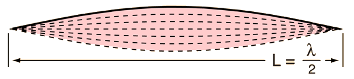
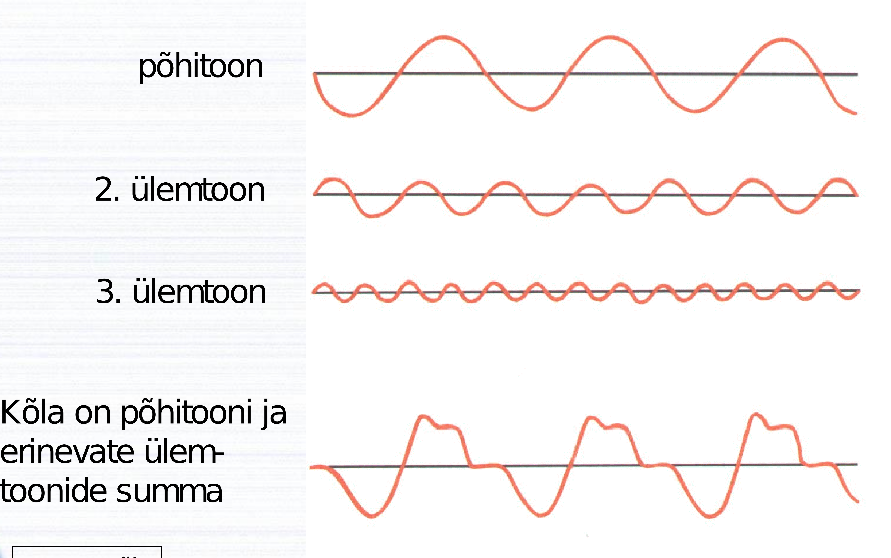

```{r setup, include=FALSE}
knitr::opts_chunk$set(echo = TRUE)
```

# Reeglid

$$hälve = {hälve}_{suurim} * sin({2 * \pi} * {{sagedus}_{võnkumine}} * {ajavahemik} + algfaas)$$

```{r}
GRAVITATION = 6.67e-11
WEIGHT_EARTH = 6E24
RADIUS_EARTH = 6.4E6
gravitationalAcceleration <- GRAVITATION * (WEIGHT_EARTH) / (RADIUS_EARTH) ^ 2
```

$$periood = 2 * \pi * \sqrt{\frac{pikkus}{{kiirendus}_{gravitatsioon}}} === 2 * \pi * \sqrt{\frac{mass}{{jäikus}_{vedru}}}$$



```{r}
VELOCITY_SOUND_AIR = 340
```

Doppleri efekt, kui nii jälgija kui heliallikas üksteise suhtes liiguvad:

$${sagedus}_{vastuvõetavHeli} = {sagedus}_{heliallikast} * (\frac{{kiirus}_{heliÕhus} + {kiirus}_{jälgija}}{{kiirus}_{heliÕhus} + {kiirus}_{heliallikas}})$$

Oluline on arvestada kiiruse märki. Kui jälgija ja allikas mõlemad liiguvad üksteise suunas, on jälgija märk pluss ja heliallika märk miinus. Üksteisest eemaldudes on heliallika märk pluss ja jälgija märk miinus.

Kui heliallikas läheneb ja jälgija on paigal, siis jälgija kiirus on null. Heliallika lähenemiskiirus on miinusmärgiga, kaugenemiskiirus plussmärgiga.

Kui heliallikas on paigal ja jälgija läheneb, siis heliallika kiirus on null. Heliallika suunas on jälgija kiirus pluss-, eemaldudes miinusmärgiga.

Kui heliallikatest lähtuva heli lained on samas faasis, siis need võimendavad üksteist, kui faasinihkega, siis nõrgendavad üksteist.

```{r}
THRESHOLD_HEARING = 1E-12
```

$$KUULDELÄVI = 10^{-12} * \frac{J}{m^2 * s}$$

$${valjus} * dB = 10 * \log \frac{intensiivsus * \frac{W}{m^2}}{kuuldelävi * \frac{W}{m^2}}$$



# Ülesanded

## Helilaine

### Ülesande püstitus

Helilained on
A.
ristlained
B.
pikilained

### Lahendus

B.

## Harmooniline võnkumine

### Ülesande püstitus

Keha teostab harmoonilist võnkumist, kus hälve sentimeetrites on *x* = 5,2 sin (31,45*t* + 1,2). Leida

a) võnkeamplituud;

b) võnkeperiood;

c) hälve ajahetkel *t* = 5 s.

### Lahendus

a) 5.2E-2 * m

b) Arvutuskäik:

```{r}
rangeOfPendulum =  2 * pi / 31.45
```

`r format(rangeOfPendulum, digits = 4)` * s on võnkeperiood.

c) Arvutuskäik:

```{r}
distanceFromCenter = 5.2e-2 * sin(31.45e-2 * 5 + 1.2)
distanceFromCenter
```

`r format(distanceFromCenter, digits = 4)` * m on hälve ajahetkel *t* = 5 * s.

## Pendelkell

### Ülesande püstitus

Soovitakse konstrueerida pendelkella, kus pendliks on peenikese varda otsas rippuv keha. Kella sekundiosuti nihkub edasi siis, kui pendel on ühes oma kahes äärmisest asendist. Milline peaks olema pendli varda pikkus, et kell võimaldaks määrata aega ühe sekundi täpsusega?

### Lahendus

Arvutuskäik:

```{r}
lengthOfPendulum = gravitationalAcceleration / pi ^ 2
```

`r format(lengthOfPendulum, digits = 1)` * m peaks olema pendli varda pikkus, et kell võimaldaks määrata aega ühe sekundi täpsusega.

## Köie otsas

### Ülesande püstitus

Keha massiga 100 kg ripub köie otsas, mis on 40 m pikkune. Kui keha panna võnkuma, siis mitu täisvõnget see teeb 1 minuti jooksul?

### Lahendus

Arvutuskäik:

```{r}
frequencyOfPendulum = 1 * 60 / (2 * pi * sqrt(40 / gravitationalAcceleration))
frequencyOfPendulum
flooredFrequencyOfPendulum = floor(frequencyOfPendulum)
```

`r flooredFrequencyOfPendulum` täisvõnget teeb keha 1 minuti kestel, kui see panna võnkuma.

## Vedru küljes

### Ülesande püstitus

Keha massiga *m* ripub vedru küljes ja võngub perioodiga 5 sekundit. Kui suur on võnkeperiood siis, kui sama vedru külge riputada kaks samasugust keha?

### Lahendus

$5 * \sqrt{2} * s$ on võnkeperiood siis, kui sama vedru külge riputada kaks samasugust keha.

## Vedru otsa

### Ülesande püstitus

Keha riputatakse vedru otsa ning vedru pikeneb 5,0 cm võrra. Nüüd viiakse keha tasakaaluasendist välja ja keha hakkab võnkuma. Kui suur on võnkeperiood?

### Lahendus

$\frac{\pi}{10} * \sqrt{\frac{5}{g}} * s$ on võnkeperiood.

Lasen arvutada ebatäpse väärtuse:

```{r}
period = 2 * pi * sqrt(5e-2 / gravitationalAcceleration)
period
```

## Ookeani sügavus

### Ülesande püstitus

Leia ookeani sügavus, kui ultraheli levimise kiirus soolases vees on 1530 m/s ning heli levib ookeani põhja ja sealt tagasi 6 sekundiga.

### Lahendus

Kui kuue sekundiga jõuab heli põhja ja tagasi, siis ainult põhja jõuab kolme sekundiga.

4590 * m on ookeani sügavus, kui ultraheli levimise kiirus soolases vees on 1530 m/s ning heli levib ookeani põhja ja sealt tagasi 6 sekundiga.

## Muinasjutuline tegelane mägedes

### Ülesande püstitus

Kujuta ette mägedes elavat muinasjutulist tegelast, kes kasutab äratuskella asemel mägedelt peegelduvat heli. Nimelt enne magama minekut hüüab onni ukselt: "ÄRKA ÜLES" ning tema hääl äratab meie tegelase kaheksa tunni pärast. Kui kaugel peaks sellisel juhul mägi asuma? Heli levimiskiirus õhus 20 °C juures on 340 m/s.

### Lahendus

Arvutuskäik:

```{r}
distanceToMountain = 340 * 8 * 3600 / 2
```

`r distanceToMountain` * m kaugusel peaks sellisel juhul mägi asuma.

## Tšello keel

### Ülesande püstitus

Tšello keel pikkusega 1,5 m annab poognaga mõjutamisel "la" noodi (352 Hz). Leia laine levimiskiirus mööda keelt.

### Lahendus

Arvutuskäik:

```{r}
velocity = 1.5 * 2 * 352
```

$`r velocity` * \frac{m}{s}$ on laine levimiskiirus mööda keelt.

## Moskiito

### Ülesande püstitus

Moskiito lehvitab tiibu sagedusega 600 lööki sekundis, mis tekitavad sumina sagedusega 600 Hz. Kui kaugele liigub heli kahe tiivalöögi vahele jääva aja jooksul? Heli kiirus õhus (20°C) on 340 m/s.

### Lahendus

$\frac{17}{30} * m kaugusele liigub heli kahe tiivalöögi vahele jääva aja kestel.

Lasen selle väärtuse ka ebatäpseks arvutada:

```{r}
distanceOfSound = 340 / 600
distanceOfSound
```

## Noodi sagedus

### Ülesande püstitus

Noodi C sagedus on 256 Hz. Kui suur on sellise sagedusega heli lainepikkus vees, kui heli kiirus vees on 1500 m/s?

### Lahendus

$\frac{375}{64} * m$ on sellise sagedusega heli lainepikkus vees, kui heli kiirus vees on 1500 m/s.

Lasen selle väärtuse ka ebatäpseks arvutada:

```{r}
wavelength = 1500 / 256
wavelength
```

## Helilaine pikkus

### Ülesande püstitus

Milline on 1000 Hz sagedusega helilaine pikkus õhus, vees, puidus? Heli kiirus õhus (20 °C) on 340 m/s, vees 1500 m/s, puidus 4000 m/s.

### Lahendus

.34 * m on 1000 * Hz sagedusega helilaine pikkus õhus, 1.5 * m vees ja 4 * m puidus.

## Nahkhiir

### Ülesande püstitus

Nahkhiir orienteerub koobastes hultraheli abil. Nahkhiire poolt tekitatud ultraheli impulss peegeldub koopaseinalt tagasi ja jõuab nahkhiire kõrva 0,01 sekundi pärast. Kui kaugel on koopa sein?

### Lahendus

Arvutuskäik:

```{r}
distanceToWall = 340 * (.01 / 2)
```

`r distanceToWall` * m kaugusel on koopa sein.

## Maja tellingutel

### Ülesande püstitus

Kaugel ehitatava maja tellingutel lööb ehitaja naela puusse. Sa näed ja kuuled haamrilööke sünkroonis, sagedusega 1 löök sekundis. Kui ehitaja on löömise peatanud, kuuled sa veel üht lööki. Kui kaugel on ehitatav maja?

### Lahendus

340 * m kaugusel on ehitatav maja.

## Tõkkepuu

### Ülesande püstitus

Tõkkepuu taga ootav inimene kuuleb läheneva rongi vilet sagedusega 546 Hz. Kui rong möödub, "kukub" vile sagedus 469 hertsile. Kui kiiresti sõidab rong?

### Lahendus

Arvutuskäik:

```{r}
library(Ryacas)
equation = paste("469 == 546 / (1 + velocityOfTrain /", VELOCITY_SOUND_AIR, ") * (1 - velocityOfTrain /", VELOCITY_SOUND_AIR, ")", sep = " ")
equation
velocityOfTrain = eval(parse(text = yac_str(y_rmvars(paste("Solve(", equation, ", velocityOfTrain)", sep = "")))))
```

Kiirusega $`r format(velocityOfTrain, digits = 3)` * \frac{m}{s}$ sõidab rong.

Lasen selle väärtuse arvutada ka kilomeetritesse tunnis:

```{r}
velocityOfTrainAsKmh = velocityOfTrain * 1e-3 / (1 / 3600)
velocityOfTrainAsKmh
```

## Kontserdiväljak

### Ülesande püstitus

Kontserdiväljakul on kaks kõlarit, mis töötavad sünkroonis. Helilaine pikkus õhus on 6 meetrit. Kas nende poolt kiiratud lained tugevdavad või nõrgendavad üksteist, kui sa asud

a) 12 m kaugusel mõlemast kõlarist;

b) 9 m kaugusel mõlemast kõlarist;

c) ühest kõlarist 9 m ja teisest 12 m kaugusel.

### Lahendus

a) Tugevdavad.

b) Tugevdavad.

c) Nõrgendavad.

## Kuulmislävi

### Ülesande püstitus

Mitu korda intensiivsem kuulmislävest on heli valjusega 10 dB, 30 dB, 60 dB?

### Lahendus

Üheksa, 999 ja 999999 korda on kuulmislävest intensiivsem heli valjusega 10 * dB, 30 * dB ja 60 * dB.

## Kitarrikeel

### Ülesande püstitus

Kui kitarrikeele põhisagedus on 220 Hz, kui suure sagedusega on teine ülemtoon? kolmas ülemtoon?

### Lahendus

Teine ülemtoon on sagedusega 440 * Hz ja kolmas ülemtoon on sagedusega 660 * Hz.

## Kuulaja laulja suhtes

### Ülesande püstitus

Kui kiiresti peaks kuulaja laulja suhtes liikuma, et ta kuuleks noodi "do" (264 Hz) asemel nooti "re" (297 Hz)?

### Lahendus

Arvutuskäik:

```{r}
equation = paste("297 == 264 * (1 + velocityOfListener /", VELOCITY_SOUND_AIR, ")", sep = " ")
#equation = paste("5.45e14 == 430e12 * (1 + velocityOfListener / 299792458)", sep = " ")
equation
velocityOfListener = eval(parse(text = yac_str(y_rmvars(paste("Solve(", equation, ", velocityOfListener)", sep = "")))))
```

$`r velocityOfListener` * \frac{m}{s}$ peaks kuulaja laulja suhtes liikuma, et ta kuuleks noodi *do* asemel nooti *re*.
