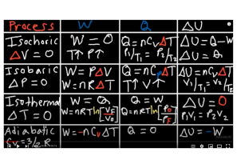
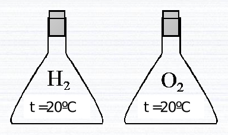
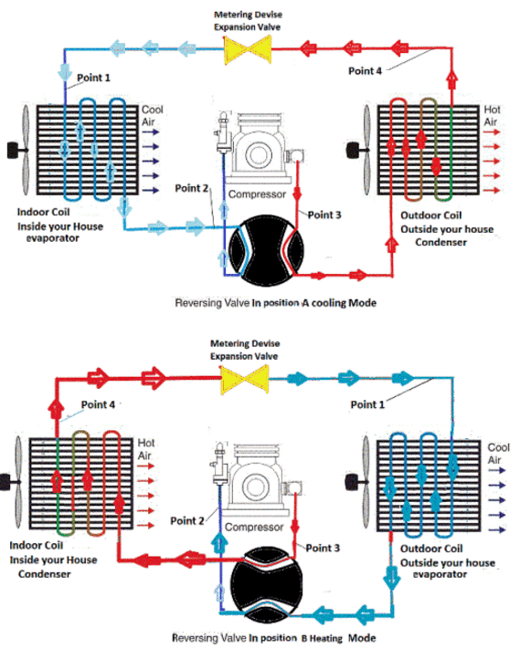

```{r setup, include=FALSE}
knitr::opts_chunk$set(echo = TRUE)
```
```{r echo=FALSE}
source("_common.R")
```

# Reeglid

## Temperatuur

$${temperature}_{c} = \frac{{temperature}_{f} - 32}{1.8}$$

## Soojusülekanne

$${soojus}_{soojendamiseks} = erisoojus * mass * \Delta(temperatuur)$$

$${erisoojus}_{1} * {mass}_{1} * \Delta({temperatuur}_1) + {erisoojus}_2 * {mass}_2 * \Delta({temperatuur}_2) === 0$$

$${soojus}_{sulamiseks} = sulamissoojus * mass$$

$${koefitsient}_{tõhusus} = \frac{{kasulikSoojus}_{lisatudVõiEemaldatud}}{töö} === \frac{{võimsus}_{kasulik}}{{võimsus}_{kogu}}$$

$${koefitsient}_{tõhusus} = \frac{{absoluutneTemperatuur}_{kuumutamine} - {absoluutneTemperatuur}_{jahutamine}}{{absoluutneTemperatuur}_{kuumutamine}}$$

$${koefitsient}_{soojendus} = \frac{|{soojus}_{kuuma}|}{töö} === \frac{|{soojus}_{külmast}| + töö}{töö} === \frac{{soojus}_{kuuma}}{{soojus}_{kuuma} - {soojus}_{külmast}}$$

$${koefitsient}_{soojendus} = \frac{{absoluutneTemperatuur}_{kuumas}}{{absoluutneTemperatuur}_{kuumas} - {absoluutneTemperatuur}_{külmas}}$$

$${koefitsient}_{külmutus} = \frac{{absoluutneTemperatuur}_{külmas}}{{absoluutneTemperatuur}_{kuumas} - {absoluutneTemperatuur}_{külmas}}$$

$${koefitsient}_{külmutus} = \frac{{soojus}_{külmast}}{{soojus}_{kuuma} - {soojus}_{külmast}} === \frac{|{soojus}_{külmast}|}{töö}$$

Termodünaamika esimene seadus:

$$töö = {soojus}_{kuuma} - {soojus}_{külmast}$$

$$\frac{{soojus}_{kuuma}}{{absoluutneTemperatuur}_{kuumas}} === \frac{{soojus}_{külmast}}{{absoluutneTemperatuur}_{külmas}}$$

Termodünaamika esimese seaduse veel üks teisend:

```{=tex}
\begin{align}
Q := \Delta(U) + W
(\#eq:thermodynamics-1)
\end{align}
```



Gaasi molaarruumala:

```{=tex}
\begin{align}
V_m :&= \frac{V}{n} \\
&= \frac{`r R` \times J \times T}{K \times mol \times 1 \times 10^5 \times Pa} &
(\#eq:molar-volume-of-gas)
\end{align}
```

[@haynes_2014_crc, p. 1-7], [@mills_1993_quantities, p. 54]
Isobaarilise protsessi töö üks valem on jooniselt \@ref(fig:iso-processes):

```{=tex}
\begin{equation}
W = n \times `r R` \times \frac{J}{K \times mol} \times \Delta(T) 
(\#eq:isobaric-work-by-amount)
\end{equation}
```

[@haynes_2014_crc, p. 7-22]

Asendan molaarruumala valemist \@ref(eq:molar-volume-of-gas) isobaarilise protsessi töö valemisse \@ref(eq:isobaric-work-by-amount) ainehulga:

```{=tex}
\begin{equation}
W = \frac{V_0 \times `r R` \times J \times \Delta(T)}{V_m \times K \times mol} 
(\#eq:isobaric-work-by-molar-volume)
\end{equation}
```

Joonisel \@ref(fig:iso-processes) on esitatud ka isobaarilise protsessi ruumalade ja temperatuuride seose valem, millest avaldan lõpptemperatuuri:

```{=tex}
\begin{equation}
T = \frac{T_0 \times V}{V_0} 
(\#eq:final-temperature)
\end{equation}
```

Valemiga \@ref(eq:final-temperature) täiendan valemit \@ref(eq:isobaric-work-by-molar-volume):

```{=tex}
\begin{align}
W :&= \frac{V_0 \times `r R` \times J \times (\frac{T_0 \times V}{V_0} - T_0)}{V_m \times K \times mol} \\
&= \frac{V_0 \times `r R` \times J \times T_0 \times (\frac{V}{V_0} - 1)}{V_m \times K \times mol} \\
&= \frac{V_0 \times `r R` \times J \times T_0 \times (\frac{V - V_0}{V_0})}{V_m \times K \times mol} \\
&= \frac{`r R` \times J \times T_0 \times (V - V_0)}{V_m \times K \times mol} \\
&= \frac{`r R` \times J \times T_0 \times (V - V_0)}{\frac{`r R` \times J \times T_0}{K \times mol \times 1 \times 10^5 \times Pa} \times K \times mol} \\
&= \frac{(V - V_0) \times K \times mol \times 1 \times 10^5 \times Pa}{K \times mol} \\
&= (V - V_0) \times 1 \times 10^5 \times Pa \\
(\#eq:isobaric-work-by-change-of-volume)
\end{align}
```

Adiabaatilise protsessi töö valemi leian samuti jooniselt \@ref(fig:iso-processes). Asendan sellesse valemisse ainehulga valemist \@ref(eq:molar-volume-of-gas):

```{=tex}
\begin{align}
W :&= \frac{V_0 \times C_V \times (T_0 - T)}{V_m} \\
&= \frac{V_0 \times C_V \times (T_0 - T)}{\frac{`r R` \times J \times T_0}{K \times mol \times p}} \\
&= \frac{V_0 \times C_V \times (T_0 - T) \times K \times mol \times p}{`r R` \times J \times T_0} \\
(\#eq:adiabatic-work-by-temperature)
\end{align}
```

Ideaalse gaasi soojusmahtuvus adiabaatilises protsessis:

```{=tex}
\begin{align}
C_V = \frac{3 \times `r R` \times J}{2 \times K \times mol}
(\#eq:adiabatic-heat-capacity)
\end{align}
```

Asendan adiabaatilise protsessi soojusmahtuvuse valemist \@ref(eq:adiabatic-heat-capacity) adiabaatilise protsessi töö valemisse \@ref(eq:adiabatic-work):

```{=tex}
\begin{align}
W :&= \frac{V_0 \times \frac{3 \times `r R` \times J}{2 \times K \times mol} \times (T_0 - T) \times K \times mol \times p}{`r R` \times J \times T_0} \\
&= \frac{V_0 \times \frac{3}{2} \times (T_0 - T) \times p}{T_0} \\
&= \frac{V_0 \times 3 \times (T_0 - T) \times p}{2 \times T_0} \\
(\#eq:adiabatic-work-of-ideal-gas)
\end{align}
```

Kui tegemist pole ideaalse gaasiga, siis on $C_V$ muutuja, millele väärtuse võime leida vastavast tabelist või umbkaudselt arvutada vastavalt vabadusastmetele.

Adiabaatilises protsessis muutuvad nii rõhk, ruumala kui temperatuur. Kui on teada, mismoodi muutub ruumala, saab arvutada gaasi poolt või gaasi suhtes tehtava töö. Kui ruumala suureneb, rõhk väheneb ja temperatuur väheneb ka. Ning vastupidi. Temperatuuri graafik on rõhu ja ruumala korrutise funktsioon, kuid mitte ainult. Selles funktsioonis on ruumala astendatud koefitsiendiga, mille väärtus sõltub gaasist. Selle funktsiooni väärtus on igasuguse ruumala korral ühesugune. Töö on jõu ja nihke korrutis:

```{=tex}
\begin{align}
W := \Delta(x) \times F
(\#eq:work)
\end{align}
```

Jõud on rõhu ja pindala korrutis:

```{=tex}
\begin{align}
F := \overrightarrow{p} \times A
(\#eq:force)
\end{align}
```

Asendan valemist \@ref(eq:force) jõu valemisse \@ref(eq:work):

```{=tex}
\begin{align}
W := \Delta(x) \times \overrightarrow{p} \times A
(\#eq:work-by-change-of-spatium-pressure-and-area)
\end{align}
```

Kui korrutada nihe ja pindala, saame ruumala:

```{=tex}
\begin{align}
W := \Delta(V) \times \overrightarrow{p}
(\#eq:work-by-change-of-volume-and-pressure)
\end{align}
```

Rõhu all mõeldakse siin välisrõhku. Seega, kui gaasi ruumala suureneb, siis see rõhk on negatiivne.

Sõltuvalt gaasist astendatakse ruumala koefitsiendiga. Rõhu ja ruumala astme korrutis on mis tahes sisendite väärtuste korral adiabaatilises protsessis jääv suurus:

```{=tex}
\begin{align}
\overrightarrow{p_0} \times V_0^\gamma = \overrightarrow{p} \times V^\gamma = CONSTANT
(\#eq:constant-partial-work)
\end{align}
```

Seega kui elementaarrõhkusid liita järjest alates algruumalast kuni lõppruumalani, saame kokku töö:

```{=tex}
\begin{align}
W :&= \int_{V_0}^{V}{\overrightarrow{p} \times d(V)} \\
&= \int_{V_0}^{V}{\frac{CONSTANT}{V^\gamma} \times d(V)} \\
&= CONSTANT \times \int_{V_0}^{V}{V^{-\gamma} \times d(V)} \\
&= CONSTANT \times (\frac{V^{-\gamma + 1}}{-\gamma + 1}) |_{V_0}^{V} \\
&= CONSTANT \times (\frac{V^{1 -\gamma}}{1 -\gamma}) |_{V_0}^{V} \\
&= CONSTANT \times (\frac{V^{1 -\gamma}}{1 -\gamma} - \frac{V_0^{1 -\gamma}}{1 -\gamma}) \\
&= CONSTANT \times (\frac{V^{1 -\gamma} - V_0^{1 -\gamma}}{1 -\gamma}) \\
&= \frac{p \times V^\gamma \times V^{1 -\gamma} - p_0 \times V_0^\gamma \times V_0^{1 -\gamma}}{1 -\gamma} \\
&= \frac{p \times V - p_0 \times V_0}{1 -\gamma} \\
(\#eq:adiabatic-work)
\end{align}
```

[@elucyda]

Milline on lõpptemperatuur adiabaatilises protsessis? Selle arvutamiseks tuleb omavahel kõrvutada töö valemid jooniselt \@ref(fig:iso-processes) ja \@ref(eq:work-by-change-of-volume-and-pressure):

```{=tex}
\begin{align}
-n \times C_V \times (T_0 - T) &= \Delta(V) \times \overrightarrow{p}\\
-n \times C_V \times d(T) &= \overrightarrow{p} \times d(V)
(\#eq:comparing-adiabatic-work-equations)
\end{align}
```

Ideaalse gaasi olekuvõrrand:

```{=tex}
\begin{align}
\overrightarrow{p} \times V = \frac{n \times `r R` \times J \times T}{K \times mol} 
(\#eq:ideal-gas)
\end{align}
```

Asendan ideaalse gaasi olekuvõrrandist \@ref(eq:ideal-gas) adiabaatilise töö võrdlusvõrrandisse rõhu:

```{=tex}
\begin{align}
-n \times C_V \times d(T) &=  \frac{n \times `r R` \times J \times T}{K \times mol \times V}\times d(V)\\
-\frac{K \times mol \times n \times C_V \times d(T)}{n \times `r R` \times J \times T} &=  \frac{d(V)}{V}\\
-\frac{K \times mol \times C_V \times d(T)}{`r R` \times J \times T} &=  \frac{d(V)}{V}\\
\int_{T_0}^T{-\frac{K \times mol \times C_V \times d(T)}{`r R` \times J \times T}} &= \int_{V_0}^V{ \frac{d(V)}{V}}\\
-\frac{K \times mol \times C_V}{`r R` \times J } \times \int_{T_0}^T{\frac{d(T)}{T}} &= \int_{V_0}^V{ \frac{d(V)}{V}}\\
-\frac{K \times mol \times C_V}{`r R` \times J } \times (ln(T) - ln(T_0)) &= ln(V) - ln(V_0)\\
\frac{K \times mol \times C_V}{`r R` \times J } \times (ln(T_0) - ln(T)) &= ln(V) - ln(V_0)\\
\frac{K \times mol \times C_V}{`r R` \times J } \times ln(\frac{T_0}{T}) &= ln(\frac{V}{V_0})\\
(\#eq:preparing-for-temperature-or-volume)
\end{align}
```

Võrrandist \@ref(eq:preparing-for-temperature-or-volume) saab avaldada nt ruumala:

```{=tex}
\begin{align}
(\frac{T_0}{T})^\frac{K \times mol \times C_V}{`r R` \times J } &= \frac{V}{V_0}\\
(\#eq:volume-from-work-comparison)
\end{align}
```

Võrrandist \@ref(eq:preparing-for-temperature-or-volume) saab avaldada nt temperatuuri:

```{=tex}
\begin{align}
ln(\frac{T_0}{T}) &= \frac{ln(\frac{V}{V_0})}{\frac{K \times mol \times C_V}{`r R` \times J }}\\
\frac{T_0}{T} &= (\frac{V}{V_0})^\frac{`r R` \times J}{K \times mol \times C_V}
(\#eq:temperature-from-work-comparison)
\end{align}
```

Adiabaatilise töö valem võib olla ka selline, milles pole lõpptemperatuuri. Sellise valemi saamiseks asendan lõpptemperatuuri valemist \@ref(eq:temperature-from-work-comparison) adiabaatilise tööprotsessi valemisse \@ref(eq:adiabatic-work-by-temperature):

```{=tex}
\begin{align}
W :&= \frac{V_0 \times C_V \times (T_0 - \frac{T_0}{(\frac{V}{V_0})^\frac{`r R` \times J}{K \times mol \times C_V}}) \times K \times mol \times p}{`r R` \times J \times T_0} \\
&= \frac{V_0 \times C_V \times (1 - \frac{1}{(\frac{V}{V_0})^\frac{`r R` \times J}{K \times mol \times C_V}}) \times K \times mol \times p}{`r R` \times J} \\
&= \frac{V_0 \times C_V \times (1 - (\frac{V_0}{V})^\frac{`r R` \times J}{K \times mol \times C_V}) \times K \times mol \times p}{`r R` \times J} \\
(\#eq:adiabatic-work-by-volumes-molar-heat-capacity-pressure)
\end{align}
```

## Energia

$${energia}_{kineetiline} = \frac{mass * \vec{kiirus ^ 2}}{2}$$

$${temperatuur}_{ideaalneGaas} = \frac{2}{3} * \frac{\overline{{kineetilineEnergia}_{molekulid}}}{1.38 * 10^{-23} * \frac{J}{K}}$$

## Soojuspaisumine

\begin{equation}
tihedus = \frac{mass}{ruumala}
(\#eq:density)
\end{equation}

```{=tex}
\begin{equation}
pikenemine = {algpikkus} * joonpaisumistegur * \Delta({temperatuur})
(\#eq:enlengthening)
\end{equation}
```

Keha ruumala suhteline suurenemine:

\begin{equation}
\frac{ruumalade\_erinevus}{algruumala} ===3 \cdot lineaarpaisumistegur \cdot temperatuuride\_vahemik
(\#eq:relative-enlargement-of-volume)
\end{equation}

Ruumpaisumistegur lineaarpaisumisteguri kaudu:

\begin{equation}
ruumpaisumistegur ===3 \cdot lineaarpaisumistegur
(\#eq:factor-of-enlargement-of-volume)
\end{equation}

Survejõud:

```{=tex}
\begin{equation}
F = \frac{E \cdot \Delta(l) \cdot A}{l}
(\#eq:strain)
\end{equation}
```

## Soojuskiirgus

```{r}
WIEN = 2.9E-3

calculateWavelengthForMaxRadiationEnergy <- function(absoluteTemperatureOfBody) {
  WIEN / absoluteTemperatureOfBody
}
```

$${lainepikkus}_{kiirgusenergiaMaksimum} = \frac{WIEN}{{temperatuur}_{absoluutne}}$$

## Adiabaatiline protsess. Polütroopne protsess

Termodünaamika esimene printsiip:

$$\Delta(Q) = \Delta(U) + A$$

$$\Delta(U) = \frac{i}{2} \cdot z \cdot R \cdot \Delta(T)$$

$$U = \frac{i}{2} \cdot z \cdot R \cdot T$$

Kui

$$\Delta(Q) = 0,$$

siis

$$\Delta(U) = -A.$$

$$A = -\Delta(U)$$

Kui $\Delta(U) >0$ (temperatuur tõuseb), siis A < 0 ehk gaasi surutakse kokku ehk välisjõud teevad tööd ja see läheb ainult U muutmiseks.

Kui

$$\Delta(Q) = 0,$$

siis soojusülekanne puudub - adiabaatiline protsess.

$$p_1 \cdot V_1^\gamma === p_2 \cdot V_2^\gamma$$

$$\gamma = \frac{i + 2}{i}$$

$$p \cdot V^\gamma = const$$

1-aatomiline:

$$\gamma = \frac{3 + 2}{3} === 1.67$$

2-aatomiline:

$$\gamma = \frac{7}{5} === 1.4$$

3-aatomiline:

$$\gamma = \frac{8}{6} === 1.33$$

õhu puhul:

$$\gamma = 1.39$$

$$p_1 \cdot V_1^n === p_2 \cdot V_2^n$$

$$\frac{p_1 \cdot V_1}{T_1} === \frac{p_2 \cdot V_2}{T_2}$$

Kui n = 0, siis isobaariline protsess, kui n = 1, siis isotermiline protsess. Kui $n = \frac{i + 2}{2} === \gamma$, siis adiabaatiline protsess. Kui $n = \infty$, siis isohooriline protsess.

## Töö erinevates protsessides

$$A = F \cdot s$$

silindri ristlõike pindala *S*

õhusamba pikkus *s~1~*

pikenenud õhusama pikkus *s~2~*

õhusamba pikkuse muutus:

$$\Delta(s) = s_2 - s_1$$

$$p = \frac{F}{S}$$

$$F = p \cdot S$$

$$A = p \cdot S \cdot \Delta(s) === p \cdot \Delta(V)$$

See kehtib, kui *p = const*.

Isobaariline protsess:

$$A = p \cdot \Delta(V) === p \cdot (V_2 - V_1)$$

Kui A < 0, siis gaasi poolt tehtud töö on negatiivne, kuid välisjõudude töö on positiivne.

Kui $\Delta(V)$ on väike ehk $\Delta(V) \rightarrow d(V)$, siis võib lugeda *p = const*.

*V = const*:

$$d(A) = p \cdot d(V)$$

*A = 0*:

$$Q = \Delta(U)$$

*T = const*:

$$d(A) = p \cdot d(V)$$

$$A = \int_{(1)}^{(2)}p \cdot d(V),$$

$$(1) \rightarrow p_1 \cdot V_1 \cdot T_1$$

$$(2) \rightarrow p_2 \cdot V_2 \cdot T_2$$

$$p \cdot V === z \cdot R \cdot T$$

$$p = \frac{z \cdot R \cdot T}{V}$$

$$A = \int_{(1)}^{(2)}\frac{z \cdot R \cdot T}{V} \cdot d(V) ===\\
z \cdot R \cdot T \int_{V_1}^{V_2}\frac{d(V)}{V} ===\\
z \cdot R \cdot T \cdot ln(V) |_{V_1}^{V_2} ===\\
z \cdot R \cdot T \cdot (ln(V_2) - ln(V_1)) ===\\
z \cdot R \cdot T \cdot ln(\frac{V_2}{V_1})$$

$$A = z \cdot R \cdot T \cdot ln(\frac{V_2}{V_1})$$

$$A = z \cdot R \cdot T \cdot ln(\frac{p_1}{p_2})$$

$$p_1 \cdot V_1 === p_2 \cdot V_2$$

$$\frac{V_2}{V_1} === \frac{p_1}{p_2}$$

töö adiabaatilises protsessis:

$$A = \int_{V_1}^{V_2}p_1 \cdot V_1^γ \cdot \frac{d(V)}{V^γ}$$

Gaas paisub silindris.

$$pV^γ === p_1V_1^γ === p_2V_2^γ === ...$$

$$γ = \frac{i + 2}{i}$$

$$d(A) = p \cdot d(V)$$

$$A = \int_{(1)}^{(2)}p \cdot d(V)$$

$$(1) \rightarrow T_1 \cdot V_1 \cdot p_1$$

$$p = \frac{p_1 \cdot V_1^γ}{V^γ}$$

$$A = \int_{(1)}^{(2)}\frac{p_1 \cdot V_1^γ}{V^γ}d(V) ===\\
p_1 \cdot V_1^γ \cdot \int_{V_1}^{V_2}V^{-γ} \cdot d(V) ===\\
p_1 \cdot V_1^γ \cdot \frac{1}{-γ + 1} \cdot V^{-γ + 1}|_{V_1}^{V_2} ===\\
\frac{p_1 \cdot V_1^γ}{1 - γ} \cdot \frac{1}{V^{γ - 1}}|_{V_1}^{V_2} ===\\
\frac{p_1 \cdot V_1^γ}{1 - γ} \cdot [\frac{1}{V_2^{γ - 1}} - \frac{1}{V_1^{γ - 1}}] ===\\
\frac{p_1 \cdot V_1^γ}{1 - γ} \cdot [\frac{V_1^{γ - 1}}{V_1^{γ - 1} \cdot V_2^{γ - 1}} - \frac{1}{V_1^{γ - 1}}] ===\\
\frac{p_1 \cdot V_1^γ}{1 - γ} \cdot \frac{1}{V_1^{γ - 1}} \cdot [\frac{V_1^{γ - 1}}{V_2^{γ - 1}} - 1] ===\\
\frac{p_1}{1 - γ} \cdot V_1^{γ - γ + 1} \cdot [\frac{V_1^{γ - 1}}{V_2^{γ - 1}} - 1]$$

$$A = \frac{p_1 \cdot V_1}{1 - γ} \cdot [(\frac{V_1}{V_2})^{γ - 1} - 1]$$

$$γ = \frac{i + 2}{i}$$

$$A = \frac{p_1 \cdot V_1}{γ - 1} \cdot [1 - (\frac{V_1}{V_2})^{γ - 1}]$$

$$p \cdot V === z \cdot R \cdot T$$

$$A = \frac{z \cdot R \cdot T_1}{γ - 1} \cdot [1 - (\frac{V_1}{V_2})^{γ - 1}]$$

Boltzmanni jaotus:

$$p = \int_{0}^{h_1}ρ \cdot g \cdot d(h)$$

$$p = p_0 \cdot e^{-\frac{m_0 \cdot g \cdot h}{k \cdot T}} === p_0 \cdot e^{-\frac{M \cdot g \cdot h}{R \cdot T}}$$

## Van der Waals

$$(p + \frac{z^2 \cdot a}{v^2}) \cdot (V - z \cdot b) = z \cdot\ R \cdot T$$

$$(\frac{p \cdot V^2 + z^2 \cdot a}{V^2}) \cdot (\frac{V - z \cdot b}{1}) = z \cdot R \cdot T$$

$$\frac{(V^2 \cdot p + z^2 \cdot a) \cdot (V - z \cdot b)}{V^2} = z \cdot R \cdot T | \cdot V^2$$

$$(V^2 \cdot p + z^2 \cdot a) \cdot (V - z \cdot b) = V^2 \cdot z \cdot R \cdot T$$

$$V^3 \cdot p - V^2 \cdot p \cdot z \cdot b + V \cdot z^2 \cdot a - a \cdot b \cdot z^3 = V^2 \cdot z \cdot R \cdot T$$

$$p \cdot V^3 - V^2 \cdot (b \cdot p \cdot z + z \cdot R \cdot T) + a \cdot z^2 \cdot V - a \cdot b \cdot z^3 = 0$$

## Märgamine

Sõltub tihedusest. Nt elavhõbeda tihedus on palju suurem kui klaasi oma, st selle osakesed on üksteisele lähemal kui klaasile. See pole alati nii.

# Ülesanded

## Vesinik ja hapnik kolvides

### Ülesande püstitus



Ühes kolvis on vesinik, teises hapnik. Mõlema 
gaasikoguse temperatuur on ühesugune. Kumma gaasi 
molekulide keskmine kiirus on suurem?

A.
vesiniku

B.
hapniku

C.
mõlema gaasi molekulide 
keskmine kiirus on 
ühesugune

D.
otsustamiseks pole piisavalt 
informatsiooni

### Lahendus

Lähtudes ideaalse gaasi temperatuuri valemist tuleb vesiniku puhul jagada kiiruse arvutamiseks väiksema arvuga kui hapniku puhul, sest vesiniku molaarmass on väiksem kui hapnikul. Seetõttu on vesiniku molekulide keskmine kiirus suurem ja õige lahend on *A*.

## Ämbrid veega

### Ülesande püstitus


Ühes ämbris on vesi temperatuuril 30
º
F, teises 
temperatuuril 45
º
F. Mõlemasse ämbrisse visatakse pall. 
Kummas ämbris jõuab pall kiiremini ämbri põhja?
A.
seal, kus on vesi 
temperatuuril 30
º
F
B.
seal, kus on vesi 
temperatuuril 45
º
F
C.
mõlemas ämbris üheaegselt
D.
otsustamiseks pole piisavalt 
informatsiooni

### Lahendus

*B*.

## Vardad

### Ülesande püstitus

Olgu meil 2 samast materjalist ja sama läbimõõduga varrast.


A
pikkus 10 cm
B
pikkus 100 cm
Tõstame mõlema temperatuuri 50 kraadi võrra.
Kuidas muutub nende pikkus?
1.
Pikenevad ühepalju
2.
Varras A pikeneb rohkem
3.
Varras B pikeneb rohkem

### Lahendus

*3*.

## Bimetallide kasutamine

### Ülesande püstitus


Bimetall on kahest erineva joonpaisumisteguriga metallist 
koosnev süsteem.
Termostaat lülitab elektrikütet sisse ja välja.

Kumma joonpaisumistegur 
on suurem, messingil või 
raual?

### Lahendus

Messingil.

## Vannist väljatulek

### Ülesande püstitus

Miks vannist välja tulles hakkab jahe?

### Lahendus

Kui ei olda just auruga täidetud ruumis, on vannist väljatulnuna kehal olevates tilkades rohkem vee osakesi kui ümbritsevas õhus ja toimub aurustumine. Selleks on vaja soojust, mille vedelik saab inimese kehalt. Tulemusena keha jahtub ja tekib jahedusetunne.

## Kuum aur ja vesi

### Ülesande püstitus

Miks kuum aur (100 °C) kõrvetab rohkem 
kui kuum vesi (100 °C)?

### Lahendus

Temperatuuril 100 °C on auru siseenergia aurustumissoojuse võrra suurem suurem kui vee siseenergia samal 
temperatuuril.

## Fahrenheiti ja Celsiuse skaala

### Ülesande püstitus

1966. aastal valminud film "451° Fahrenheiti" põhineb USA ulmekirjaniku Ray Bradburi samanimelisel romaanil. Romaan peegeldab Ameerika tulevikku, kus ühiskond on hakanud raamatuid põlgama ja põletama. Kui suur on pealkirjas esinev temperatuur Celsiuse skaalas?

### Lahendus

```{r}
temperatureC = format((451 - 32) / 1.8, digits = 3)
```

`r temperatureC` * ° on pealkirjas esinev temperatuur Celsiuse skaalas.

## Absoluutne null

### Ülesande püstitus

Kui suur on absoluutne nulltemperatuur Fahrenheiti skaalas?

### Lahendus

```{r}
temperatureF = (0 - 273.15) * 1.8 + 32
```

`r temperatureF` * ° on absoluutne nulltemperatuur Fahrenheiti skaalas.

## Lati pikenemine

### Ülesande püstitus

1 meetri pikkune latt pikenes soojendamisel 0,5 cm. Kui palju pikeneks samast materjalist 100 meetri pikkune latt, kui selle temperatuuri tõstetakse sama palju?

### Lahendus

Pool meetrit pikeneks samast materjalist 100 meetri pikkune latt, kui selle temperatuuri tõstetakse sama palju.

## Pendelkella pendel

### Ülesande püstitus

Pendelkella pendliks on raudvarras pikkusega 10,00 meetrit, mille otsas on raskus. Mitu millimeetrit pikeneb pendel, kui temperatuur tõuseb 20,0 kraadi?

### Lahendus

Arvutuskäik:

```{r}
differenceOfLength = 10 * 20 * COEFFICIENT_LINEAR_EXPANSION_FE * 10 ^ 3
```

`r differenceOfLength` * mm pikeneb pendel, kui temperatuur tõuseb 20,0 kraadi.

## Terasest toru

### Ülesande püstitus

Kujutle, et 40 000 km pikkune terasest toru paigutati ümber Maa sarnase planeedi ekvaatori tihedalt vastu maad ning seejärel soojendati toru terves ulatuses 1 kraadi võrra, mille tagajärjel toru pikenes. Kas roti suurune elukas pääseks nüüd maapinna ja toru vahelt läbi?

### Lahendus

Arvutuskäik:

```{r}
lengthBefore = 40000 * 10 ^ 3
radiusBefore = lengthBefore / 2 / pi
lengthAfter = lengthBefore * (COEFFICIENT_LINEAR_EXPANSION_STEEL + 1)
radiusAfter = lengthAfter / 2 / pi
differenceOfRadii = radiusAfter - radiusBefore
```

`r differenceOfRadii` * m on pärast toru pikendamist vahe maapinna ja toru vahel, millest roti suurune elukas kindlasti pääseks läbi.

## Veesegu

### Ülesande püstitus

Leia veesegu lõpptemperatuur, kui kokku segati 100 g 25 °C juures olevat vett ja 75 g 40 °C juures olevat vett.

### Lahendus

Arvutuskäik:

```{r}
weightTogether = 100 + 75
temperatureAfter = format((100 / weightTogether * 25 + 75 / weightTogether * 40) + ZERO_DEGREES_C_IN_K, digits = 2)
```

`r temperatureAfter` * K on veesegu lõpptemperatuur, kui kokku segati 100 * g 25 * °C juures olevat vett ja 75 * g 40 * °C juures olevat vett.

## Süsteemi temperatuur

### Ülesande püstitus

Milline on süsteemi lõpptemperatuur, kui 100 g toatemperatuuri juures olevasse vette sukeldati 100 g massiga raudnael temperatuuriga 40 °C?

### Lahendus

Vaatasin just järele ja minu toas on õhutemperatuur põrandal 16.9 * °C:

```{R}
library(Ryacas)
equation = paste(SPECIFIC_HEAT_CAPACITY_OF_WATER, "* (temperatureEnd - (16.9 +", ZERO_DEGREES_C_IN_K, ")) +", SPECIAL_HEAT_FE, "* (temperatureEnd - (40 +", ZERO_DEGREES_C_IN_K, ")) == 0", sep = " ")
equation
temperatureEnd = yac_str(y_rmvars(paste("Solve(", equation, ", temperatureEnd)", sep = "")))
```

`r format(eval(parse(text = temperatureEnd)), digits = 3)` * K on süsteemi lõpptemperatuur, kui 100 * g toatemperatuuri juures olevasse vette sukeldati 100 * g massiga raudnael temperatuuriga 40 * °C.

## Jää

### Ülesande püstitus

Kui suurt soojushulka vajatakse

a) 1 kilogrammi jää sulatamiseks temperatuuril 0 °C;

b) 1 kg jäise vee (temperatuuril 0 °C) keemaajamiseks;

c) 1 kg keeva vee aurustamiseks;

d) temperatuuril 0 °C oleva 1 kg jää muutmiseks 100 °C temperatuuriga veeauruks.

### Lahendus

a) 330000 * J

b) 419000 * J

c) `r HEAT_VAPORIZATION_WATER` * J

d) `r HEAT_OF_FUSION_OF_ICE + 419000 + HEAT_VAPORIZATION_WATER` * J

## Graniit

### Ülesande püstitus

Graniidi ja teise kivimite radioaktiivsel lagunemisel tekkiv soojus on piisav, et hoida Maa tuuma kõrgel temperatuuril. Keskmiselt eraldub radioaktiivsel lagunemisel soojushulk 0,03 J ühe kilogrammi kohta aastas. Kui mitu aastat kulub termiliselt isoleeritud graniidi soojendamiseks 500 °C võrra, kui graniidi erisoojus on $800 J/kg \cdot K$?

### Lahendus

$\frac{40000000}{3} * a$ kulub termiliselt isoleeritud graniidi soojendamiseks 500 * °C võrra, kui graniidi erisoojus on $800 J/kg \cdot K$.

## Terasnael

### Ülesande püstitus

Lüües terasnaela puusse, muutub nael selle tagajärjel soojemaks. Oletame, et vasar mõjutab naela keskmise jõuga 500 N ning et nael on 12 cm pikk ja mass on 10 g. Leida naela temperatuuri muutus.

### Lahendus

Arvutuskäik:

```{r}
differenceOfTemperature = 500 * 12 * .1 ^ 2 / (10 * .1 ^ 3) / SPECIAL_HEAT_STEEL
```

`r differenceOfTemperature` * K on naela temperatuuri muutus.

## Rauast kuul

### Ülesande püstitus

Rauast kuul massiga 10 kg langeb 100 m kõrguselt maapinnale. Milline on kuuli temperatuuri muutus, kui pool kuuli mehaanilisest energiast muutub kuuli soojendamiseks?

### Lahendus

$\frac{5}{44} * g * K$ on kuuli temperatuuri muutus, kui pool kuuli mehaanilisest energiast muutub kuuli soojendamiseks.

## Lainepikkus

### Ülesande püstitus

Millise lainepikkuse juures on järgmiste kehade soojuskiirguse maksimumid

a) Päike pinnatemperatuuriga 5800 K;

b) hõõglamp, temperatuur 1500 K;

c) inimkeha.

### Lahendus

a) `r calculateWavelengthForMaxRadiationEnergy(5800)` * m

b) `r format(calculateWavelengthForMaxRadiationEnergy(1500), digits = 2)` * m

c) `r format(calculateWavelengthForMaxRadiationEnergy(convertFromDegreesFToK(96)), digits = 2)` * m, kui inimese keha temperatuur on 96 * °F

## Automootori kasutegur

### Ülesande püstitus

Kui suur on automootori maksimaalne kasutegur, kui kütus põleb temperatuuril 760 °C ja jahutusvedeliku temperatuur on 90 °C?

### Lahendus

Arvutuskäik:

```{r}
temperatureOfHeating = 760 + ZERO_DEGREES_C_IN_K
efficiency = (temperatureOfHeating - (90 + ZERO_DEGREES_C_IN_K)) / (temperatureOfHeating)
```
$`r format(efficiency, digits = 2)`$ on automootori maksimaalne kasutegur, kui kütus põleb temperatuuril 760 * °C ja jahutusvedeliku temperatuur on 90 * °C.

## Elektrijaam

### Ülesande püstitus

Elektrijaam, mille kasutegur on 40% ja elektriline võimsus 10^8^ W, eraldab jahutusvette soojusenergiat $1,5 \cdot 10 ^ 8 W$. Leida, kui palju jahutusvett kasutab elektrijaam igas sekundis, kui vesi soojeneb 3 kraadi võrra.

### Lahendus

Elektrijaama võimsus tähendab seda kogust energiat, mis väljub elektrijaamast tarbijatele. Kasutegur näitab, kui suure osa see moodustab sisendist, mida on vaja selleks, et sellist võimsust väljastada. Sisendvõimsuse arvutan seega jagades väljundvõimsuse kasuteguriga ja saan selleks 2.5 * 10 ^ 8 * W. Võin seda võimsust nimetada ka soojuseks, sest küsitakse ühe sekundi kohta ja võimsus ongi soojushulk sekundi kohta. Nii et sisendvõimsus on kaks ja pool korda suurem kui väljundvõimsus. See sisendsoojus tuleb nt söe põletamisest.

Söe põletamisest eraldunud soojushulka kasutatakse nt turbiini liigutamiseks. Ühtlasi on vaja süsteemi jahutada ja selleks kasutatakse jahutusvedelikku. Kirjas on, et kui jahutusvesi peale lastakse, eraldub sellesse 1.5 * 10 ^ 8 * W ehk J soojust. Nii et sisse pandi 2.5 * 10 ^ 8 * J ja jahutamiseks kasutati 1.5 * 10 ^ 8 * J ning üle jäi nende jääk ehk just see väljundsoojushulk, mis võimsusena kirjas ehk 10 ^ 8 * J.

Küsitakse jahutusvedeliku koguse kohta. Juba ülesande püstituse oli kirjas, kui palju soojust jahutusvette eraldus. See kogus tuleb jagada vee erisoojuse ja temperatuurierinevusega, mille põhjustas sellise soojushulgaga kokkupuutumine, et arvutada välja vajalik veemass:

```{r}
weightOfWater = 1.5e8 / SPECIFIC_HEAT_CAPACITY_OF_WATER / 3
```

`r format(weightOfWater, digits = 2)` * kg jahutusvett kasutab elektrijaam igas sekundis, kui vesi soojeneb 3 kraadi võrra. Kui tahta seda väärtust avaldada kuupmeetrites, tuleb see lihtsalt tuhandega läbi jagada. Nägime, et kasutegurit ja väljundvõimsust polnudki vaja kasutada veekoguse arvutamiseks ja need olid lihtsalt näitlikustavad või siis kontrollandmed.

## Külmik

### Ülesande püstitus

Külmikus on temperatuur 4 °C ja toatemperatuur on 20 °C.

a) Kui suur on külmiku maksimaalne külmutustegur (ideaalsel juhul)?

b) Kui suur on maksimaalne soojushulk, mis võetakse ööpäevas jahutatavast kambrist ära, kui elektrienergia kulu ööpäevas on 0,55 kWh? 1 kWh=3,6 MJ.

c) Külmikusse pannakse toatemperatuuril olev veepudel, milles on 1,5 liitrit vett. Milline on minimaalne elektrienergia hulk, mis kulub selle jahutamiseks temperatuurini 4 °C?

### Lahendus

a) Arvutuskäik:

```{r}
temperatureOutside = 20 + ZERO_DEGREES_C_IN_K
temperatureInside = (4 + ZERO_DEGREES_C_IN_K)
efficiencyOfFridge = temperatureInside / (temperatureOutside - temperatureInside)
```

`r format(efficiencyOfFridge, digits = 1)` on külmiku maksimaalne külmutustegur.

b) Arvutuskäik:

```{r}
workOfFridge = 3.6 * 10 ^ 6 * .55
library(Ryacas)
equation = paste(efficiencyOfFridge, "== (heatIn) /", workOfFridge, sep = " ")
equation
heatIn = eval(parse(text = yac_str(y_rmvars(paste("Solve(", equation, ", heatIn)", sep = "")))))
```

`r format(heatIn, digits = 2)` * J on maksimaalne soojushulk, mis võetakse ööpäevas jahutatavast kambrist ära, kui elektrienergia kulu ööpäevas on .55 * kWh.

c) Sedapuhku on vaja arvutada väljas olev soojus, milleks on pudelivee soojus. Arvutuskäik:

```{r}
energyInJ = SPECIFIC_HEAT_CAPACITY_OF_WATER * 1.5 * (20 - 4) / efficiencyOfFridge
```

`r format(energyInJ, digits = 2)` * J on minimaalne elektrienergia hulk, mis kulub selle veepudeli jahutamiseks temperatuurini 4 °C.

```{r}
energyInKwh = energyInJ * .1 ^ 3 / 3600
```

`r format(energyInKwh, digits = 2)` * kWh on seesama elektrienergia hulk teistes ühikutes.

## Soojuspump

### Ülesande püstitus

Õhk-õhk soojuspump võtab soojust välisõhust ja annab selle edasi toaõhule.

a) Kui suur on soojuspumba maksimaalne võimalik soojendustegur, kui välisõhu temperatuur on -5 °C ja toatemperatuur 20 °C?

b) Olgu elektriradiaatori kasutegur 100%, st kogu radiaatori poolt tarbitud elektrienergia muudetakse soojuseks. Mitu korda vähem elektrienergiat kulutab soojuspump sama soojushulga ülekandmiseks?

### Lahendus

a) Arvutuskäik:

```{r}
temperatureInside = 20 + ZERO_DEGREES_C_IN_K
cop = temperatureInside / (temperatureInside - (-5 + ZERO_DEGREES_C_IN_K))
```

`r format(cop, digits = 1)` on soojuspumba maksimaalne võimalik soojendustegur, kui välisõhu temperatuur on -5 °C ja toatemperatuur 20 °C.

b) 100 * % kasuteguriga elektriradikas tarbib iga ühe väljundi kohta ühe sisendi. See on konverteerimine. Soojendustegur on minimaalselt 1. See näitab, mitu ühikut sisendit on vajalik ühe ühiku väljundsoojuse jaoks. Erinevus on märgatav. Kui radika puhul nii palju kui sisse tuleb, läheb välja, siis pumba puhul tuleb palju vähem sisse kui läheb välja. Arvutan, mitu korda vähem tarbib pump elektrit võrreldes radikaga:

```{r}
difference = 1 - (1 / cop)
```

`r format(difference, digits = 1)` korda vähem elektrienergiat kulutab soojuspump sama soojushulga ülekandmiseks.

## Heat Pump – Heating and Air Conditioning

### Task



A reversible heat pump has a coefficient of performance COP = 3.0 when operated in the heating mode. Its compressor consumes 1500 W of electric energy.

Calculate the amount of heat (Qhot) the heat pump can add to a room?
If the heat pump were turned to the cooling mode (i.e., to act as an air conditioner in the summer), what would you expect its coefficient of performance to be? Assume all else stays the same and neglect all other losses.

### Solution

$4500 * \frac{J}{s}$ is the amount of heat the heat pump can add to a room.

If the heat pump were turned to the cooling mode, I would expect its coefficient of performance to be 2.

## Terassild

### Ülesande püstitus

Kui palju tõmbub terassild kokku või paisub temperatuuride vahemikus -30oCkuni   +40o?   Silla   pikkus   0oC   juures   on  200,0   m,   terase   joonpaisumistegur   onα=11⋅10^-6^1/K.

### Lahendus

Arvutuskäik:

```{r}
length <- 200
differenceOfLengthIfWarmer <- (1 + 11e-6 * (40 - 0)) * length - length
differenceOfLengthIfColder <- (1 + 11e-6 * (-30 - 0)) * length - length
```

Sild pikeneb soojenemisel `r differenceOfLengthIfWarmer` * m ja jahtumisel `r differenceOfLengthIfColder` * m.

## Bensiin

### Ülesande püstitus

80   liitriline   terasest   anum   valati   ääreni   täis   bensiini   temperatuuril   5oC.   Kui
palju   bensiini   voolas   üle   ääre   kui   temperatuur   tõusis   20oC   võrra?   Terase
joonpaisumistegur on 11⋅10^-6^1/K, bensiini  ruumpaisumistegur on9,5⋅10^-4^1/K.

### Lahendus

#### Algandmed

anuma maht $V_0$: 80 * l ehk $(80E-3) \cdot m^3$

algtemperatuur $T_0$: 5°C ehk 278.15 * K

temperatuuride erinevus $\Delta(T)$: 20°C ehk 20 * K

terase joonpaisumistegur $\alpha_{teras}$: $(11E-6) \cdot \frac{1}{K}$

bensiini ruumpaisumistegur $3 \cdot \alpha_{bensiin}$: $(9.5E-4) \cdot \frac{1}{K}$

#### Vaja arvutada

ruumalade erinevus pärast paisumist $\Delta(V)$

#### Arvutused

Kasutan ruumala suhtelise suurenemise valemit \@ref(eq:relative-enlargement-of-volume).

Avaldan sellest valemist ruumalade erinevuse:

\begin{equation}
\Delta(V) === V_0 \cdot 3 \cdot \alpha \cdot \Delta(T)
(\#eq:change-of-volume)
\end{equation}

Kuna vaja on arvutada bensiini ja nõu mahu muutude erinevus, siis selle üldvalem on järgmine:

\begin{equation}
\Delta(V) === \Delta(V_{bensiin}) - \Delta(V_{nõu})
(\#eq:change-of-volume-change)
\end{equation}

Täiendan valemit \@ref(eq:change-of-volume-change) kummagi mahumuudu valemiga valemi \@ref(eq:change-of-volume)  ja valemi \@ref(eq:factor-of-enlargement-of-volume) põhjal:

\begin{equation}
\Delta(V) === V_0 \cdot \alpha_{bensiin} \cdot \Delta(T) - V_0 \cdot 3 \cdot \alpha_{terasnõu} \cdot \Delta(T) === \Delta(T) \cdot V_0 \cdot (\alpha_{bensiin} - 3 \cdot \alpha_{terasnõu})
(\#eq:change-of-volume-change)
\end{equation}

Lasen arvutada terasnõu algruumala:

```{r}
 change_volume_change <- 20 * 80e-3 * (9.5e-4 - 3 * 11e-6)
```

#### Lahend

`r signif(change_volume_change, digits <- 2)` * m^3 bensiini voolas üle ääre.

## Katseanum

### Ülesande püstitus

Katseanuma täitmisel servani veega temperatuuril 20oC mahtus sinna 65,50 ml vett. Kui anumat javett soojendati temperatuurini 60oC, läks üle serva 0,35g vett. Milline on anuma ruumpaisumistegur?Vee ruumpaisumistegur on 0,21·10^-3^1/K ning tihedus temperatuuril 60oC on 983,24 kg/m^3^.

### Lahendus

#### Algandmed

algtemperatuur *T~0~*: 20°C ehk 293.15 * K

algmaht *V~0~*: 65.50 * ml ehk 65.5e-6 * m^3^

lõpptemperatuur *T*: 60°C ehk 333.15 * K

mahtude muutude erinevus *V~vesi~ - V~anum~*: .35 * g ehk .35e-3 * kg

vee ruumpaisumistegur *3 \* α~vesi~*: $.21 \cdot 10^{-3} \cdot \frac{1}{K}$

vee tihedus lõpptemperatuuril *ρ*: $983.24 \cdot \frac{kg}{m^3}$

#### Vaja arvutada

anuma ruumpaisumistegur *3 \* α~anum~*

#### Arvutuskäik

Esmalt avaldan mahu, milles vett voolas üle serva, kasutades valemit \@ref(eq:relative-enlargement-of-volume):

\begin{equation}
V_{vesi} - V_{anum} = {3 \cdot \alpha_{vesi} \cdot \Delta(T) \cdot V_0 + V_0} - {3 \cdot \alpha_{anum} \cdot \Delta(T) \cdot V_0 - V_0} ===\\
{3 \cdot \alpha_{vesi} \cdot \Delta(T) \cdot V_0} - {3 \cdot \alpha_{anum} \cdot \Delta(T) \cdot V_0} === V_0 \cdot ({3 \cdot \alpha_{vesi} \cdot \Delta(T)} - {3 \cdot \alpha_{anum} \cdot \Delta(T)}) ===\\
V_0 \cdot \Delta(T) \cdot ({3 \cdot \alpha_{vesi}} - {3 \cdot \alpha_{anum}})
(\#eq:excess-water)
\end{equation}

Avaldan valemist \@ref(eq:excess-water) anuma ruumpaisumisteguri:

\begin{equation}
3 \cdot \alpha_{anum} = 3 \cdot \alpha_{vesi} - \frac{V_{vesi} - V_{anum}}{\Delta(T) \cdot V_0}
(\#eq:factor-of-enlargement-of-beaker)
\end{equation}

Asendan valemisse \@ref(eq:factor-of-enlargement-of-beaker) ruumala muudus vee ruumala massi ja tiheduse suhtega valemist \@ref(eq:density):

\begin{equation}
3 \cdot \alpha_{anum} = 3 \cdot \alpha_{vesi} - \frac{\frac{mass_{vesi}}{tihedus_{vesi}}}{\Delta(T) \cdot V_0} === 3 \cdot \alpha_{vesi} - \frac{{mass_{vesi}}}{{tihedus_{vesi}} \cdot \Delta(T) \cdot V_0}
(\#eq:cte-of-beaker-with-density)
\end{equation}

```{r}
cte_volume_beaker <- .21e-3 - (.35e-3) / (983.24 * (60 - 20) * 65.5e-6)
```

#### Lahend

$`r signif(cte_volume_beaker, digits <- 5)` \cdot \frac{1}{K}$ on anuma ruumpaisumistegur.

## Betoonplokkidest tee

### Ülesande püstitus

Tee on valatud $20 \cdot m$ pikkustest ning $.2 \cdot m^2$ ristlõikepindalaga betoonplokkidest, mille vahele on jäetud $1 \cdot mm$ suurune vahe (temperatuuril $0°C$). Kas betoonplokid paisuvad temperatuuri tõusul $50 \cdot kraadi$ võrra nii palju, et otsad ulatuvad kokku? Kui jah, siis kui suur jõud mõjub plokkide vahel? Betooni soojuspaisumistegur on $\frac{12 \cdot 10^{-6}}{K}$, Youngi moodul on $30 \cdot 10^9 \cdot \frac{N}{m^2}$. (8p).

### Sisendid

$$l = 20 \cdot m = 2 \cdot 10 \cdot m$$

```{r l}
l = 2e1
```


$$A = .2 \cdot m^2 = 2 \cdot 10^{-1} \cdot m^2$$

```{r A}
A = 2e-1
```

$$d = 1 \cdot mm = 1 \cdot 10^{-3} \cdot m$$

```{r d}
d = 1e-3
```

```{r T}
#T = celsius_to_kelvin(0)
```


$$T = 0°C = `r T` \cdot K$$

$$\Delta(T) = 50°C = 50 \cdot K$$

```{r change-of-temperature}
change_of_temperature <- 50
```

$$\alpha_l = \frac{12 \cdot 10^{-6}}{K}$$ [@erichardcohen_1987_symbols, p. 31]

```{r}
alpha_l <- 12e-6
```

$$E = 30 \cdot 10^9 \cdot \frac{N}{m^2} = 3 \cdot 10^{10} \cdot \frac{N}{m^2}$$

```{r}
E <- 3e10
```

### Mida arvutada?

$$\Delta(l) - d \ge 0 = ?$$

$$\Delta(l) - d \ge 0 = TRUE \rightarrow F = ?$$

### Kuidas arvutada?

Et teada saada, kas plokid paisudes üksteist puudutavad, on vaja arvutada, kui palju iga plokk pikeneb. Selleks kasutan valemit \@ref(eq:enlengthening):

```{=tex}
\begin{equation}
\Delta(l) - d = {l} * \alpha_l * \Delta({T}) - d
(\#eq:difference-between-enlengthening-and-distance)
\end{equation}
```

Jõu arvutamiseks saab kasutada valemit \@ref(eq:strain):

```{=tex}
\begin{equation}
F = \frac{E \cdot (\Delta(l) - d) \cdot A}{(l + d)}
(\#eq:strain)
\end{equation}
```

### Arvutuskäik

```{r}
difference_between_enlengthening_and_distance <- l * alpha_l * change_of_temperature - d

if(difference_between_enlengthening_and_distance >= 0) {
  F <- E * difference_between_enlengthening_and_distance * A / ((l + d))
  solution <- paste("Betoonplokid paisuvad temperatuuri tõusul 50 kraadi võrra nii palju, et otsad ulatuvad kokku. Nende plokkide vahel mõjub jõud suurusega ", changeSciNot(signif(F, digits = 2)), " $\\times N$.")
} else {
  solution <- "Betoonplokid ei paisu temperatuuri tõusul 50 kraadi võrra nii palju, et otsad ulatuksid kokku."
}
```

### Lahend

`r solution`

## Gaas teeb tööd.

### Ülesande püstitus

Milline on gaasi poolt tehtud töö, kui 150l süsihapegaasi, mille algtemperatuur on 30°C paisub isobaariliselt 300l-ni? Milline on gaasi töö juhul, kui süsihappegaas paisuks adiabaatiliselt? (8p.)

### Sisendid

$$V_0 := 150 \times l = 1.5 \times 10^{-1} \times m^3$$

```{r}
V_0 <- 150e-3
T_0 <- celsius_to_kelvin(30)
```


$$t := 30°C \leadsto T_0 := `r T` \times K$$

$$V := 300 \times l = 3 \times 10^{-1} \times m^3$$

```{r co2-expanding-isobaric-adiabatic-work-v}
V <- 300e-3
```

$$C_V := 0.6593 \times \frac{kJ}{kg \times K} = 6.593 \times 10^{2} \times \frac{J}{kg \times K}$$ [@haynes_2014_crc, p. 6-36]

```{r co2-expanding-isobaric-adiabatic-work-cv}
C_V <- .6593e3
```

### Väljundid

$$W_p := \ldots$$

$$W_a := \ldots$$

### Kuidas lahendada?

Isobaarilise töö arvutamiseks kasutan valemit \@ref(eq:isobaric-work-by-change-of-volume).

Adiabaatilise töö arvutamiseks kasutan valemit \@ref(eq:adiabatic-work-by-volumes-molar-heat-capacity-pressure).

### Arvutuskäik

```{r co2-expanding-isobaric-adiabatic-work}
W_p <- (V - V_0) * -p
W_a <- (V_0 * C_V * (1 - (V_0 / V)^(R / C_V)) * -p) / R
```

### Lahend

$`r W_p` \times J$ on gaasi poolt tehtud töö, kui $`r V_0` \times m^3$ süsihappegaasi, mille algtemperatuur on $`r T_0` \times K$, paisub isobaariliselt $`r V` \times m^3$-ni.

$`r signif(W_a, digits = 7)` \times J$ oleks gaasi töö juhul, kui süsihappegaas paisuks adiabaatiliselt.


## Õhumull

### Ülesande püstitus

Õhumulli ruumala 43,5 m sügavuse järve põhjas on 1,00 cm^3^. Milline on mulli ruumala veepinnale jõudes, kui järve põhjas on temperatuur 5,5oC ning pinnal 20oC?

### Lahendus

#### Algandmed

õhumulli ruumala järve põhjas *V~0~*: 1 * cm^3^ ehk 1e-6 * m^3^

järve sügavus *h*: 43.5 * m

temperatuur järve põhjas *T~0~*: 5.5°C === 278.65 * K

temperatuur järve pinnal *T~1~*: 20°C === 293.15 * K

#### Arvutada

õhumulli ruumala järve pinnal *V~1~*

#### Arvutuskäik


## Alumiiniumtraat

### Ülesande püstitus

100m pikkune alumiiniumtraat läbimõõduga 3 mm on kinnitatud postide vahelehorisontaalselt ning tõmmatud pingule temperatuuril 0oC. Hinnata, kui palju vajub
traat   keskkohast   allapoole   kui   temperatuur   tõuseb   40oC-ni.   Alumiiniumi
soojuspaisumistegur   on  23,2⋅10^-6^1/K.   Kas   traat   hakkab   purunema,   kui
temperatuur langeb -40oC-ni? Alumiiniumi purunemispinge on 300MPa.

### Lahendus

Arvutuskäik:

```{r}
ELASTIC_MODULUS_AL <- 69E9
differenceOfTemperatureAndSpecialHeat <- 40 - 0
pressure <- (40 - 0) * 23.2e-6 * ELASTIC_MODULUS_AL
pressure
#difference <- ()
```

## Õhurõhu tasakaaldustumine

### Ülesande püstitus

Hinnata,   kui   kaua   võtab   aega,   et   (õhu)rõhk   50   m   pikkusega   ruumis
tasakaalustuks, kui ruumi ühes otsas on toimunud rõhu hetkeline suurenemine,
temperatuuridel

a) -50oC ning

b) +50oC.

### Alusandmed

ruumi pikkus l = 50 * m

esimene temperatuur T~a~ = -50°C === 223.15 * K

teine temperatuur T~b~ = 50°C === 323.15 * K

$$R = 8.314 \cdot \frac{J}{K \cdot mol}$$ 

$$M = .029 \cdot \frac{kg}{mol}$$

### Arvutada

aeg *t*

### Valemid

$$v_h = \sqrt{\frac{P}{ρ}}$$
$$v_h = \frac{s}{t}$$

$$t = \frac{s}{v_h}$$

$$P = \frac{1}{3} \cdot m_0 \cdot n \cdot \bar{v^2} === \frac{1}{3} \cdot ρ  \bar{v^2}$$

$$v_h = \sqrt{\frac{\frac{1}{3} * ρ \bar{v^2}}{ρ}} === \sqrt{\frac{\bar{v^2}}{3}}$$

$$\bar{\epsilon} = \frac{3}{2} \cdot k \cdot T$$

$$\bar\epsilon_õ = \frac{5}{2} \cdot k \cdot T === \frac{m_0 \cdot \bar{v^2}}{2}$$

$$\bar{v^2} = \frac{5 \cdot k \cdot T}{m_0} === 5 \cdot T \cdot \frac{R}{M}$$

$$v_h = \sqrt{\frac{5 \cdot T}{3} \cdot \frac{R}{M}}$$

$$v_{h_1} = \sqrt{\frac{5 \cdot 223 \cdot 8.314}{3 \cdot .029}} === 324 \cdot \frac{m}{s}$$

$$v_{h_2} = 392 \cdot \frac{m}{s}$$

$$t_1 = .15 \cdot s$$

$$t_2 = .12 \cdot s$$

3 ruumi sihti, sellest 3:

$$\bar{\epsilon_k} = \frac{3}{2} \cdot k \cdot T$$

*i* sõltumatut sihti ehk vabadusastet:

$$\bar{\epsilon} = \frac{i}{2} \cdot k \cdot T$$

Kui pind, siis võimalikud liikumissihid *x* ja *y* ehk *i = 2*.

Mitmeaatomiliste gaaside puhul tuleb arvestda ka teisi võimalikke liikumisi.

Ülal 3: need on kulgliikumise vabadusastmed.

Pöördliikumise vabadusastmed sõltuvad telgedest, mille ümber saab pöörelda.

Üheaatomiline gaas - pöördliikumise vabadusastmed puuduvad.

Kaheaatomiline gaas - kaks pöördliikumise vabadusastet, st *i~p~ = 2*.

Kolme ja enama aatomilise gaasi puhul: *i~p~ = 3*.

$$i = i_{kulg} + i_{pöörd}$$

Üheaatomilise gaasi puhul *i = i~kulg~ = 3*.

Kaheaatomilise gaasi puhul $i = 3 + 2 === 5$.

Kolmeaatomiline gaas: $i = 3 + 3 === 6$.

$$\bar{\epsilon}_{kin} = \fra¢{i}{2} \cdot k \cdot T$$

$$\bar{\epsilon}_{kulg} = \frac{3}{2} \cdot k \cdot T$$

$$\bar{\epsilon}_{pöörd} = \frac{i_p}{2} \cdot k \cdot T$$

1-aatomiline:

$$\bar{\epsilon}_{k} = \frac{3}{2} \cdot k \cdot T$$

2-aatomiline:

$$\bar{\epsilon}_{k} = \frac{5}{2} \cdot k \cdot T$$

3-aatomiline:

$$\bar{\epsilon}_{k} = \frac{6}{2} \cdot k \cdot T$$

$$\bar{\epsilon}_{k} = \frac{5}{2} \cdot k \cdot T$$

## Lämmastik

### Ülesande püstitus

Lämmastikku temperatuuriga 300K rõhul 100 kPa on lastud sisse väike kogus
lämmastikku temperatuuriga 500K. Hinnata, kui kaua läheb aega, et temperatuur
gaasis tasakaalustuks arvestades, et lämmastiku molekulide efektiivdiameeter d on
0,36 nm. Vaba tee pikkus gaasis on leitav valemiga $\lambda = \frac{1}{\sqrt{2} \cdot \pi \cdot d^2 \cdot n}$, kus n on gaasi
kontsentratsioon.

### Algandmed

alglämmastiku temperatuur $T_0 = 300 \cdot K$

### Valemid

$$v = \sqrt{\frac{3 \cdot R \cdot T}{M}}$$

$$p = n \cdot k \cdot T$$

$$n = \frac{p}{k \cdot T}$$

$$t = \frac{\lambda}{v}$$

$$t = \frac{\frac{1}{\sqrt{2} \cdot \pi \cdot d^2 \cdot \frac{p}{k \cdot T}}}{\sqrt{\frac{3 \cdot R \cdot T}{M}}} === \frac{\sqrt{M}}{\sqrt{3 \cdot R \cdot T}} \cdot \frac{k \cdot T}{\sqrt{2} \cdot \pi \cdot d^2 \cdot p}$$

### Arvutamine

```{r}
t_1 <- sqrt(.028) / (sqrt(3 * 8.31 * 300)) * (1.38e-23 * 300) / (sqrt(2) * pi * (3.6e-10)^2 * 1e6)
t_1
t_2 <- sqrt(.028) / sqrt(3 * 8.31 * 500) * (1.38e-23 * 500) / (sqrt(2) * pi * (3.6e-10)^2 * 1e6)
t_2
```

### Lahend


## Süsinikdioksiidi ja hapniku molekulide ruutkeskmised kiirused

### Ülesande püstitus

Mitu   korda   erinevad   süsinikdioksiidi   ja   hapniku   molekulide   ruutkeskmised
kiirused temperatuuril 0
o
C?

### Alusandmed

T = 0°C === 237.15 * K

$$R = 8.314 \cdot \frac{J}{K \cdot mol}$$

$$M(O_2) = 32 \cdot \frac{g}{mol} === .032 \cdot \frac{kg}{mol}$$

$$M(CO_2) = .044 \cdot \frac{kg}{mol}$$

$$i_{O_2} = 5$$

$$i_{CO_2} = 6$$
### Valemid

$$v_{rk} = \sqrt{\frac{i \cdot R \cdot T}{M}}$$

$$\bar{\epsilon}_{k} = \frac{i}{2} \cdot k \cdot T === \frac{m_0 \cdot \bar{v^2}}{2}$$

$$\bar{v^2} = \frac{2 \cdot i \cdot k \cdot T}{2 \cdot m_0} === \frac{i \cdot k \cdot T}{m_0} === \frac{i \cdot R \cdot T}{M}$$

$$\frac{v_{rk_{O_2}}}{v_{rk_{CO_2}}} === \sqrt{\frac{i_{O_2} \cdot R \cdot T}{M_{O_2}} : \frac{i_{CO_2} \cdot R \cdot T}{M_{CO_2}}} === \sqrt{\frac{i_{O_2} \cdot R \cdot T}{M_{O_2}} \cdot \frac{M_{CO_2}}{i_{CO_2} \cdot R \cdot T}} === \sqrt{\frac{i_{O_2} \cdot M_{CO_2}}{i_{CO_2} \cdot M_{O_2}}}$$

$$\frac{v_{O_2}}{v_{CO_2}} = \sqrt{\frac{5 \cdot .0044}{6 \cdot .032}} === 1.07$$

## Gaasi tihedus

### Ülesande püstitus

Gaasi   molekulide   ruutkeskmine   kiirus   on   470   m/s.   Leida   gaasi   tihedus
normaalrõhul (10^5^Pa). Kui suur on 40 l-sesse ballooni mahtuva gaasi mass antud
juhul?

### Alusandmed

$$v_{rk} = 470 \cdot \frac{m}{s}$$

$$P = 1 \cdot 10^5 Pa$$

$$V = 40 \cdot l === .04 \cdot m^3$$

### Arvutada

ρ

m

### Valemid

$$ρ = \frac{m}{V}$$

$$p = \frac{1}{3} \cdot ρ \cdot \bar{v_{rk}^2}$$

$$ρ = \frac{3 \cdot p}{\bar{v_{rk}^2}}$$

$$ρ = \frac{3 \cdot 10^5}{470^2} === 1.358 (\frac{kg}{m^3})$$

$$m = ρ \cdot V$$

$$m = 1.358 \cdot .004 === .054 (\cdot kg)$$

## Õhuvahetus

### Ülesande püstitus

Toas, mille ruumala on 90 m^3^, vahetub õhk täielikult 2 tunni jooksul. Kui palju
on   vaja   soojust,   et   toas   püsiks   ööpäeva   jooksul   temperatuur   18oC,   kusjuures
välisõhu temperatuur on -5oC? Eeldame, et õhu tihedus on 1,25 g/l.

### Alusandmed

$$V_0 = 90 \cdot m^3$$

$$t_1 = 2 \cdot h$$

$$T_1 = 268 \cdot K$$

$$T_2 = 291 \cdot K$$

$$ρ = 1.25 \cdot \frac{kg}{m^3}$$

$$t_2 = 24 \cdot h$$

$$M = .029 \cdot \frac{kg}{mol}$$

### Arvutada

Q

### Valemid

$$C_{aine} = \frac{i}{2} === R$$

$$C_v = \frac{3}{2} \cdot R$$

$$C_p = \frac{5}{2} \cdot R$$

$$C_v = \frac{i}{2} \cdot R$$

$$C_p = \frac{i + 2}{2} \cdot R$$

$$Q = m \cdot c \cdot \Delta(T)$$

$$Q = z \cdot C \cdot \Delta(T)$$

$$z = \frac{m}{M}$$

$$m = ρ \cdot V === \frac{t_2}{t_1} \cdot ρ \cdot V_0$$

$$C = C_p === \frac{i + 2}{2} \cdot R$$

$$i = 5$$

$$Q = \frac{t_2 \cdot ρ \cdot V_0}{t_1 \cdot M} \cdot \frac{5 + 2}{2} \cdot R \cdot (T_2 - T_1)$$

$$Q = 4.06 \cdot 10^7 \cdot J === 40.6 \cdot MJ$$

Mitu kg puid on vaja põletada selle energia saamiseks?

$$Q = k \cdot m,$$

kus k on kütteväärtus ja m on puidu mass.

$$k = 10 \cdot \frac{MJ}{kg}$$

### Arvutuskäik

```{r}
Q = (24 * 1.25 * 90) / (2 * .029) * (5 + 2) / 2 * 8 * (291 - 268)
Q
```

## Õhu siseenergia

### Ülesande püstitus

Milline on 20 mooli õhu siseenergia, kui gaasi ruumala on 100l ja rõhk 3 MPa?

### Alusandmed

$$p = 3 \cdot MPa === 3 \cdot 10^6 \cdot Pa$$

$$V = 100 \cdot l === .1 \cdot m^3$$

$$z = 20 \cdot mooli$$

$$i = 5$$

### Arvutada

*U*

### Valemid

$$\bar{\epsilon_k} = \frac{i}{2} \cdot k \cdot T$$

$$U = \frac{i}{2} \cdot z \cdot R \cdot T$$

$$p \cdot V === z \cdot R \cdot T$$

$$U = \frac{i}{2} \cdot p \cdot V$$

$$U = \frac{5}{2} \cdot 3 \cdot 10^6 \cdot .1 === 7.5 \cdot 10^5 (\cdot J) === 750 (\cdot kJ)$$

Mehaanikas potentsiaalne energia:

$$E_{pot} = m \cdot g \cdot h$$

Kui *m = 100 \* kg*, millisele kõrgusele peab tõstma selle 100 * kg keha, et see saaks energia 750 * kJ?

$$h = \frac{E_{pot}}{m \cdot g}$$

$$h = \frac{750000}{100 \cdot 10} \approx 750 \cdot m$$

## Lämmastiku soojendamine

### Ülesande püstitus

 Kui palju soojust kulub 1 kg lämmastiku soojendamiseks jääval rõhul -50oC-lt
kuni 50oC-ni. Kui suur on gaasi siseenergia juurdekasv? Kui palju teeb gaas tööd?

### Alusandmed

lämmastiku mass $m = 1 \cdot kg$

rõhk *p = const*

algtemperatuur $T_1 = -50°C === 223.15 \cdot K$

lõpptemperatuur $T_2 = 50°C === 323.15 \cdot K$

lämmastiku molaarmass $M(N_2) = 28.014 \cdot \frac{g}{mol} === .028014 \frac{kg}{mol}$

$$R = 8.314 \cdot \frac{J}{K \cdot mol}$$

$$i = 5$$

### Arvutada

soojushulk *Q*

gaasi siseenergia juurdekasv $\Delta(U)$

gaasi tehtav töö *A*

### Valemid

$$\Delta(U) = \frac{i}{2} \cdot z \cdot R \cdot \Delta(T)$$

$$z = \frac{m}{M}$$

$$\Delta(U) = \frac{i}{2} \cdot \frac{m}{M} \cdot R \cdot \Delta(T)$$

$$7.42 \cdot 10^4 \cdot J$$

$$Q = z \cdot C_p \cdot \Delta(T)$$

$$C_p = \frac{i + 2}{2} \cdot R$$

$$Q = z \cdot \frac{i + 2}{2} \cdot R \cdot \Delta(T)$$

$$103.9 \cdot kJ$$

$$A = Q - \Delta(U)$$

$$A = p \cdot \Delta(V) === p_2 \cdot V_2 - p_1 \cdot V_1$$

$$p \cdot V === z \cdot R \cdot T$$

$$A = z \cdot R \cdot T_2 - z \cdot R \cdot T_1 === z \cdot R \cdot \Delta(T)$$

### Arvutused

```{r}
change_u <- 5 / 2 * 1 / .028014 * 8.314 * (323.15 - 223.15)
q <- 1 / .028014 * (5 + 2) / 2 * 8.314 * (323.15 - 223.15)
a <- q - change_u
```

### Lahend

`r signif(change_u, digits <- 5)` * J soojust kulub 1 * kg lämmastiku soojendamiseks jääval rõhul -50°C'lt kuni 50°C'ni. `r signif(q, digits <- 5)` * J on gaasi siseenergia juurdekasv. `r signif(a, digits <- 5)` * J teeb gaas tööd.

##

### Ülesande püstitus

Neljataktilises   diiselmootoris   surutakse   sisseimetud   õhk   12-kordselt   kokku.
Oletades,   et   protsess   on   adiabaatiline,   leida   lõpprõhk,   lõpptemperatuur   ja
kokkusurumisel tehtud töö, kui algrõhk on 0,1MPa, algtemperatuur on 10
o
C ja
algruumala 2l.

### Algandmed

$$p_1 = .1 \cdot MPa === 10^5 \cdot Pa$$

$$T_1 = 10°C === 283 \cdot K$$

$$V_1 = 2 \cdot l === .002 \cdot m^3$$

$$\frac{V_1}{V_2} = 12$$

$$\gamma = 1.39$$

### Arvutada

$$p_2 = ?$$

$$T_2 = ?$$

$$A = ?$$

### Valemid

$$p_1 \cdot V_1^\gamma === p_2 \cdot V_2^\gamma$$

$$p = \frac{i + 2}{i}$$

$$p_2 = p_1 \cdot (\frac{V_1}{V_2})^\gamma$$

$$\frac{p_1 \cdot V_1}{T_1} === \frac{p_2 \cdot V_2}{T_2}$$

$$T_2 = ...$$

$$A = \frac{p_1 \cdot V_1}{\gamma - 1} \cdot [1 - (\frac{V_1}{V_2})^{\gamma - 1}]$$

### Arvutamine

```{r}
gamma = (5 + 2) / 5
gamma
```

##

### Ülesande püstitus

Leida gaasisegu erisoojused jääval rõhul ja jääval ruumalal, kui gaas koosneb
2 g CO2-st ning 3 g N2-st.

### Sisendid

$CO_2$ mass $m\_CO_2 = 2 \cdot g === 2 \cdot 10^{-3} \cdot kg$

$N_2$ mass $m\_N_2 = 3 \cdot g === 3 \cdot 10^{-3} \cdot kg$

$CO_2$ vabadusastmete arv $i\_CO_2 = 6$

$N_2$ vabadusastmete arv $i\_N_2 = 5$

### Mida arvutada

gaasisegu erisoojus jääval rõhul $c_p$

gaasisegu erisoojus jääval ruumalal $c_V$

### Lahendus

```{r}
M_CO2 <- MOLAR_WEIGHT_C + 2 * MOLAR_WEIGHT_O
M_CO2
M_N2 <- MOLAR_WEIGHT_N * 2
M_N2
```


$c$ näitab, kui palju energiat on vaja anda 1 * kg ainele, et tõsta selle temperatuuri 1 * K võrra.

$$c_V = \frac{i}{2} \cdot R$$

$$c_V = \frac{i}{2 \cdot \mu} \cdot R$$

$$\Delta(Q) = c \cdot m \cdot \Delta(T)$$

$$c = \frac{\Delta(Q)}{m \cdot \Delta(T)}$$

$\lambda \cdot \Delta(Q_1)$ on $CO_2$ jaoks

```{r}
c_v_1 <- 6 / (2 * .044) * 8.31
c_v_1
c_v_2 <- 5 / (2 * .028) * 8.31
c_v_2
```

$$\Delta(Q_1) = m_1 \cdot c_1 \cdot \Delta(T)$$

Vastavalt definitsioonile võtame laest, et $\Delta(T) = 1 \cdot K$.

```{r}
change_q1 <- 2e-3 * c_v_1 * 1
change_q1
change_q2 <- 3e-3 * c_v_2 * 1
change_q2
```

$$c = \frac{\Delta(Q_1) + \Delta(Q_2)}{(m_1 + m_2) \cdot \Delta(T)}$$

```{r}
c <- (change_q1 + change_q2) / ((2e-3 + 3e-3) * 1)
c
```

See oli siis konstantse ruumala jaoks. Nüüd konstantse rõhu jaoks:

$$c_p = \frac{i + 2}{2 \cdot \mu} \cdot R$$

## Vesi

### Ülesande püstitus

1,00 kg vett on temperatuuril 100oC ning muudetakse veeauruks jääval rõhul
100 kPa. Vee ruumala kasvab väärtuselt 1,00 l vedelas olekus väärtuseni 1,671 m3
aurufaasis. Kui palju tehakse selle protsessi käigus tööd? Kui palju kantakse üle
energiat ning milline on süsteemi siseenergia muutus, kui vee aurustumissoojus
on 2,256 MJ/kg?

### Lahendus

#### Sisendid

vee mass $m = 1 \cdot kg$

vee temperatuur $T = 100°C === 373.15 \cdot K$

rõhk $p = 1 \cdot 10^5 \cdot Pa$

vee algruumala $V_0 = 1 \cdot l === 1 \cdot 10^{-3} \cdot m^3$

vee lõppruumala $V_1 = 1.671 \cdot m^3$

vee aurustumissoojus $\lambda = 2.256 \cdot \frac{MJ}{kg} === 2.256 \cdot 10^6 \cdot \frac{J}{kg}$

#### Mida arvutada?

töö $A = ?$

ülekantav energiakogus $\Delta(Q) = ?$, sest üle kantakse energiat soojusena

siseenergia muutus $\Delta(U) = ?$

#### Lahendus

$$\Delta(Q) = \Delta(U) + A$$

1.  Aurustumine:
    
    $$\Delta(Q_1) = \lambda \cdot m$$
    
    Kui vedelik ei paisu, siis:
    
    $$\Delta(Q_1) = \Delta(U_1)$$

2.  Gaasi paisumine:
    
    $$\Delta(Q_2) = c \cdot m \cdot \Delta(T)$$

    $$\Delta(Q_2) + A$$
    
    $$\Delta(U_2) = 0$$
    
    Gaasi korral, kuna siseenergia muutub faasi (pole olek, sest olek on nt siis muu, kui muutub temperatuur vms) ehk oleku ülemineku korral, või ka ainult tahkise korral või ainult vedeliku korral:
    
    $$\Delta(U) ~ \Delta(T)$$
    
    Gaasides pole vaja potentsiaalset energiat arvestada, küll aga voolistes, sest tõmbejõud.
    
$$\Delta(Q) = \Delta(U_1) + A_2$$

$$A_2 = p \cdot \Delta(V)$$

$$\Delta(U) = \Delta(Q_1)$$

$$\Delta(U) = \lambda \cdot m$$

$$\Delta(U) = 2.256 \cdot 10^6 \cdot J$$

```{r}
A_2 <- 1e5 * 1.67
A_2
change_u <- 1.67e3 + 2.256e6
change_u
```

Aurustumistemperatuuril aur kõrvetab rohkem kui vesi, sest auru siseenergia on suurem.

## Gaasi paisumine graafikute järgi

### Ülesande püstitus

Gaas paisub, minnes olekust A olekusse B nii nagu näidatud joonisel 1. Kui
suur on gaasi paisumise töö? Kui suur on gaasi paisumise töö joonise 2 järgi?

### Lahendus

$$V_1 = .2 \cdot l = 2 \cdot 10^{-4} \cdot m^3$$

$$V_2 = .65 = 6.5 \cdot 10^{-4} \cdot m^3$$

$$p_1 = p_2 = 120 \cdot 10^3 \cdot Pa$$

$$A_1 = ?$$

$$A = \Delta(V) \cdot p$$

$$A = (6.5 - 2) \cdot 10^{-4} \cdot 120 \cdot 10^3 === 54 \cdot J$$

Graafiku järgi pindala:

$$120 \cdot 6.5^{-4}$$
Teise graafiku järgi tuleb arvutada ühe ruudu pindala ja siis korrutada ruutude arvuga.

$$A_{elementaarne} = S_{elementaarne} = 5 \cdot 10^{-5} \cdot m^3 \cdot 5 \cdot 10^3 \cdot Pa === .25 \cdot J$$

$$A = A_1 + A_2$$

$$A_1 = 1.15 \cdot 10^5 \cdot Pa \cdot (.7 - .25) \cdot 10^{-3} \cdot m^3$$

```{r}
a_1 <- 1.15e5 * (.7 - .25) * 10^{-3}
a_1
```

```{r}
a_2 <- 17 * .25
a_2
a <- a_1 + a_2
a
```

## Kalorimeeter

### Ülesande püstitus

 Kalorimeetrisse   soojusmahtuvusega   63   J/K   valati   250   g   õli   temperatuuril
12oC.   Kui   õlisse   lasti   vasksilinder   massiga   500g   temperatuuril   100oC,   kujunes
lõpptemperatuuriks 33oC. Kui suur on õli erisoojus antud andmete põhjal?  Vase
erisoojus on 390 J/(kg·K) ) (V: 2240 J/(kg·K) ).

### Lahendus

#### Sisendid

kalorimeetri soojusmahtuvus $C = 63 \cdot \frac{J}{K}$

õli mass $m_{oil} = 250 \cdot g === 2.5 \cdot 10^{-1} \cdot kg$

õli temperatuur $T_{oil} = 12°C === 285.15 \cdot K$

vasksilindri mass $m_{CU} = 500 \cdot g === 5 \cdot 10^{-1} \cdot kg$

vasksilindri temperatuur $T_{CU} = 100°C === 373.15 \cdot K$

segu temperatuur $T = 33°C === 306.15 \cdot K$

vase erisoojus $c_{CU} = 390 \cdot \frac{J}{kg \cdot K}$

```{r}
C <- 63
m_oil <- 2.5e-1
T_oil <- 285.15
m_CU <- 5e-1
T_CU <- 373.15
T <- 306.15
c_CU <- 390
```


#### Mida arvutada

õli erisoojus $c_{oil} = ?$

#### Reeglid

$$\Delta(Q_1) + \Delta(Q_2) + ... + \Delta(Q_n) === 0$$

Annab:

$$\Delta(Q_3) = m_{CU} \cdot c_{CU} \cdot \Delta(T)$$

$$\Delta(T) = T_{CU} - T_{oil}$$

Võtab:

$$|\Delta(Q_3)| = \Delta(Q_1) + \Delta(Q_2)$$

kalorimeetris:

$$\Delta(Q_1) = C \cdot (T - T_{oil})$$

õli:

$$\Delta(Q_2) = m_{oil} \cdot c_{oil} \cdot (T - T_{oil})$$

$$\Delta(Q_3) = m_{CU} \cdot c_{CU} \cdot (T - T_{oil})$$

$$C \cdot (T - T_{oil}) + m_{oil} \cdot c_{oil} \cdot (T - T_{oil}) + m_{CU} \cdot c_{CU} \cdot (T - T_{CU}) === 0$$

$$m_{oil} \cdot c_{oil} \cdot (T - T_{oil}) === -m_{CU} \cdot c_{CU} \¢dot (T - T_{CU}) - C \cdot (T - T_{oil})$$

$$c_{oil} = \frac{-m_{CU} \cdot c_{CU} \cdot (T - T_{CU}) - C \cdot (T - T_{oil})}{m_{oil} \cdot (T - T_{oil})}$$

### Lahendus

```{r}
c_oil <- (-m_CU * c_CU * (T - T_CU) - C * (T - T_oil)) / (m_oil * (T - T_oil))
```

### Lahend

$`r c_oil` \cdot \frac{J}{kg \cdot K}$ on õli erisoojus antud andmete põhjal.

## Anumasse juhitav veeaur

### Ülesande püstitus

Anumasse, milles on 1,5 kg vett temperatuuril 15oC, juhitakse 200g veeauru
temperatuuril 100oC. Kui suur on segu lõpptemperatuur?

### Sisendid

vee mass $m_{vesi} = 1.5 \cdot kg$

vee temperatuur $T_{vesi} = 15°C === 288.15 \cdot K$

auru mass $m_{aur} = 200 \cdot g === 2 \cdot 10^{-1} \cdot kg$

veeauru temperatuur $T_{aur} = 100°C === 373.15 \cdot K$

vee aurustumissoojus $\lambda = 2.26 \cdot 10^6 \cdot \frac{J}{kg}$

```{r}
m_vesi <- 1.5
T_vesi <- 288.15
m_aur <- 2e-1
T_aur <- 373.15
lambda <- 2.26
```

### Arvutada mida?

segu lõpptemperatuur $T = ?$

### Reeglid

$$\Delta(Q_1) + \Delta(Q_2) + \Delta(Q_3) === 0$$

$$\Delta(Q_1) = -\lambda \cdot m_{aur}$$

$$\Delta(Q_2) = m_{aur} \cdot c \cdot (T - T_{aur})$$

$$\Delta(Q_3) = m_{vesi} \cdot c \cdot (T - T_{vesi})$$

$$m_{aur} \cdot c \cdot T - m_{aur} \cdot c \cdot T_{aur} + m_{vesi} \cdot c \cdot T - m_{vesi} \cdot c \cdot T_{vesi} - \lambda \cdot m_{aur} === 0$$

$$T \cdot (m_{aur} \cdot c + m_{vesi} \cdot c) === \lambda \cdot m_{aur} + m_{aur} \cdot c \cdot T_{aur} + m_{vesi} \cdot c \cdot T_{vesi}$$

$$$$

### Lahendus

1) Veeaur kondenseerub veeks.

2) Vesi jahtub lõpptemperatuurini.

3) Algne vesi soojeneb.

Eeldan, et on normaalrõhk, muidu on mingi -baariline protsess.

```{r}
T <- (lambda * m_aur + m_aur * c * T_aur + m_vesi * c * T_vesi) / (m_aur * c + m_vesi * c)
```

### Lahend

`r T` * K on segu lõpptemperatuur.88.5C

##

### Ülesande püstitus

Mitu   protsenti   vesiniku   molekulidest   omab   temperatuuril   300K   kiirust
vahemikus   200-205   m/s?   Mitu   protsenti   hapniku   molekulidest   on   samal
temperatuuril samas kiirustevahemikus? (V: umbes 0,011% vesiniku ning 0,57%
hapniku korral). 

### Sisendid

temperatuur $T = 300 \cdot K$

algkiirus $v_0 = 200 \frac{m}{s}$

lõppkiirus $v = 205 \frac{m}{s}$

```{r}
T = 300
v_0 <- 200
v = 205
```


### Mida arvutada?

vesiniku molekulide osa protsentides $\frac{\Delta(N_v)}{N} = ?$

hapniku molekulide osa protsentides $r_{O_2} = ?$

### Reeglid

$$f(v) = \frac{1}{N} \cdot \rho(v) === \frac{1}{N} \cdot \frac{\Delta(N_v)}{\Delta(v)}$$

$$f(v) = 4 \cdot \pi \cdot \sqrt{(\frac{M}{2 \cdot \pi \cdot R \cdot T})^3} \cdot e^{\frac{-M \cdot v^2}{2 \cdot R \cdot T}} \cdot v^2$$

$$\frac{\Delta(N_v)}{N} === f(v) \cdot \Delta(v)$$

$$v_{probable} = \sqrt{\frac{2 \cdot R \cdot T}{M}}$$

### Lahendus

```{r}
ratio_hydrogen <- 4 * pi * sqrt((MOLAR_WEIGHT_H * 2 / (2 * pi * 8.314 * T))^3) * exp(1)^{-MOLAR_WEIGHT_H * 2 * ((v + v_0) / 2) ^2 / (2 * 8.314 * 300)} * ((v + v_0) / 2) ^2
ratio_hydrogen
v_probable = sqrt(2 * 8.314 * 300 / (MOLAR_WEIGHT_H * 2))
v_probable
```


### Lahend

1.16*10^-4

##

### Ülesande püstitus

Oletame, et maapinnal on õhus 78% lämmastikku N2
 ning umbes 20% hapnikkuO2
 – kas ja kuidas muutub lämmastiku ja hapniku protsentuaalne sisaldus õhus
1000 m kõrgusel, kui eeldada, et õhu temperatuur on kõikjal

a) 0oC?

b) 20°C?

Kuidas muutub õhu rõhk, kui maapinnal on see 101.3 * kPa?

### Sisend

kõrgus $h = 1000 \cdot m$

lämmastiku sisaldus $\eta_{O_2} = 78%$

hapniku sisaldus $\eta_{N_2} = 20%$

a) temperatuur $T = 0°C === 237.15 \cdot K$

b) temperatuur $T = 20°C === 293.15 \cdot K$

õhu rõhk $p = 101.3 \cdot kPa === 1.013 \cdot 10^5 \cdot Pa$

### Mida arvutada?

lämmastiku sisaldus kõrgemal $\eta_{N_2}^{'}$

hapniku sisaldus kõrgemal $\eta_{O_2}^{'}$

õhu rõhk kõrgemal $p^{'}$

### Reeglid

$$p = p_0 \cdot e^{-\frac{M \cdot g \cdot h}{R \cdot T}}$$

$$n = n_0 \cdot e^{-\frac{M \cdot g \cdot h}{R \cdot T}}$$

$$p_0 = p_{0_1} + p_{0_2} + p_{0_h}$$

$$p = n \cdot k \cdot T$$

lämmastiku osarõhk (7.5*10^4Pa):

$$p_{1_0} = .78 \cdot p_0$$

hapniku osarõhk maapinnal (2*10^4Pa):

$$p_{2_0} = .2 \cdot p_0$$

lämmastiku osarõhk kõrgemal (6.9*10^4Pa):

$$p_{1_1} = p_{1_0} \cdot e^{-\frac{.028 \cdot 9.8 \cdot 1000}{8.31 \cdot 273}}$$

hapniku osarõhk kõrgema (1.7*10^4Pa)l:

$$p_{2_1}$$

$$\frac{n_{1_0}}{n_{2_0}} === \frac{7.9}{2}$$

$$\frac{n_{1_1}}{n_{2_1}} === \frac{p_{1_1}}{n_{2_1}} \frac{69}{17}$$

### Lahendus

Eeldame, et õhu protsentuaalne koostis väga ei muutu:

$$M_{air} = .029 \cdot \frac{kg}{mol}$$

```{r}
p = 101.3 * 10^3 * exp(1)^(-.029 * 9.81 * 1000 / (8.31 * 273))
```


### Lahend

p = 8.9*10^4 Pa

## Puidu põletamine

### Ülesande püstitus

Kui palju puid peab põletama ahjus, mille kasutegur on 40%, et saada 200g
lumest   temperatuuril   -10oC  vesi   temperatuuril   20oC.   Puidu   kütteväärtus   on   10MJ/kg,   jää   erisoojus   on   2100   J/(kg*K),   vee   erisoojus   on   4190   J/(kg*K),   jääsulamissoojus on 330 kJ/kg.

### Sisendid

ahju kasutegur $\eta = 40%$

lume mass $m_{lumi} = 200 \cdot g === 2 \cdot 10^{-1} \cdot kg$

lume temperatuur $-10°C === 263.15 \cdot K$

vee temperatuur $T = 20°C === 293.15 \cdot K$

puidu kütteväärtus $k = 10 \cdot \frac{MJ}{kg} === 1 \cdot 10^7 \cdot \frac{J}{kg}$

jää erisoojus $c_{ice} = 2100 \frac{J}{kg \cdot K}$

vee erisoojus $c_{vesi} = 4190 \cdot \frac{J}{kg \cdot K}$

jää sulamissoojus $L = 330 \cdot \frac{kJ}{kg} === 3.3 \cdot 10^5 \cdot \frac{J}{kg}$

jää sulamistemperatuur $T_{sulamine} = 273.15 \cdot K$

### Mida arvutada?

puude mass $m_{puit} = ?$

### Reeglid

1) $\Delta(Q_1) = -k \cdot m_2 \cdot \eta$

2) $\Delta(Q_2) = c_{ice} \cdot m_{ice} \cdot (T_{sulamine} - T_{ice})$

3) $\Delta(Q_3) = m_{lumi} \cdot L$

4) $\Delta(Q_4) = m_{lumi} \cdot c_{ice} \cdot (T_{vesi} - T_{sulamine})$

$$\Delta(Q_1) + \Delta(Q_2) + \Delta(Q_3) + \Delta(Q_4) === 0$$

$$m_{puit} = \frac{m_{lumi} \cdot L + m_{lumi} \cdot c_{vesi} \cdot (T_{vesi} -)}{}$$

### Lahendus

1) Puidu põlemine.

2) Jää soojenemine.

3) Jää sulamine.

4) Vee soojenemine.

### Lahend


## Jää sulatamine

### Ülesande püstitus

Kui palju 80oC-lise temperatuuriga vett on vaja, et sulatada 0,5 kg jääd, mille
temperatuur on -10oC kalorimeetris, mille soojusmahtuvus on 90 J/K ning mille
algtemperatuur on samuti -10oC? Vee erisoojus on 4190 J/(kg*K), jää erisoojus on
2100 J/(kg*K), jää sulamissoojus on 330 kJ/kg.

### Sisendid

vee temperatuur $T_{vesi} = 80°C === 353.15 \cdot K$

jää mass $m_{jää} = .5 \cdot kg$

jää temperatuur $-10°C === 263.15 \cdot K$

kalorimeetri soojusmahtuvus $c_{calorimeter} = 4190 \cdot \frac{J}{kg \cdot K}$

jää erisoojus $c_{ice} = 2100 \cdot \frac{J}{kg \cdot K}$

jää sulamissoojus $L = 330 \cdot \frac{kJ}{kg} === 3.3 \cdot 10^5 \frac{J}{kg}$

### Mida arvutada?

vee mass $m_{vesi} = ?$

### Reeglid

1) $\Delta(Q_1) = m_1 \cdot c_1 \cdot (T - T_1)$

2) $\Delta(Q_2) = m_2 \cdot c_2 \cdot (T - T_2)$

3) $\Delta(Q_3) = L \cdot m_2$

4) $\Delta(Q_4) = C \cdot (T - T_2)$

$$\Delta(Q_1) + \Delta(Q_2) + \Delta(Q_3) + \Delta(Q_4) === 0$$

$$m_1 \cdot c_1 \cdot (T - T_1) === -m_2 \cdot c_2 \cdot (T - T_2) - L \cdot m_2 - C \cdot (T - T_2)$$

### Lahendus

1) Kuum vesi jahtub.

2) Jää soojeneb.

3) Jää sulab.

4) Kalorimeeter soojeneb.

### Lahend

.52

## Märgamine

### Ülesande püstitus

Kui   kõrgele   tõuseb   vesi   kahe   vertikaalselt   asetatud   paralleelse   klaasplaadi
vahel, kui nendevaheline kaugus on 0,5 mm. Eeldada, et märgamine on täielik. Vee
pindpinevustegur   on   0,072   N/m.   Vee   tihedus   on   1000   kg/m3.   Vaba   langemise
kiirendus g=9,81 m/s2.

### Sisendid

kaugus $s = .5 \cdot mm === 5 \cdot 10^{-4} \cdot m$

vee pindpinevustegur $.072 \cdot \frac{}{}$

### Lahendus

## Iseseisvaks lahendamiseks

20, 26, 33, 31, 37

## 

### Ülesande püstitus

Missugusel temperatuuril on hapniku rõhk 7 MPa, kui hapniku tihedus on
$100 \cdot \frac{kg}{m^3}$. Lahendada ülesanne reaalse ja ideaalse gaasi võrrandi abil.
(V: 296K, 289K. Reaalse gaasi puhul on mõistlik fikseerida ruumala, näiteks võtta
ruumalaks   $1 \cdot m^3$,   seejärel   leida   moolide   arv   ning   siis   arvutada   temperatuur.   Või
fikseerida moolide arv, siis tiheduse kaudu saab kätte ruumala jne)

### Tegu

$$p \cdot V = z \cdot R \cdot T$$

$$(p + \frac{z^2 \cdot a}{V^2}) \cdot (V - z \cdot b) = z \cdot R \cdot T$$

Kui $V = 1 \cdot m^3$, siis $m = 100 \cdot kg$.

```{r}
T = 7e6 / (100 / 3.2e-2 * 8.314)
T
# See on õige, ülesannete kogus on viga.
T_waals <- (7e6 + (100 / 3.2e-2)^2 * 1.36e-1) * (1 - 100 / 3.2e-2 * 3.16e-5) / (100 / 3.2e-2 * 8.314)
T_waals
z = 100 / 3.2e-2
z
z_b = z * 3.16e-5
z_b
z2_a_over_v = z^2 * 1.36e-1
z2_a_over_v
```

## 

### Ülesande püstitus

Õhk on küllastunud temperatuuril 15oC. Kui suur on õhu suhteline niiskus, kui temperatuur tõuseb 25oC-ni?

### Tegu

$$R = \frac{a}{A} \cdot 100\%$$

15 kraadi juures on küllastunud, st $12.8 \cdot \frac{g}{m^3}$, mis on 100%.

$$A = 23.5 \cdot \frac{g}{m^3}$$

$$R = 53\%$$

##

### Ülesande püstitus

80m3-lise ruumalaga toas on suhteline õhuniiskus temperatuuril 18oC 75%.
Toas on avatud veeanum, milles on 3 l vett. Kas vesi sellest anumast saab tuppa
täielikult auruda?
(Vihje: Leida, milline on antud temperatuuril küllastava veeauru tihedus. Siis leida,
milline oleks veeauru tihedus, kui kõik auruks, kasutades Mendelejev-Clapeyroni
võrrandit).

### Tegu

Tegelik õhuniiskus on 75% $15.4 \cdot \frac{g}{m^3}$.

$$V = 80 \cdot m^3$$

$$t = 18°C$$

$$R = 75\%$$

$$V_1 = 3 \cdot l = 3 \cdot 10^{-3} \cdot \frac{g}{m^3}$$

$$m = ?$$

$$a = 15.4 \cdot .75 = 11.55 \cdot \frac{g}{m^3}$$

$$A = 15.4 \cdot \frac{g}{m^3}$$

$$15.4 - 11.55 = 3.85 \cdot \frac{g}{m^3}$$

$$m_{võimalik} = 3.85 \cdot 80 = 308 \cdot g$$

$1 \cdot m^3$ saab lisada 3.85 * g veeauru.

$$m_{vesi} = 3 \cdot kg$$


$$m = \rho \cdot V$$

##

### Ülesande püstitus

Kui kõrgele tõuseb vesi kahe vertikaalselt asetatud paralleelse klaasplaadi
vahel, kui nendevaheline kaugus on 0,5 mm. Eeldada, et märgamine on täielik. Vee
pindpinevustegur on 0,072 N/m. Vee tihedus on 1000 kg/m3. Vaba langemise
kiirendus g=9,81 m/s2. (V: 29 mm)

### Tegu

$$s = 5 * 10^-4 \cdot m$$

$$h = ?$$

$$F_pind = m * g$$

$$\sigma * L = m * g$$

$$m = \rho \cdot V$$

$$V = h \cdot \l \cdot s$$

$$L = 2 * l$$

$$2 \cdot \sigma \cdot l = h \cdot l \cdot s \cdot g \cdot \rho$$

$$2 \cdot \sigma = h \cdot s \cdot g \cdot \rho$$

$$\frac{2 \cdot \sigma}{s \cdot g \cdot \rho}$$

57, 58 kodus

## 

### Ülesande püstitus

Veetorust tilgub külma vett 10 tilka minutis. Mitu korda on suurenenud või
vähenenud vee pindpinevustegur, kui samast torust tilgub seda 12 tilka minutis?
(V: Pindpinevustegur on vähenenud 6/5 korda).

### Tegu

$$t = 60 \times s$$

$$N_1 = 10$$

$$N_2 = 12$$

$$\frac{\sigma_1}{\sigma_2} = ?$$

Pindpinevusjõud mõjub üles, raskusjõud alla:

$$F_{pind} = m \times g$$

$$\sigma \times l = m \times g$$

Ühe minuti kestel läbi toru tuleb vesi massiga $M$.

Tilga mass $m_1 = \frac{M}{N_1}$ ja $m_2 = \frac{M}{N_2}$.

$$\sigma \times l = \frac{M}{N} \times g$$

$$\sigma = \frac{M \times g}{N \times l}$$

$$\frac{sigma_1}{sigma_2} = \frac{\frac{M \times g}{N_1 \times l}}{\frac{M \times g}{N_2 \times l}} = \frac{g \times N_2}{N_1}$$

$$\frac{sigma_1}{sigma_2} = \frac{N_2}{N_1}$$

##

### Ülesande püstitus

 37   cm   paksuse   telliskiviseina   välispinna   temperatuur   on   -15oC,   sisepinnal
+20oC.   Leida   ööpäeva   jooksul   läbi   25m2
  pinna   mineva   soojuse   hulk.   Telliskivi
soojusjuhtivustegur   on   0,7   W/(m*K).   Kui   palju   puid   peaks   ahjus   põletama,   et
sellist soojusenergiat saada? Puidu kütteväärtus on 19,4 MJ/kg.(V: 7,37 kg)


### Tegu

$$T_1 = -15°C = 258 K$$

$$T_2 = 20°C = 293 K$$

$$l = 37 cm = .37 m$$

$$t = 86400 s$$

$$\kappa = .7 \times \frac{W}{m \times K}$$

$$k_v = 19.4 \times 10^6 \times \frac{J}{kg}$$

$$m = ?$$

$$\Delta(Q) = ?$$

$$q = \frac{\Delta(Q)}{\Delta(t)} = \frac{S \times \Delta(T) \times k_v}{l}$$

```{r}
q <- 25 * (293 - 258) * .7 / .37
q
```

$$\Delta(Q) = q \times \Delta(t)$$

```{r}
delta_q <- q * 86400
delta_q
```

$$Q = k_v \times m$$

$$m = \frac{Q}{k_v}$$

```{r}
m <- delta_q / (19.4e6)
m
```

Samad küsimused, kui seinale lisada viis sentimeetrit klaasvilla, mille $\kappa_2 = .037 \times \frac{W}{m \times K}$.

$$q = \frac{S \times \Delta(T)}{\frac{l_1}{\kappa_1} + \frac{l_2}{\kappa_2}}$$

```{r}
q = 25 * (293 - 258) / (.37 / .7 + .05 / .037)
q
Q <- q * 86400
Q
m <- Q / 19.4e6
m
```

##

### Ülesande püstitus

Maja   seina   soojuspidavuse   2,5-kordseks   suurendamiseks   temperatuuride
vahel   20oC   (st,   et   seest   välja   läheks   2,5   korda   vähem   soojust),   otsustati   20cm
paksusele tellisest seinale lisada klaasvilla ning sellele 2 cm paksune voodrilaud.
Kui   paks   peab   olema   klaasvilla   kiht?   Klaasvilla   soojusjuhtivustegur   on   0,037 W/(m*K), puidul 0,16 W/(m*K). (V: 1,1 cm.)

### Tegu

$$Delta(T) = 20°C$$

$$l_1 = 20 cm = 0.2 m$$

$$l_3 = 2 cm = 0.02 m$$

$$\kappa_1 = 0.7 \frac{W}{m \times K}$$

$$\kappa_2 = 0.037 \frac{W}{m \times K}$$

$$\kappa_3 = 0.16 \frac{W}{m \times K}$$

$$\frac{q_1}{q_2} = 2.5$$

$$l_2$$

$$q_1 = \kappa_1 \times \frac{Delta(T) \times S}{l_1}$$

$$q_2 = \frac{\Delta(T) \times S}{\frac{l_1}{\kappa_1} + \frac{l_2}{\kappa_2} + \frac{l_3}{\kappa_3}}$$

$$q_1 = 2.5 \times q_2$$

$$\frac{\Delta(T) \times S}{\frac{l_1}{\kappa_1}} = \frac{2.5 \Delta(T) \times S}{\frac{l_1}{\kappa_1} + \frac{l_2}{\kappa_2} + \frac{l_3}{\kappa_3}}$$

$$\frac{1}{\frac{l_1}{\kappa_1}} = \frac{2.5}{\frac{l_1}{\kappa_1} + \frac{l_2}{\kappa_2} + \frac{l_3}{\kappa_3}}$$

$$\frac{l_1}{\kappa_1} + \frac{l_2}{\kappa_2} + \frac{l_3}{\kappa_3} = 2.5 \times \frac{l_1}{\kappa_1}$$

$$\frac{l_2}{\kappa_2} = 2.5 \times \frac{l_1}{\kappa_1} - \frac{l_1}{\kappa_1} - \frac{l_3}{\kappa_3}$$

$$\frac{l_2}{\kappa_2} = 1.5 \times \frac{l_1}{\kappa_1} - \frac{l_3}{\kappa_3}$$

$$l_2 = \kappa_2 \times (1.5 \times \frac{l_1}{\kappa_1} - \frac{l_3}{\kappa_3})$$

```{r}
l_2 <- .037 * (1.5 * .2 / .7 - .02 / .16)
l_2
```

tellis: $\frac{0.2}{0.7} \approx 0.29$

puit: $0.29 \times 0.16 = 0.045$

Seega 4.5 cm puitu on sama mis 29 cm tellisseina.

vill: $0.29 \times 0.037 = 0.01 (m)$

63 ise!
