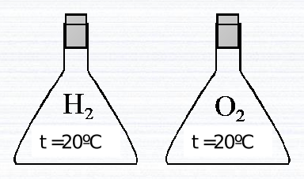
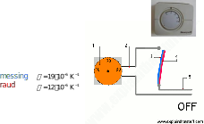

```{r setup, include=FALSE}
knitr::opts_chunk$set(echo = TRUE)
```

# Reeglid

## Maa

```{r}
RADIUS_EARTH = 6.4E6
LENGTH_EQUATOR_EARTH = RADIUS_EARTH * 2 * pi
```

## Temperatuur

$${temperature}_{c} = \frac{{temperature}_{f} - 32}{1.8}$$

```{r}
ZERO_DEGREES_C_IN_K = 273.15
```

$${erisoojus}_{1} * {mass}_{1} * \Delta({temperatuur}_1) + {erisoojus}_2 * {mass}_2 * \Delta({temperatuur}_2) === 0$$

```{r}
SPECIAL_HEAT_WATER = 4190
SPECIAL_HEAT_FE = .44 / (.1 ^ 3)
```

$${soojus}_{sulamiseks} = sulamissoojus * mass$$

```{r}
MELTING_HEAT_ICE = 330000
```

$${soojus}_{soojendamiseks} = erisoojus * mass * \Delta(temperatuur)$$

```{r}
HEAT_VAPORIZATION_WATER = 40.65 * 10 ^ 3 / ((1.008 * 2 + 15.999) * .1 ^ 3)
```

## Energia

$${energia}_{kineetiline} = \frac{mass * \vec{kiirus ^ 2}}{2}$$

$${temperatuur}_{ideaalneGaas} = \frac{2}{3} * \frac{\overline{{kineetilineEnergia}_{molekulid}}}{1.38 * 10^{-23} * \frac{J}{K}}$$

## Soojuspaisumine

$$pikenemine = {algpikkus} * joonpaisumistegur * \Delta({temperatuur})$$

```{r}
COEFFICIENT_LINEAR_EXPANSION_FE = .000011
COEFFICIENT_LINEAR_EXPANSION_STEEL = 1.2E-5
```

# Ülesanded

## Vesinik ja hapnik kolvides

### Ülesande püstitus



Ühes kolvis on vesinik, teises hapnik. Mõlema 
gaasikoguse temperatuur on ühesugune. Kumma gaasi 
molekulide keskmine kiirus on suurem?

A.
vesiniku

B.
hapniku

C.
mõlema gaasi molekulide 
keskmine kiirus on 
ühesugune

D.
otsustamiseks pole piisavalt 
informatsiooni

### Lahendus

Lähtudes ideaalse gaasi temperatuuri valemist tuleb vesiniku puhul jagada kiiruse arvutamiseks väiksema arvuga kui hapniku puhul, sest vesiniku molaarmass on väiksem kui hapnikul. Seetõttu on vesiniku molekulide keskmine kiirus suurem ja õige lahend on *A*.

## Ämbrid veega

### Ülesande püstitus


Ühes ämbris on vesi temperatuuril 30
º
F, teises 
temperatuuril 45
º
F. Mõlemasse ämbrisse visatakse pall. 
Kummas ämbris jõuab pall kiiremini ämbri põhja?
A.
seal, kus on vesi 
temperatuuril 30
º
F
B.
seal, kus on vesi 
temperatuuril 45
º
F
C.
mõlemas ämbris üheaegselt
D.
otsustamiseks pole piisavalt 
informatsiooni

### Lahendus

*B*.

## Vardad

### Ülesande püstitus

Olgu meil 2 samast materjalist ja sama läbimõõduga varrast.


A
pikkus 10 cm
B
pikkus 100 cm
Tõstame mõlema temperatuuri 50 kraadi võrra.
Kuidas muutub nende pikkus?
1.
Pikenevad ühepalju
2.
Varras A pikeneb rohkem
3.
Varras B pikeneb rohkem

### Lahendus

*3*.

## Bimetallide kasutamine

### Ülesande püstitus



Bimetall on kahest erineva joonpaisumisteguriga metallist 
koosnev süsteem.
Termostaat lülitab elektrikütet sisse ja välja.

Kumma joonpaisumistegur 
on suurem, messingil või 
raual?

### Lahendus

Messingil.

## Vannist väljatulek

### Ülesande püstitus

Miks vannist välja tulles hakkab jahe?

### Lahendus

Kui ei olda just auruga täidetud ruumis, on vannist väljatulnuna kehal olevates tilkades rohkem vee osakesi kui ümbritsevas õhus ja toimub aurustumine. Selleks on vaja soojust, mille vedelik saab inimese kehalt. Tulemusena keha jahtub ja tekib jahedusetunne.

## Kuum aur ja vesi

### Ülesande püstitus

Miks kuum aur (100 °C) kõrvetab rohkem 
kui kuum vesi (100 °C)?

### Lahendus

Temperatuuril 100 °C on auru siseenergia aurustumissoojuse võrra suurem suurem kui vee siseenergia samal 
temperatuuril.

## Fahrenheiti ja Celsiuse skaala

### Ülesande püstitus

1966. aastal valminud film "451° Fahrenheiti" põhineb USA ulmekirjaniku Ray Bradburi samanimelisel romaanil. Romaan peegeldab Ameerika tulevikku, kus ühiskond on hakanud raamatuid põlgama ja põletama. Kui suur on pealkirjas esinev temperatuur Celsiuse skaalas?

### Lahendus

```{r}
temperatureC = format((451 - 32) / 1.8, digits = 3)
```

`r temperatureC` * ° on pealkirjas esinev temperatuur Celsiuse skaalas.

## Absoluutne null

### Ülesande püstitus

Kui suur on absoluutne nulltemperatuur Fahrenheiti skaalas?

### Lahendus

```{r}
temperatureF = (0 - 273.15) * 1.8 + 32
```

`r temperatureF` * ° on absoluutne nulltemperatuur Fahrenheiti skaalas.

## Lati pikenemine

### Ülesande püstitus

1 meetri pikkune latt pikenes soojendamisel 0,5 cm. Kui palju pikeneks samast materjalist 100 meetri pikkune latt, kui selle temperatuuri tõstetakse sama palju?

### Lahendus

Pool meetrit pikeneks samast materjalist 100 meetri pikkune latt, kui selle temperatuuri tõstetakse sama palju.

## Pendelkella pendel

### Ülesande püstitus

Pendelkella pendliks on raudvarras pikkusega 10,00 meetrit, mille otsas on raskus. Mitu millimeetrit pikeneb pendel, kui temperatuur tõuseb 20,0 kraadi?

### Lahendus

Arvutuskäik:

```{r}
differenceOfLength = 10 * 20 * COEFFICIENT_LINEAR_EXPANSION_FE * 10 ^ 3
```

`r differenceOfLength` * mm pikeneb pendel, kui temperatuur tõuseb 20,0 kraadi.

## Terasest toru

### Ülesande püstitus

Kujutle, et 40 000 km pikkune terasest toru paigutati ümber Maa sarnase planeedi ekvaatori tihedalt vastu maad ning seejärel soojendati toru terves ulatuses 1 kraadi võrra, mille tagajärjel toru pikenes. Kas roti suurune elukas pääseks nüüd maapinna ja toru vahelt läbi?

### Lahendus

Arvutuskäik:

```{r}
lengthBefore = 40000 * 10 ^ 3
radiusBefore = lengthBefore / 2 / pi
lengthAfter = lengthBefore * (COEFFICIENT_LINEAR_EXPANSION_STEEL + 1)
radiusAfter = lengthAfter / 2 / pi
differenceOfRadii = radiusAfter - radiusBefore
```

`r differenceOfRadii` * m on pärast toru pikendamist vahe maapinna ja toru vahel, millest roti suurune elukas kindlasti pääseks läbi.

## Veesegu

### Ülesande püstitus

Leia veesegu lõpptemperatuur, kui kokku segati 100 g 25 °C juures olevat vett ja 75 g 40 °C juures olevat vett.

### Lahendus

Arvutuskäik:

```{r}
weightTogether = 100 + 75
temperatureAfter = format((100 / weightTogether * 25 + 75 / weightTogether * 40) + ZERO_DEGREES_C_IN_K, digits = 2)
```

`r temperatureAfter` * K on veesegu lõpptemperatuur, kui kokku segati 100 * g 25 * °C juures olevat vett ja 75 * g 40 * °C juures olevat vett.

## Süsteemi temperatuur

### Ülesande püstitus

Milline on süsteemi lõpptemperatuur, kui 100 g toatemperatuuri juures olevasse vette sukeldati 100 g massiga raudnael temperatuuriga 40 °C?

### Lahendus

Vaatasin just järele ja minu toas on õhutemperatuur põrandal 16.9 * °C:

```{R}
library(Ryacas)
equation = paste(SPECIAL_HEAT_WATER, "* (temperatureEnd - (16.9 +", ZERO_DEGREES_C_IN_K, ")) +", SPECIAL_HEAT_FE, "* (temperatureEnd - (40 +", ZERO_DEGREES_C_IN_K, ")) == 0", sep = " ")
equation
temperatureEnd = yac_str(y_rmvars(paste("Solve(", equation, ", temperatureEnd)", sep = "")))
```

`r format(eval(parse(text = temperatureEnd)), digits = 3)` * K on süsteemi lõpptemperatuur, kui 100 * g toatemperatuuri juures olevasse vette sukeldati 100 * g massiga raudnael temperatuuriga 40 * °C.

## Jää

### Ülesande püstitus

Kui suurt soojushulka vajatakse

a) 1 kilogrammi jää sulatamiseks temperatuuril 0 °C;

b) 1 kg jäise vee (temperatuuril 0 °C) keemaajamiseks;

c) 1 kg keeva vee aurustamiseks;

d) temperatuuril 0 °C oleva 1 kg jää muutmiseks 100 °C temperatuuriga veeauruks.

### Lahendus

a) 330000 * J

b) 419000 * J

c) `r HEAT_VAPORIZATION_WATER` * J

d) `r MELTING_HEAT_ICE + 419000 + HEAT_VAPORIZATION_WATER` * J
