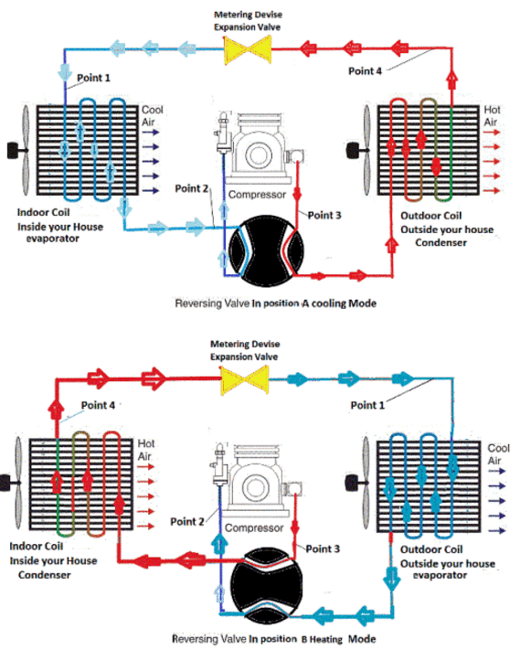

```{r setup, include=FALSE}
knitr::opts_chunk$set(echo = TRUE)
```

# Reeglid

## Maa

```{r}
RADIUS_EARTH = 6.4E6
LENGTH_EQUATOR_EARTH = RADIUS_EARTH * 2 * pi
```

## Temperatuur

$${temperature}_{c} = \frac{{temperature}_{f} - 32}{1.8}$$

```{r}
ZERO_DEGREES_C_IN_K = 273.15

convertFromDegreesFToK <- function(temperatureF) {
  (temperatureF - 32) / 1.8 + ZERO_DEGREES_C_IN_K
}
```

$${erisoojus}_{1} * {mass}_{1} * \Delta({temperatuur}_1) + {erisoojus}_2 * {mass}_2 * \Delta({temperatuur}_2) === 0$$

```{r}
SPECIAL_HEAT_WATER = 4190
SPECIAL_HEAT_FE = .44 / (.1 ^ 3)
SPECIAL_HEAT_STEEL = 502
```

$${soojus}_{sulamiseks} = sulamissoojus * mass$$

```{r}
MELTING_HEAT_ICE = 330000
```

$${soojus}_{soojendamiseks} = erisoojus * mass * \Delta(temperatuur)$$

```{r}
HEAT_VAPORIZATION_WATER = 40.65 * 10 ^ 3 / ((1.008 * 2 + 15.999) * .1 ^ 3)
```

$${koefitsient}_{tõhusus} = \frac{{kasulikSoojus}_{lisatudVõiEemaldatud}}{töö} === \frac{{võimsus}_{kasulik}}{{võimsus}_{kogu}}$$

$${koefitsient}_{tõhusus} = \frac{{absoluutneTemperatuur}_{kuumutamine} - {absoluutneTemperatuur}_{jahutamine}}{{absoluutneTemperatuur}_{kuumutamine}}$$

$${koefitsient}_{soojendus} = \frac{|{soojus}_{kuuma}|}{töö} === \frac{|{soojus}_{külmast}| + töö}{töö} === \frac{{soojus}_{kuuma}}{{soojus}_{kuuma} - {soojus}_{külmast}}$$

$${koefitsient}_{soojendus} = \frac{{absoluutneTemperatuur}_{kuumas}}{{absoluutneTemperatuur}_{kuumas} - {absoluutneTemperatuur}_{külmas}}$$

$${koefitsient}_{külmutus} = \frac{{absoluutneTemperatuur}_{külmas}}{{absoluutneTemperatuur}_{kuumas} - {absoluutneTemperatuur}_{külmas}}$$

$${koefitsient}_{külmutus} = \frac{{soojus}_{külmast}}{{soojus}_{kuuma} - {soojus}_{külmast}} === \frac{|{soojus}_{külmast}|}{töö}$$

Termodünaamika esimene seadus:

$$töö = {soojus}_{kuuma} - {soojus}_{külmast}$$

$$\frac{{soojus}_{kuuma}}{{absoluutneTemperatuur}_{kuumas}} === \frac{{soojus}_{külmast}}{{absoluutneTemperatuur}_{külmas}}$$

## Energia

$${energia}_{kineetiline} = \frac{mass * \vec{kiirus ^ 2}}{2}$$

$${temperatuur}_{ideaalneGaas} = \frac{2}{3} * \frac{\overline{{kineetilineEnergia}_{molekulid}}}{1.38 * 10^{-23} * \frac{J}{K}}$$

## Soojuspaisumine

\begin{equation}
tihedus = \frac{mass}{ruumala}
(\#eq:density)
\end{equation}

$$pikenemine = {algpikkus} * joonpaisumistegur * \Delta({temperatuur})$$

Keha ruumala suhteline suurenemine:

\begin{equation}
\frac{ruumalade\_erinevus}{algruumala} ===3 \cdot lineaarpaisumistegur \cdot temperatuuride\_vahemik
(\#eq:relative-enlargement-of-volume)
\end{equation}

Ruumpaisumistegur lineaarpaisumisteguri kaudu:

\begin{equation}
ruumpaisumistegur ===3 \cdot lineaarpaisumistegur
(\#eq:factor-of-enlargement-of-volume)
\end{equation}

```{r}
COEFFICIENT_LINEAR_EXPANSION_FE = .000011
COEFFICIENT_LINEAR_EXPANSION_STEEL = 1.2E-5
```

## Soojuskiirgus

```{r}
WIEN = 2.9E-3

calculateWavelengthForMaxRadiationEnergy <- function(absoluteTemperatureOfBody) {
  WIEN / absoluteTemperatureOfBody
}
```

$${lainepikkus}_{kiirgusenergiaMaksimum} = \frac{WIEN}{{temperatuur}_{absoluutne}}$$

## Adiabaatiline protsess. Polütroopne protsess

Termodünaamika esimene printsiip:

$$\Delta(Q) = \Delta(U) + A$$

$$\Delta(U) = \frac{i}{2} \cdot z \cdot R \cdot \Delta(T)$$

$$U = \frac{i}{2} \cdot z \cdot R \cdot T$$

$$\Delta(Q) = 0$$

$$\Delta(U) = -A$$

$$A = -\Delta(U)$$

Kui $\Delta(U) >0$ (temperatuur tõuseb), siis A < 0 ehk gaasi surutakse kokku ehk välisjõud teevad tööd ja see läheb ainult U muutmiseks.

$$\Delta(Q) = 0$$

soojusülekanne puudub - adiabaatiline protsess

$$p_1 \cdot V_1^\gamma === p_2 \cdot V_2^\gamma$$

$$\gamma = \frac{i + 2}{i}$$

$$p \cdot V^\gamma = const$$

1-aatomiline:

$$\gamma = \frac{3 + 2}{3} === 1.67$$

2-aatomiline:

$$\gamma = \frac{7}{5} === 1.4$$

3-aatomiline:

$$\gamma = \frac{8}{6} === 1.33$$

õhu puhul:

$$\gamma = 1.39$$

$$p_1 \cdot V_1^n === p_2 \cdot V_2^n$$

$$\frac{p_1 \cdot V_1}{T_1} === \frac{p_2 \cdot V_2}{T_2}$$

Kui n = 0, siis isobaariline protsess, kui n = 1, siis isotermiline protsess. Kui $n = \frac{i + 2}{2} === \gamma$, siis adiabaatiline protsess. Kui $n = \infty$, siis isohooriline protsess.

## Töö erinevates protsessides

$$A = F \cdot s$$

silindri ristlõike pindala *S*

õhusamba pikkus *s~1~*

pikenenud õhusama pikkus *s~2~*

õhusamba pikkuse muutus:

$$\Delta(s) = s_2 - s_1$$

$$p = \frac{F}{S}$$

$$F = p \cdot S$$

$$A = p \cdot S \cdot \Delta(s) === p \cdot \Delta(V)$$

See kehtib, kui *p = const*.

Isobaariline protsess:

$$A = p \cdot \Delta(V) === p \cdot (V_2 - V_1)$$

Kui A < 0, siis gaasi poolt tehtud töö on negatiivne, kuid välisjõudude töö on positiivne.

Kui $\Delta(V)$ on väike ehk $\Delta(V) \rightarrow d(V)$, siis võib lugeda *p = const*.

$$d(A) = p \cdot d(V)$$

*V = const*:

$$d(A) = p \cdot d(V)$$

*A = 0*

$$Q = \Delta(U)$$

*T = const*:

$$d(A) = p \cdot d(V)$$

$$A = \int_{(1)}^{(2)}p \cdot d(V),$$

$$(1) \rightarrow p_1 \cdot V_1 \cdot T_1$$

$$(2) \rightarrow p_2 \cdot V_2 \cdot T_2$$

$$p \cdot V === z \cdot R \cdot T$$

$$p = \frac{z \cdot R \cdot T}{V}$$

$$A = \int_{(1)}^{(2)}\frac{z \cdot R \cdot T}{V} \cdot d(V) === z \cdot R \cdot T \int_{V_1}^{V_2}\frac{d(V)}{V} === z \cdot R \cdot T \cdot ln(V) |_{V_1}^{V_2} === z \cdot R \cdot T \cdot (ln(V_2) - ln(V_1)) === z \cdot R \cdot T \cdot ln(\frac{V_2}{V_1})$$

$$A = z \cdot R \cdot T \cdot ln(\frac{V_2}{V_1})$$

$$A = z \cdot R \cdot T \cdot ln(\frac{p_1}{p_2})$$

$$p_1 \cdot V_1 === p_2 \cdot V_2$$

$$\frac{V_2}{v_1} === \frac{p_1}{p_2}$$

töö adiabaatilises protsessis:

$$A = \frac{p_1 \cdot V_1}{\gamma - 1} \cdot (1 - (\frac{V_1}{V_2})^{\gamma - 1})$$


# Ülesanded

## Vesinik ja hapnik kolvides

### Ülesande püstitus


Ühes kolvis on vesinik, teises hapnik. Mõlema 
gaasikoguse temperatuur on ühesugune. Kumma gaasi 
molekulide keskmine kiirus on suurem?

A.
vesiniku

B.
hapniku

C.
mõlema gaasi molekulide 
keskmine kiirus on 
ühesugune

D.
otsustamiseks pole piisavalt 
informatsiooni

### Lahendus

Lähtudes ideaalse gaasi temperatuuri valemist tuleb vesiniku puhul jagada kiiruse arvutamiseks väiksema arvuga kui hapniku puhul, sest vesiniku molaarmass on väiksem kui hapnikul. Seetõttu on vesiniku molekulide keskmine kiirus suurem ja õige lahend on *A*.

## Ämbrid veega

### Ülesande püstitus


Ühes ämbris on vesi temperatuuril 30
º
F, teises 
temperatuuril 45
º
F. Mõlemasse ämbrisse visatakse pall. 
Kummas ämbris jõuab pall kiiremini ämbri põhja?
A.
seal, kus on vesi 
temperatuuril 30
º
F
B.
seal, kus on vesi 
temperatuuril 45
º
F
C.
mõlemas ämbris üheaegselt
D.
otsustamiseks pole piisavalt 
informatsiooni

### Lahendus

*B*.

## Vardad

### Ülesande püstitus

Olgu meil 2 samast materjalist ja sama läbimõõduga varrast.


A
pikkus 10 cm
B
pikkus 100 cm
Tõstame mõlema temperatuuri 50 kraadi võrra.
Kuidas muutub nende pikkus?
1.
Pikenevad ühepalju
2.
Varras A pikeneb rohkem
3.
Varras B pikeneb rohkem

### Lahendus

*3*.

## Bimetallide kasutamine

### Ülesande püstitus


Bimetall on kahest erineva joonpaisumisteguriga metallist 
koosnev süsteem.
Termostaat lülitab elektrikütet sisse ja välja.

Kumma joonpaisumistegur 
on suurem, messingil või 
raual?

### Lahendus

Messingil.

## Vannist väljatulek

### Ülesande püstitus

Miks vannist välja tulles hakkab jahe?

### Lahendus

Kui ei olda just auruga täidetud ruumis, on vannist väljatulnuna kehal olevates tilkades rohkem vee osakesi kui ümbritsevas õhus ja toimub aurustumine. Selleks on vaja soojust, mille vedelik saab inimese kehalt. Tulemusena keha jahtub ja tekib jahedusetunne.

## Kuum aur ja vesi

### Ülesande püstitus

Miks kuum aur (100 °C) kõrvetab rohkem 
kui kuum vesi (100 °C)?

### Lahendus

Temperatuuril 100 °C on auru siseenergia aurustumissoojuse võrra suurem suurem kui vee siseenergia samal 
temperatuuril.

## Fahrenheiti ja Celsiuse skaala

### Ülesande püstitus

1966. aastal valminud film "451° Fahrenheiti" põhineb USA ulmekirjaniku Ray Bradburi samanimelisel romaanil. Romaan peegeldab Ameerika tulevikku, kus ühiskond on hakanud raamatuid põlgama ja põletama. Kui suur on pealkirjas esinev temperatuur Celsiuse skaalas?

### Lahendus

```{r}
temperatureC = format((451 - 32) / 1.8, digits = 3)
```

`r temperatureC` * ° on pealkirjas esinev temperatuur Celsiuse skaalas.

## Absoluutne null

### Ülesande püstitus

Kui suur on absoluutne nulltemperatuur Fahrenheiti skaalas?

### Lahendus

```{r}
temperatureF = (0 - 273.15) * 1.8 + 32
```

`r temperatureF` * ° on absoluutne nulltemperatuur Fahrenheiti skaalas.

## Lati pikenemine

### Ülesande püstitus

1 meetri pikkune latt pikenes soojendamisel 0,5 cm. Kui palju pikeneks samast materjalist 100 meetri pikkune latt, kui selle temperatuuri tõstetakse sama palju?

### Lahendus

Pool meetrit pikeneks samast materjalist 100 meetri pikkune latt, kui selle temperatuuri tõstetakse sama palju.

## Pendelkella pendel

### Ülesande püstitus

Pendelkella pendliks on raudvarras pikkusega 10,00 meetrit, mille otsas on raskus. Mitu millimeetrit pikeneb pendel, kui temperatuur tõuseb 20,0 kraadi?

### Lahendus

Arvutuskäik:

```{r}
differenceOfLength = 10 * 20 * COEFFICIENT_LINEAR_EXPANSION_FE * 10 ^ 3
```

`r differenceOfLength` * mm pikeneb pendel, kui temperatuur tõuseb 20,0 kraadi.

## Terasest toru

### Ülesande püstitus

Kujutle, et 40 000 km pikkune terasest toru paigutati ümber Maa sarnase planeedi ekvaatori tihedalt vastu maad ning seejärel soojendati toru terves ulatuses 1 kraadi võrra, mille tagajärjel toru pikenes. Kas roti suurune elukas pääseks nüüd maapinna ja toru vahelt läbi?

### Lahendus

Arvutuskäik:

```{r}
lengthBefore = 40000 * 10 ^ 3
radiusBefore = lengthBefore / 2 / pi
lengthAfter = lengthBefore * (COEFFICIENT_LINEAR_EXPANSION_STEEL + 1)
radiusAfter = lengthAfter / 2 / pi
differenceOfRadii = radiusAfter - radiusBefore
```

`r differenceOfRadii` * m on pärast toru pikendamist vahe maapinna ja toru vahel, millest roti suurune elukas kindlasti pääseks läbi.

## Veesegu

### Ülesande püstitus

Leia veesegu lõpptemperatuur, kui kokku segati 100 g 25 °C juures olevat vett ja 75 g 40 °C juures olevat vett.

### Lahendus

Arvutuskäik:

```{r}
weightTogether = 100 + 75
temperatureAfter = format((100 / weightTogether * 25 + 75 / weightTogether * 40) + ZERO_DEGREES_C_IN_K, digits = 2)
```

`r temperatureAfter` * K on veesegu lõpptemperatuur, kui kokku segati 100 * g 25 * °C juures olevat vett ja 75 * g 40 * °C juures olevat vett.

## Süsteemi temperatuur

### Ülesande püstitus

Milline on süsteemi lõpptemperatuur, kui 100 g toatemperatuuri juures olevasse vette sukeldati 100 g massiga raudnael temperatuuriga 40 °C?

### Lahendus

Vaatasin just järele ja minu toas on õhutemperatuur põrandal 16.9 * °C:

```{R}
library(Ryacas)
equation = paste(SPECIAL_HEAT_WATER, "* (temperatureEnd - (16.9 +", ZERO_DEGREES_C_IN_K, ")) +", SPECIAL_HEAT_FE, "* (temperatureEnd - (40 +", ZERO_DEGREES_C_IN_K, ")) == 0", sep = " ")
equation
temperatureEnd = yac_str(y_rmvars(paste("Solve(", equation, ", temperatureEnd)", sep = "")))
```

`r format(eval(parse(text = temperatureEnd)), digits = 3)` * K on süsteemi lõpptemperatuur, kui 100 * g toatemperatuuri juures olevasse vette sukeldati 100 * g massiga raudnael temperatuuriga 40 * °C.

## Jää

### Ülesande püstitus

Kui suurt soojushulka vajatakse

a) 1 kilogrammi jää sulatamiseks temperatuuril 0 °C;

b) 1 kg jäise vee (temperatuuril 0 °C) keemaajamiseks;

c) 1 kg keeva vee aurustamiseks;

d) temperatuuril 0 °C oleva 1 kg jää muutmiseks 100 °C temperatuuriga veeauruks.

### Lahendus

a) 330000 * J

b) 419000 * J

c) `r HEAT_VAPORIZATION_WATER` * J

d) `r MELTING_HEAT_ICE + 419000 + HEAT_VAPORIZATION_WATER` * J

## Graniit

### Ülesande püstitus

Graniidi ja teise kivimite radioaktiivsel lagunemisel tekkiv soojus on piisav, et hoida Maa tuuma kõrgel temperatuuril. Keskmiselt eraldub radioaktiivsel lagunemisel soojushulk 0,03 J ühe kilogrammi kohta aastas. Kui mitu aastat kulub termiliselt isoleeritud graniidi soojendamiseks 500 °C võrra, kui graniidi erisoojus on $800 J/kg \cdot K$?

### Lahendus

$\frac{40000000}{3} * a$ kulub termiliselt isoleeritud graniidi soojendamiseks 500 * °C võrra, kui graniidi erisoojus on $800 J/kg \cdot K$.

## Terasnael

### Ülesande püstitus

Lüües terasnaela puusse, muutub nael selle tagajärjel soojemaks. Oletame, et vasar mõjutab naela keskmise jõuga 500 N ning et nael on 12 cm pikk ja mass on 10 g. Leida naela temperatuuri muutus.

### Lahendus

Arvutuskäik:

```{r}
differenceOfTemperature = 500 * 12 * .1 ^ 2 / (10 * .1 ^ 3) / SPECIAL_HEAT_STEEL
```

`r differenceOfTemperature` * K on naela temperatuuri muutus.

## Rauast kuul

### Ülesande püstitus

Rauast kuul massiga 10 kg langeb 100 m kõrguselt maapinnale. Milline on kuuli temperatuuri muutus, kui pool kuuli mehaanilisest energiast muutub kuuli soojendamiseks?

### Lahendus

$\frac{5}{44} * g * K$ on kuuli temperatuuri muutus, kui pool kuuli mehaanilisest energiast muutub kuuli soojendamiseks.

## Lainepikkus

### Ülesande püstitus

Millise lainepikkuse juures on järgmiste kehade soojuskiirguse maksimumid

a) Päike pinnatemperatuuriga 5800 K;

b) hõõglamp, temperatuur 1500 K;

c) inimkeha.

### Lahendus

a) `r calculateWavelengthForMaxRadiationEnergy(5800)` * m

b) `r format(calculateWavelengthForMaxRadiationEnergy(1500), digits = 2)` * m

c) `r format(calculateWavelengthForMaxRadiationEnergy(convertFromDegreesFToK(96)), digits = 2)` * m, kui inimese keha temperatuur on 96 * °F

## Automootori kasutegur

### Ülesande püstitus

Kui suur on automootori maksimaalne kasutegur, kui kütus põleb temperatuuril 760 °C ja jahutusvedeliku temperatuur on 90 °C?

### Lahendus

Arvutuskäik:

```{r}
temperatureOfHeating = 760 + ZERO_DEGREES_C_IN_K
efficiency = (temperatureOfHeating - (90 + ZERO_DEGREES_C_IN_K)) / (temperatureOfHeating)
```
$`r format(efficiency, digits = 2)`$ on automootori maksimaalne kasutegur, kui kütus põleb temperatuuril 760 * °C ja jahutusvedeliku temperatuur on 90 * °C.

## Elektrijaam

### Ülesande püstitus

Elektrijaam, mille kasutegur on 40% ja elektriline võimsus 10^8^ W, eraldab jahutusvette soojusenergiat $1,5 \cdot 10 ^ 8 W$. Leida, kui palju jahutusvett kasutab elektrijaam igas sekundis, kui vesi soojeneb 3 kraadi võrra.

### Lahendus

Elektrijaama võimsus tähendab seda kogust energiat, mis väljub elektrijaamast tarbijatele. Kasutegur näitab, kui suure osa see moodustab sisendist, mida on vaja selleks, et sellist võimsust väljastada. Sisendvõimsuse arvutan seega jagades väljundvõimsuse kasuteguriga ja saan selleks 2.5 * 10 ^ 8 * W. Võin seda võimsust nimetada ka soojuseks, sest küsitakse ühe sekundi kohta ja võimsus ongi soojushulk sekundi kohta. Nii et sisendvõimsus on kaks ja pool korda suurem kui väljundvõimsus. See sisendsoojus tuleb nt söe põletamisest.

Söe põletamisest eraldunud soojushulka kasutatakse nt turbiini liigutamiseks. Ühtlasi on vaja süsteemi jahutada ja selleks kasutatakse jahutusvedelikku. Kirjas on, et kui jahutusvesi peale lastakse, eraldub sellesse 1.5 * 10 ^ 8 * W ehk J soojust. Nii et sisse pandi 2.5 * 10 ^ 8 * J ja jahutamiseks kasutati 1.5 * 10 ^ 8 * J ning üle jäi nende jääk ehk just see väljundsoojushulk, mis võimsusena kirjas ehk 10 ^ 8 * J.

Küsitakse jahutusvedeliku koguse kohta. Juba ülesande püstituse oli kirjas, kui palju soojust jahutusvette eraldus. See kogus tuleb jagada vee erisoojuse ja temperatuurierinevusega, mille põhjustas sellise soojushulgaga kokkupuutumine, et arvutada välja vajalik veemass:

```{r}
weightOfWater = 1.5e8 / SPECIAL_HEAT_WATER / 3
```

`r format(weightOfWater, digits = 2)` * kg jahutusvett kasutab elektrijaam igas sekundis, kui vesi soojeneb 3 kraadi võrra. Kui tahta seda väärtust avaldada kuupmeetrites, tuleb see lihtsalt tuhandega läbi jagada. Nägime, et kasutegurit ja väljundvõimsust polnudki vaja kasutada veekoguse arvutamiseks ja need olid lihtsalt näitlikustavad või siis kontrollandmed.

## Külmik

### Ülesande püstitus

Külmikus on temperatuur 4 °C ja toatemperatuur on 20 °C.

a) Kui suur on külmiku maksimaalne külmutustegur (ideaalsel juhul)?

b) Kui suur on maksimaalne soojushulk, mis võetakse ööpäevas jahutatavast kambrist ära, kui elektrienergia kulu ööpäevas on 0,55 kWh? 1 kWh=3,6 MJ.

c) Külmikusse pannakse toatemperatuuril olev veepudel, milles on 1,5 liitrit vett. Milline on minimaalne elektrienergia hulk, mis kulub selle jahutamiseks temperatuurini 4 °C?

### Lahendus

a) Arvutuskäik:

```{r}
temperatureOutside = 20 + ZERO_DEGREES_C_IN_K
temperatureInside = (4 + ZERO_DEGREES_C_IN_K)
efficiencyOfFridge = temperatureInside / (temperatureOutside - temperatureInside)
```

`r format(efficiencyOfFridge, digits = 1)` on külmiku maksimaalne külmutustegur.

b) Arvutuskäik:

```{r}
workOfFridge = 3.6 * 10 ^ 6 * .55
library(Ryacas)
equation = paste(efficiencyOfFridge, "== (heatIn) /", workOfFridge, sep = " ")
equation
heatIn = eval(parse(text = yac_str(y_rmvars(paste("Solve(", equation, ", heatIn)", sep = "")))))
```

`r format(heatIn, digits = 2)` * J on maksimaalne soojushulk, mis võetakse ööpäevas jahutatavast kambrist ära, kui elektrienergia kulu ööpäevas on .55 * kWh.

c) Sedapuhku on vaja arvutada väljas olev soojus, milleks on pudelivee soojus. Arvutuskäik:

```{r}
energyInJ = SPECIAL_HEAT_WATER * 1.5 * (20 - 4) / efficiencyOfFridge
```

`r format(energyInJ, digits = 2)` * J on minimaalne elektrienergia hulk, mis kulub selle veepudeli jahutamiseks temperatuurini 4 °C.

```{r}
energyInKwh = energyInJ * .1 ^ 3 / 3600
```

`r format(energyInKwh, digits = 2)` * kWh on seesama elektrienergia hulk teistes ühikutes.

## Soojuspump

### Ülesande püstitus

Õhk-õhk soojuspump võtab soojust välisõhust ja annab selle edasi toaõhule.

a) Kui suur on soojuspumba maksimaalne võimalik soojendustegur, kui välisõhu temperatuur on -5 °C ja toatemperatuur 20 °C?

b) Olgu elektriradiaatori kasutegur 100%, st kogu radiaatori poolt tarbitud elektrienergia muudetakse soojuseks. Mitu korda vähem elektrienergiat kulutab soojuspump sama soojushulga ülekandmiseks?

### Lahendus

a) Arvutuskäik:

```{r}
temperatureInside = 20 + ZERO_DEGREES_C_IN_K
cop = temperatureInside / (temperatureInside - (-5 + ZERO_DEGREES_C_IN_K))
```

`r format(cop, digits = 1)` on soojuspumba maksimaalne võimalik soojendustegur, kui välisõhu temperatuur on -5 °C ja toatemperatuur 20 °C.

b) 100 * % kasuteguriga elektriradikas tarbib iga ühe väljundi kohta ühe sisendi. See on konverteerimine. Soojendustegur on minimaalselt 1. See näitab, mitu ühikut sisendit on vajalik ühe ühiku väljundsoojuse jaoks. Erinevus on märgatav. Kui radika puhul nii palju kui sisse tuleb, läheb välja, siis pumba puhul tuleb palju vähem sisse kui läheb välja. Arvutan, mitu korda vähem tarbib pump elektrit võrreldes radikaga:

```{r}
difference = 1 - (1 / cop)
```

`r format(difference, digits = 1)` korda vähem elektrienergiat kulutab soojuspump sama soojushulga ülekandmiseks.

## Heat Pump – Heating and Air Conditioning

### Task



A reversible heat pump has a coefficient of performance COP = 3.0 when operated in the heating mode. Its compressor consumes 1500 W of electric energy.

Calculate the amount of heat (Qhot) the heat pump can add to a room?
If the heat pump were turned to the cooling mode (i.e., to act as an air conditioner in the summer), what would you expect its coefficient of performance to be? Assume all else stays the same and neglect all other losses.

### Solution

$4500 * \frac{J}{s}$ is the amount of heat the heat pump can add to a room.

If the heat pump were turned to the cooling mode, I would expect its coefficient of performance to be 2.

## Terassild

### Ülesande püstitus

Kui palju tõmbub terassild kokku või paisub temperatuuride vahemikus -30oCkuni   +40o?   Silla   pikkus   0oC   juures   on  200,0   m,   terase   joonpaisumistegur   onα=11⋅10^-6^1/K.

### Lahendus

Arvutuskäik:

```{r}
length <- 200
differenceOfLengthIfWarmer <- (1 + 11e-6 * (40 - 0)) * length - length
differenceOfLengthIfColder <- (1 + 11e-6 * (-30 - 0)) * length - length
```

Sild pikeneb soojenemisel `r differenceOfLengthIfWarmer` * m ja jahtumisel `r differenceOfLengthIfColder` * m.

## Bensiin

### Ülesande püstitus

80   liitriline   terasest   anum   valati   ääreni   täis   bensiini   temperatuuril   5oC.   Kui
palju   bensiini   voolas   üle   ääre   kui   temperatuur   tõusis   20oC   võrra?   Terase
joonpaisumistegur on 11⋅10^-6^1/K, bensiini  ruumpaisumistegur on9,5⋅10^-4^1/K.

### Lahendus

#### Algandmed

anuma maht $V_0$: 80 * l ehk $(80E-3) \cdot m^3$

algtemperatuur $T_0$: 5°C ehk 278.15 * K

temperatuuride erinevus $\Delta(T)$: 20°C ehk 20 * K

terase joonpaisumistegur $\alpha_{teras}$: $(11E-6) \cdot \frac{1}{K}$

bensiini ruumpaisumistegur $3 \cdot \alpha_{bensiin}$: $(9.5E-4) \cdot \frac{1}{K}$

#### Vaja arvutada

ruumalade erinevus pärast paisumist $\Delta(V)$

#### Arvutused

Kasutan ruumala suhtelise suurenemise valemit \@ref(eq:relative-enlargement-of-volume).

Avaldan sellest valemist ruumalade erinevuse:

\begin{equation}
\Delta(V) === V_0 \cdot 3 \cdot \alpha \cdot \Delta(T)
(\#eq:change-of-volume)
\end{equation}

Kuna vaja on arvutada bensiini ja nõu mahu muutude erinevus, siis selle üldvalem on järgmine:

\begin{equation}
\Delta(V) === \Delta(V_{bensiin}) - \Delta(V_{nõu})
(\#eq:change-of-volume-change)
\end{equation}

Täiendan valemit \@ref(eq:change-of-volume-change) kummagi mahumuudu valemiga valemi \@ref(eq:change-of-volume)  ja valemi \@ref(eq:factor-of-enlargement-of-volume) põhjal:

\begin{equation}
\Delta(V) === V_0 \cdot \alpha_{bensiin} \cdot \Delta(T) - V_0 \cdot 3 \cdot \alpha_{terasnõu} \cdot \Delta(T) === \Delta(T) \cdot V_0 \cdot (\alpha_{bensiin} - 3 \cdot \alpha_{terasnõu})
(\#eq:change-of-volume-change)
\end{equation}

Lasen arvutada terasnõu algruumala:

```{r}
 change_volume_change <- 20 * 80e-3 * (9.5e-4 - 3 * 11e-6)
```

#### Lahend

`r signif(change_volume_change, digits <- 2)` * m^3 bensiini voolas üle ääre.

## Katseanum

### Ülesande püstitus

Katseanuma täitmisel servani veega temperatuuril 20oC mahtus sinna 65,50 ml vett. Kui anumat javett soojendati temperatuurini 60oC, läks üle serva 0,35g vett. Milline on anuma ruumpaisumistegur?Vee ruumpaisumistegur on 0,21·10^-3^1/K ning tihedus temperatuuril 60oC on 983,24 kg/m^3^.

### Lahendus

#### Algandmed

algtemperatuur *T~0~*: 20°C ehk 293.15 * K

algmaht *V~0~*: 65.50 * ml ehk 65.5e-6 * m^3^

lõpptemperatuur *T*: 60°C ehk 333.15 * K

mahtude muutude erinevus *V~vesi~ - V~anum~*: .35 * g ehk .35e-3 * kg

vee ruumpaisumistegur *3 \* α~vesi~*: $.21 \cdot 10^{-3} \cdot \frac{1}{K}$

vee tihedus lõpptemperatuuril *ρ*: $983.24 \cdot \frac{kg}{m^3}$

#### Vaja arvutada

anuma ruumpaisumistegur *3 \* α~anum~*

#### Arvutuskäik

Esmalt avaldan mahu, milles vett voolas üle serva, kasutades valemit \@ref(eq:relative-enlargement-of-volume):

\begin{equation}
V_{vesi} - V_{anum} = {3 \cdot \alpha_{vesi} \cdot \Delta(T) \cdot V_0 + V_0} - {3 \cdot \alpha_{anum} \cdot \Delta(T) \cdot V_0 - V_0} ===\\
{3 \cdot \alpha_{vesi} \cdot \Delta(T) \cdot V_0} - {3 \cdot \alpha_{anum} \cdot \Delta(T) \cdot V_0} === V_0 \cdot ({3 \cdot \alpha_{vesi} \cdot \Delta(T)} - {3 \cdot \alpha_{anum} \cdot \Delta(T)}) ===\\
V_0 \cdot \Delta(T) \cdot ({3 \cdot \alpha_{vesi}} - {3 \cdot \alpha_{anum}})
(\#eq:excess-water)
\end{equation}

Avaldan valemist \@ref(eq:excess-water) anuma ruumpaisumisteguri:

\begin{equation}
3 \cdot \alpha_{anum} = 3 \cdot \alpha_{vesi} - \frac{V_{vesi} - V_{anum}}{\Delta(T) \cdot V_0}
(\#eq:factor-of-enlargement-of-beaker)
\end{equation}

Asendan valemisse \@ref(eq:factor-of-enlargement-of-beaker) ruumala muudus vee ruumala massi ja tiheduse suhtega valemist \@ref(eq:density):

\begin{equation}
3 \cdot \alpha_{anum} = 3 \cdot \alpha_{vesi} - \frac{\frac{mass_{vesi}}{tihedus_{vesi}}}{\Delta(T) \cdot V_0} === 3 \cdot \alpha_{vesi} - \frac{{mass_{vesi}}}{{tihedus_{vesi}} \cdot \Delta(T) \cdot V_0}
(\#eq:cte-of-beaker-with-density)
\end{equation}

```{r}
cte_volume_beaker <- .21e-3 - (.35e-3) / (983.24 * (60 - 20) * 65.5e-6)
```

#### Lahend

$`r signif(cte_volume_beaker, digits <- 5)` \cdot \frac{1}{K}$ on anuma ruumpaisumistegur.

## Õhumull

### Ülesande püstitus

Õhumulli ruumala 43,5 m sügavuse järve põhjas on 1,00 cm^3^. Milline on mulli ruumala veepinnale jõudes, kui järve põhjas on temperatuur 5,5oC ning pinnal 20oC?

### Lahendus

#### Algandmed

õhumulli ruumala järve põhjas *V~0~*: 1 * cm^3^ ehk 1e-6 * m^3^

järve sügavus *h*: 43.5 * m

temperatuur järve põhjas *T~0~*: 5.5°C === 278.65 * K

temperatuur järve pinnal *T~1~*: 20°C === 293.15 * K

#### Arvutada

õhumulli ruumala järve pinnal *V~1~*

#### Arvutuskäik


## Alumiiniumtraat

### Ülesande püstitus

100m pikkune alumiiniumtraat läbimõõduga 3 mm on kinnitatud postide vahelehorisontaalselt ning tõmmatud pingule temperatuuril 0oC. Hinnata, kui palju vajub
traat   keskkohast   allapoole   kui   temperatuur   tõuseb   40oC-ni.   Alumiiniumi
soojuspaisumistegur   on  23,2⋅10^-6^1/K.   Kas   traat   hakkab   purunema,   kui
temperatuur langeb -40oC-ni? Alumiiniumi purunemispinge on 300MPa.

### Lahendus

Arvutuskäik:

```{r}
ELASTIC_MODULUS_AL <- 69E9
differenceOfTemperatureAndSpecialHeat <- 40 - 0
pressure <- (40 - 0) * 23.2e-6 * ELASTIC_MODULUS_AL
pressure
#difference <- ()
```

## Õhurõhu tasakaaldustumine

### Ülesande püstitus

Hinnata,   kui   kaua   võtab   aega,   et   (õhu)rõhk   50   m   pikkusega   ruumis
tasakaalustuks, kui ruumi ühes otsas on toimunud rõhu hetkeline suurenemine,
temperatuuridel

a) -50oC ning

b) +50oC.

### Alusandmed

ruumi pikkus l = 50 * m

esimene temperatuur T~a~ = -50°C === 223.15 * K

teine temperatuur T~b~ = 50°C === 323.15 * K

$$R = 8.314 \cdot \frac{J}{K \cdot mol}$$ 

$$M = .029 \cdot \frac{kg}{mol}$$


### Arvutada

aeg t

### Valemid

$$v_h = \sqrt{\frac{P}{ρ}}$$
$$v_h = \frac{s}{t}$$

$$t = \frac{s}{v_h}$$

$$P = \frac{1}{3} \cdot m_0 \cdot n \cdot \bar{v^2} === \frac{1}{3} \cdot ρ  \bar{v^2}$$

$$v_h = \sqrt{\frac{\frac{1}{3} * ρ \bar{v^2}}{ρ}} === \sqrt{\frac{\bar{v^2}}{3}}$$

$$\bar{\epsilon} = \frac{3}{2} \cdot k \cdot T$$

$$\bar\epsilon_õ = \frac{5}{2} \cdot k \cdot T === \frac{m_0 \cdot \bar{v^2}}{2}$$

$$\bar{v^2} = \frac{5 \cdot k \cdot T}{m_0} === 5 \cdot T \cdot \frac{R}{M}$$

$$v_h = \sqrt{\frac{5 \cdot T}{3} \cdot \frac{R}{M}}$$

$$v_{h_1} = \sqrt{\frac{5 \cdot 223 \cdot 8.314}{3 \cdot .029}} === 324 \cdot \frac{m}{s}$$

$$v_{h_2} = 392 \cdot \frac{m}{s}$$

$$t_1 = .15 \cdot s$$

$$t_2 = .12 \cdot s$$

3 ruumi sihti, sellest 3:

$$\bar{\epsilon_k} = \frac{3}{2} \cdot k \cdot T$$

*i* sõltumatut sihti ehk vabadusastet:

$$\bar{\epsilon} = \frac{i}{2} \cdot k \cdot T$$

Kui pind, siis võimalikud liikumissihid *x* ja *y* ehk *i = 2*.

Mitmeaatomiliste gaaside puhul tuleb arvestda ka teisi võimalikke liikumisi.

Ülal 3: need on kulgliikumise vabadusastmed.

Pöördliikumise vabadusastmed sõltuvad telgedest, mille ümber saab pöörelda.

Üheaatomiline gaas - pöördliikumise vabadusastmed puuduvad.

Kaheaatomiline gaas - kaks pöördliikumise vabadusastet, st *i~p~ = 2*.

Kolme ja enama aatomilise gaasi puhul: *i~p~ = 3*.

$$i = i_{kulg} + i_{pöörd}$$

Üheaatomilise gaasi puhul *i = i~kulg~ = 3*.

Kaheaatomilise gaasi puhul $i = 3 + 2 === 5$.

Kolmeaatomiline gaas: $i = 3 + 3 === 6$.

$$\bar{\epsilon}_{kin} = \fra¢{i}{2} \cdot k \cdot T$$

$$\bar{\epsilon}_{kulg} = \frac{3}{2} \cdot k \cdot T$$

$$\bar{\epsilon}_{pöörd} = \frac{i_p}{2} \cdot k \cdot T$$

1-aatomiline:

$$\bar{\epsilon}_{k} = \frac{3}{2} \cdot k \cdot T$$

2-aatomiline:

$$\bar{\epsilon}_{k} = \frac{5}{2} \cdot k \cdot T$$

3-aatomiline:

$$\bar{\epsilon}_{k} = \frac{6}{2} \cdot k \cdot T$$

$$\bar{\epsilon}_{k} = \frac{5}{2} \cdot k \cdot T$$

## Lämmastik

### Ülesande püstitus

Lämmastikku temperatuuriga 300K rõhul 100 kPa on lastud sisse väike kogus
lämmastikku temperatuuriga 500K. Hinnata, kui kaua läheb aega, et temperatuur
gaasis tasakaalustuks arvestades, et lämmastiku molekulide efektiivdiameeter d on
0,36 nm. Vaba tee pikkus gaasis on leitav valemiga 
λ =
1
√
2
π
d
2
n
, kus n on gaasi
kontsentratsioon

###

## Süsinikdioksiidi ja hapniku molekulide ruutkeskmised kiirused

### Ülesande püstitus

Mitu   korda   erinevad   süsinikdioksiidi   ja   hapniku   molekulide   ruutkeskmised
kiirused temperatuuril 0
o
C?

### Alusandmed

T = 0°C === 237.15 * K

$$R = 8.314 \cdot \frac{J}{K \cdot mol}$$

$$M(O_2) = 32 \cdot \frac{g}{mol} === .032 \cdot \frac{kg}{mol}$$

$$M(CO_2) = .044 \cdot \frac{kg}{mol}$$

$$i_{O_2} = 5$$

$$i_{CO_2} = 6$$
### Valemid

$$v_{rk} = \sqrt{\frac{i \cdot R \cdot T}{M}}$$

$$\bar{\epsilon}_{k} = \frac{i}{2} \cdot k \cdot T === \frac{m_0 \cdot \bar{v^2}}{2}$$

$$\bar{v^2} = \frac{2 \cdot i \cdot k \cdot T}{2 \cdot m_0} === \frac{i \cdot k \cdot T}{m_0} === \frac{i \cdot R \cdot T}{M}$$

$$\frac{v_{rk_{O_2}}}{v_{rk_{CO_2}}} === \sqrt{\frac{i_{O_2} \cdot R \cdot T}{M_{O_2}} : \frac{i_{CO_2} \cdot R \cdot T}{M_{CO_2}}} === \sqrt{\frac{i_{O_2} \cdot R \cdot T}{M_{O_2}} \cdot \frac{M_{CO_2}}{i_{CO_2} \cdot R \cdot T}} === \sqrt{\frac{i_{O_2} \cdot M_{CO_2}}{i_{CO_2} \cdot M_{O_2}}}$$

$$\frac{v_{O_2}}{v_{CO_2}} = \sqrt{\frac{5 \cdot .0044}{6 \cdot .032}} === 1.07$$

## Gaasi tihedus

### Ülesande püstitus

Gaasi   molekulide   ruutkeskmine   kiirus   on   470   m/s.   Leida   gaasi   tihedus
normaalrõhul (10^5^Pa). Kui suur on 40 l-sesse ballooni mahtuva gaasi mass antud
juhul?

### Alusandmed

$$v_{rk} = 470 \cdot \frac{m}{s}$$

$$P = 1 \cdot 10^5 Pa$$

$$V = 40 \cdot l === .04 \cdot m^3$$

### Arvutada

ρ

m

### Valemid

$$ρ = \frac{m}{V}$$

$$p = \frac{1}{3} \cdot ρ \cdot \bar{v_{rk}^2}$$

$$ρ = \frac{3 \cdot p}{\bar{v_{rk}^2}}$$

$$ρ = \frac{3 \cdot 10^5}{470^2} === 1.358 (\frac{kg}{m^3})$$

$$m = ρ \cdot V$$

$$m = 1.358 \cdot .004 === .054 (\cdot kg)$$

## Õhuvahetus

### Ülesande püstitus

Toas, mille ruumala on 90 m^3^, vahetub õhk täielikult 2 tunni jooksul. Kui palju
on   vaja   soojust,   et   toas   püsiks   ööpäeva   jooksul   temperatuur   18oC,   kusjuures
välisõhu temperatuur on -5oC? Eeldame, et õhu tihedus on 1,25 g/l.

### Alusandmed

$$V_0 = 90 \cdot m^3$$

$$t_1 = 2 \cdot h$$

$$T_1 = 268 \cdot K$$

$$T_2 = 291 \cdot K$$

$$ρ = 1.25 \cdot \frac{kg}{m^3}$$

$$t_2 = 24 \cdot h$$

$$M = .029 \cdot \frac{kg}{mol}$$

### Arvutada

Q

### Valemid

$$C_{aine} = \frac{i}{2} === R$$

$$C_v = \frac{3}{2} \cdot R$$

$$C_p = \frac{5}{2} \cdot R$$

$$C_v = \frac{i}{2} \cdot R$$

$$C_p = \frac{i + 2}{2} \cdot R$$

$$Q = m \cdot c \cdot \Delta(T)$$

$$Q = z \cdot C \cdot \Delta(T)$$

$$z = \frac{m}{M}$$

$$m = ρ \cdot V === \frac{t_2}{t_1} \cdot ρ \cdot V_0$$

$$C = C_p === \frac{i + 2}{2} \cdot R$$

$$i = 5$$

$$Q = \frac{t_2 \cdot ρ \cdot V_0}{t_1 \cdot M} \cdot \frac{5 + 2}{2} \cdot R \cdot (T_2 - T_1)$$

$$Q = 4.06 \cdot 10^7 \cdot J === 40.6 \cdot MJ$$

Mitu kg puid on vaja põletada selle energia saamiseks?

$$Q = k \cdot m,$$

kus k on kütteväärtus ja m on puidu mass.

$$k = 10 \cdot \frac{MJ}{kg}$$

### Arvutuskäik

```{r}
Q = (24 * 1.25 * 90) / (2 * .029) * (5 + 2) / 2 * 8 * (291 - 268)
Q
```

## Õhu siseenergia

### Ülesande püstitus

Milline on 20 mooli õhu siseenergia, kui gaasi ruumala on 100l ja rõhk 3 MPa?

### Alusandmed

$$p = 3 \cdot MPa === 3 \cdot 10^6 \cdot Pa$$

$$V = 100 \cdot l === .1 \cdot m^3$$

$$z = 20 \cdot mooli$$

$$i = 5$$

### Arvutada

*U*

### Valemid

$$\bar{\epsilon_k} = \frac{i}{2} \cdot k \cdot T$$

$$U = \frac{i}{2} \cdot z \cdot R \cdot T$$

$$p \cdot V === z \cdot R \cdot T$$

$$U = \frac{i}{2} \cdot p \cdot V$$

$$U = \frac{5}{2} \cdot 3 \cdot 10^6 \cdot .1 === 7.5 \cdot 10^5 (\cdot J) === 750 (\cdot kJ)$$

Mehaanikas potentsiaalne energia:

$$E_{pot} = m \cdot g \cdot h$$

Kui *m = 100 \* kg*, millisele kõrgusele peab tõstma selle 100 * kg keha, et see saaks energia 750 * kJ?

$$h = \frac{E_{pot}}{m \cdot g}$$

$$h = \frac{750000}{100 \cdot 10} \approx 750 \cdot m$$

## Lämmastiku soojendamine

### Ülesande püstitus

 Kui palju soojust kulub 1 kg lämmastiku soojendamiseks jääval rõhul -50oC-lt
kuni 50oC-ni. Kui suur on gaasi siseenergia juurdekasv? Kui palju teeb gaas tööd?

### Alusandmed

lämmastiku mass $m = 1 \cdot kg$

rõhk *p = const*

algtemperatuur $T_1 = -50°C === 223.15 \cdot K$

lõpptemperatuur $T_2 = 50°C === 323.15 \cdot K$

lämmastiku molaarmass $M(N_2) = 28.014 \cdot \frac{g}{mol} === .028014 \frac{kg}{mol}$

$$R = 8.314 \cdot \frac{J}{K \cdot mol}$$

$$i = 5$$

### Arvutada

soojushulk *Q*

gaasi siseenergia juurdekasv $\Delta(U)$

gaasi tehtav töö *A*

### Valemid

$$\Delta(U) = \frac{i}{2} \cdot z \cdot R \cdot \Delta(T)$$

$$z = \frac{m}{M}$$

$$\Delta(U) = \frac{i}{2} \cdot \frac{m}{M} \cdot R \cdot \Delta(T)$$

$$7.42 \cdot 10^4 \cdot J$$

$$Q = z \cdot C_p \cdot \Delta(T)$$

$$C_p = \frac{i + 2}{2} \cdot R$$

$$Q = z \cdot \frac{i + 2}{2} \cdot R \cdot \Delta(T)$$

$$103.9 \cdot kJ$$

$$A = Q - \Delta(U)$$

$$A = p \cdot \Delta(V) === p_2 \cdot V_2 - p_1 \cdot V_1$$

$$p \cdot V === z \cdot R \cdot T$$

$$A = z \cdot R \cdot T_2 - z \cdot R \cdot T_1 === z \cdot R \cdot \Delta(T)$$

### Arvutused

```{r}
change_u <- 5 / 2 * 1 / .028014 * 8.314 * (323.15 - 223.15)
q <- 1 / .028014 * (5 + 2) / 2 * 8.314 * (323.15 - 223.15)
a <- q - change_u
```

### Lahend

`r signif(change_u, digits <- 5)` * J soojust kulub 1 * kg lämmastiku soojendamiseks jääval rõhul -50°C'lt kuni 50°C'ni. `r signif(q, digits <- 5)` * J on gaasi siseenergia juurdekasv. `r signif(a, digits <- 5)` * J teeb gaas tööd.

## Iseseisvaks lahendamiseks

20, 26, 33, 31, 37
